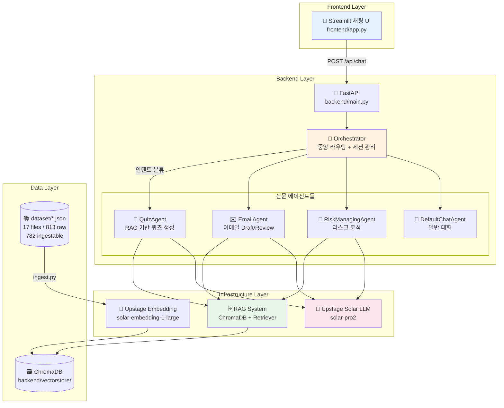
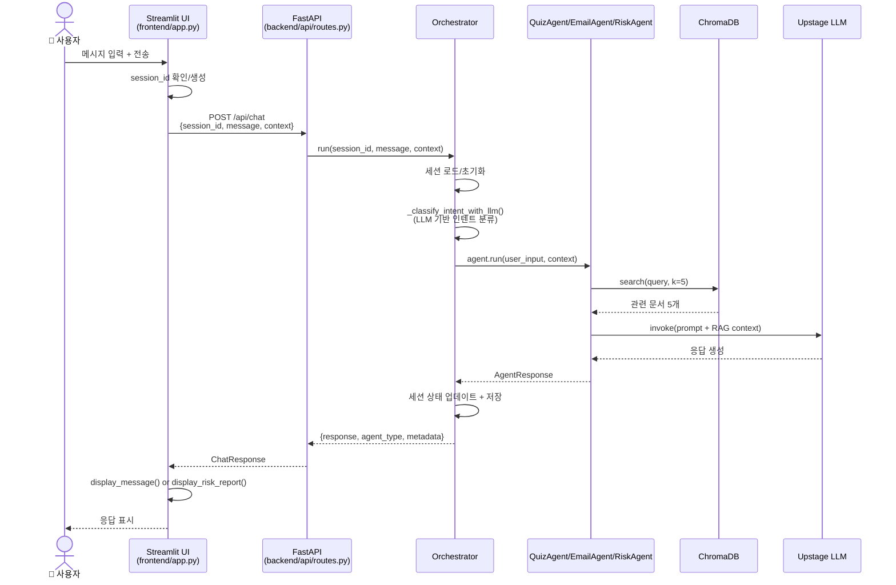
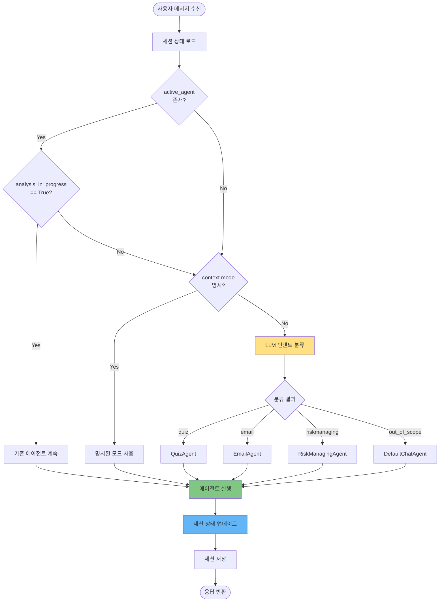
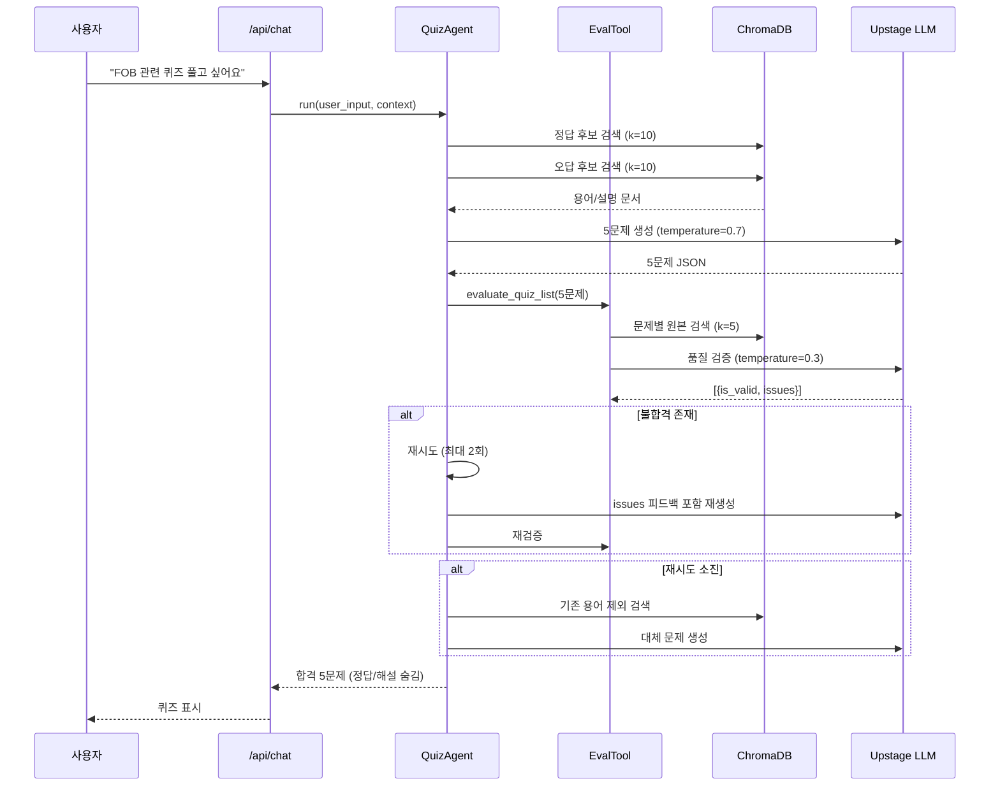
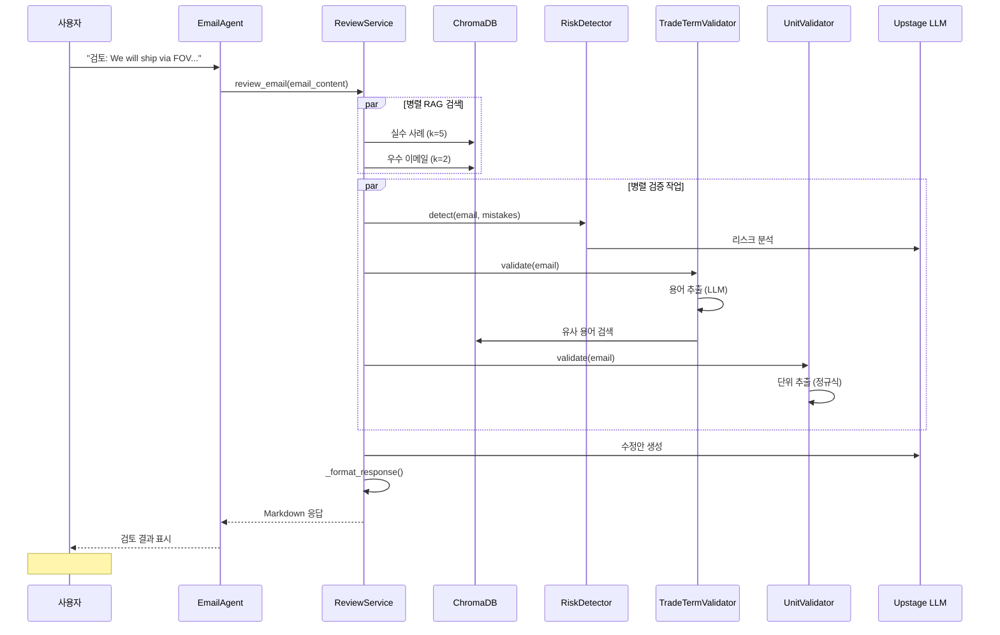
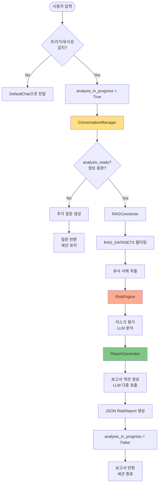

# CLAUDE.md

This file provides guidance to Claude Code (claude.ai/code) when working with code in this repository.

---

## 📋 목차

1. [문서 범위 및 상태 기준](#문서-범위-및-상태-기준)
2. [1️⃣ 프로젝트 개요](#1️⃣-프로젝트-개요)
3. [🏗️ 시스템 아키텍처](#🏗️-시스템-아키텍처)
4. [💬 챗봇 인터페이스 구조](#💬-챗봇-인터페이스-구조)
5. [🤖 에이전트 시스템](#🤖-에이전트-시스템)
6. [🛠️ 개발 가이드](#🛠️-개발-가이드)
7. [🧪 테스트 및 디버깅](#🧪-테스트-및-디버깅)

---

## 문서 범위 및 상태 기준

- `README.md`: 사용자/운영자 중심 사용 가이드
- `CLAUDE.md`(이 문서): 개발자/에이전트 작업 기준 및 구현 상태 검증 기준
- API/기능 상태 라벨:
  - `GA`: 현재 동작 검증 완료
  - `Beta`: 동작하나 변경 가능성 높음
  - `Planned`: 스펙만 존재, 코드 미구현 또는 TODO
- 데이터 규모 표기 기준(2026-02-15):
  - `source_files`: 17 (`dataset/*.json`)
  - `raw_records`: 813 (JSON 원소 총합)
  - `ingestable_records`: 782 (`content` 기반 ingest 가능 항목)

---

## 1️⃣ 프로젝트 개요

**TradeOnboarding Chatbot** - 무역회사 신입사원을 위한 AI 온보딩 챗봇 시뮬레이터

### 핵심 컨셉

**채팅으로 시작하는 실무 온보딩**
- 🗨️ **대화형 인터페이스**: Streamlit 채팅 UI로 자연스러운 학습 경험 제공
- 🤖 **멀티 에이전트 시스템**: 3개 전문 에이전트가 도메인별 코칭 수행
- 📚 **RAG 기반 정확성**: 17 files / 813 raw / 782 ingestable 기반 지식 베이스
- 🎯 **실전 시뮬레이션**: 퀴즈, 이메일 검토, 리스크 분석 등 실무 시나리오 훈련

### 기술 스택

| 레이어 | 기술 | 역할 |
|--------|------|------|
| **패키지 관리** | uv | 빠른 Python 패키지 매니저 (모든 명령어에 `uv run` 필수) |
| **프론트엔드** | Streamlit | 채팅 UI 및 사용자 인터페이스 |
| **백엔드** | FastAPI + Python 3.11+ | RESTful API 서버 |
| **AI/LLM** | Upstage Solar API | 자연어 이해 및 생성 |
| **임베딩** | Upstage Solar Embedding | 문서 벡터화 |
| **벡터 스토어** | ChromaDB | RAG 문서 검색 (영구 저장) |
| **에이전트** | LangChain + 커스텀 오케스트레이터 | 멀티 에이전트 조율 |
| **트레이싱** | LangSmith (선택) | 에이전트 실행 디버깅 |

### 프로젝트 구조 개요

```
trade-onboarding-agent/
├── backend/                    # 백엔드 로직
│   ├── agents/                # 에이전트 구현
│   │   ├── orchestrator.py   # 중앙 라우팅 및 세션 관리
│   │   ├── quiz_agent.py     # 퀴즈 생성 및 채점
│   │   ├── email/            # 이메일 코칭 (7개 서비스)
│   │   └── riskmanaging/     # 리스크 분석 (5개 모듈)
│   ├── rag/                  # RAG 시스템
│   │   ├── ingest.py         # 데이터 임베딩
│   │   ├── retriever.py      # 벡터 검색
│   │   └── embedder.py       # 임베딩 생성
│   ├── api/                  # FastAPI 엔드포인트
│   ├── ports/                # 추상 인터페이스 (Hexagonal)
│   ├── infrastructure/        # 구현체 (Upstage LLM, ChromaDB)
│   ├── prompts/              # LLM 프롬프트 템플릿
│   └── config.py             # 환경 설정
├── frontend/                  # Streamlit UI
│   └── app.py                # 채팅 인터페이스
├── dataset/                   # 원본 데이터셋 (JSON)
│   ├── icc_trade_terms.json  # ICC 무역용어집 284 records
│   ├── trade_dictionary_full.json  # 화성상공회의소 용어 169개
│   ├── mistakes.json         # 실수 사례 40 records
│   ├── emails.json           # 이메일 템플릿 40 records
│   └── ...                   # 기타 280 raw records
├── docs/                      # 상세 워크플로우 문서
│   ├── quiz_agent.md         # QuizAgent 상세 (327줄)
│   ├── email_agent.md        # EmailAgent 상세 (816줄)
│   ├── riskmanaging_workflow.md  # RiskAgent 플로우 (110줄)
│   └── riskmanaging_agent_REPORT.md  # 문제점 분석 (143줄)
├── tests/                     # 테스트 코드
└── backend/vectorstore/      # ChromaDB 저장소 (gitignore)
```

---

## 🏗️ 시스템 아키텍처

### 전체 시스템 아키텍처



### Hexagonal Architecture (포트 앤 어댑터)

이 프로젝트는 **비즈니스 로직과 인프라를 분리**하기 위해 헥사고날 아키텍처를 따릅니다.

#### 포트 (Ports) - 추상 인터페이스

**파일**: `backend/ports/`

| 포트 | 역할 | 메서드 |
|------|------|--------|
| `llm_gateway.py` | LLM 호출 추상화 | `invoke(prompt, temperature)` |
| `document_retriever.py` | 벡터 검색 추상화 | `search(query, k, filters)` |

#### 어댑터 (Adapters) - 구현체

**파일**: `backend/infrastructure/`

| 어댑터 | 구현 대상 | 기술 스택 |
|--------|----------|----------|
| `upstage_llm.py` | LLMGateway | Upstage Solar API + 지수 백오프 재시도 (3회) |
| `chroma_retriever.py` | DocumentRetriever | ChromaDB + 메타데이터 필터링 |

**중요**: 새로운 LLM 프로바이더 추가 시, 포트 인터페이스를 구현하는 새 어댑터만 작성하면 됩니다. 에이전트 코드는 변경 불필요.

#### 예시: LLM 호출 패턴

```python
# ❌ 나쁜 예: 인프라에 직접 결합
from openai import OpenAI
llm = OpenAI(base_url="https://api.upstage.ai/v1", api_key="...")
response = llm.chat.completions.create(...)

# ✅ 좋은 예: 포트 인터페이스 사용
from backend.ports.llm_gateway import LLMGateway
llm: LLMGateway = UpstageLLMGateway(api_key="...")  # 의존성 주입
response = llm.invoke(prompt, temperature=0.3)
```

### 세션 상태 관리 아키텍처

**파일**: `backend/agents/orchestrator.py` (44-65줄)

#### InMemoryConversationStore

현재 세션 관리는 **인메모리 Dict**로 구현되어 있습니다 (프로덕션용 아님).

**세션 상태 구조**:
```python
{
    "active_agent": str | None,  # 현재 활성 에이전트 이름
    "conversation_history": [    # 대화 이력
        {"role": "User", "content": "..."},
        {"role": "Agent", "content": "..."}
    ],
    "agent_specific_state": {    # 에이전트별 상태
        "analysis_in_progress": bool  # RiskManagingAgent 전용
    },
    "last_interaction_timestamp": float
}
```

**라이프사이클**:
1. 새 세션 → `session_id` 생성 (UUID)
2. 대화 진행 → Orchestrator가 히스토리 관리
3. 에이전트 전환 → 히스토리/상태 초기화
4. 서버 재시작 → 모든 세션 손실 ⚠️

**프로덕션 교체 필요**: Redis, PostgreSQL, MongoDB 등으로 교체하여 영속성 확보.

---

## 💬 챗봇 인터페이스 구조

### Streamlit 채팅 플로우



### API 엔드포인트

**파일**: `backend/api/routes.py`

| 엔드포인트 | 메서드 | 상태 | 요청 | 응답 | 설명 |
|-----------|--------|------|------|------|------|
| `/api/chat` | POST | `GA` | `{session_id, message, context?}` | `{response, agent_type, metadata}` | 메인 채팅 (Orchestrator 라우팅) |
| `/api/quiz/start` | POST | `Planned` | `{topic?, difficulty?}` | `{message, topic, difficulty}` | TODO placeholder 응답 |
| `/api/quiz/answer` | POST | `Planned` | `{quiz_id, answer}` | `{message, quiz_id, answer}` | TODO placeholder 응답 |

**참고**: 현재 QuizAgent/EmailAgent는 `/api/chat`를 통해 Orchestrator가 라우팅합니다. 전용 엔드포인트는 향후 구현 예정입니다.

### Streamlit UI 주요 기능

**파일**: `frontend/app.py`

| 기능 | 코드 위치 | 설명 |
|------|----------|------|
| 채팅 입력 | `st.chat_input()` (350줄) | 사용자 메시지 입력 |
| 메시지 표시 | `display_message()` (206-227줄) | 사용자/AI 메시지 구분 렌더링 |
| 리스크 보고서 | `display_risk_report()` (229-293줄) | JSON 보고서 시각화 (색상 코딩) |
| 세션 초기화 | `st.button("새로운 리스크 분석")` (305줄) | 새 `session_id` 생성 |
| 히스토리 관리 | `st.session_state.messages` (177줄) | 클라이언트 측 메시지 저장 |

---

## 🤖 에이전트 시스템

### Orchestrator 라우팅 플로우



**우선순위**:
1. **active_agent** (멀티턴 진행 중) → 최우선
2. **context.mode** (프론트엔드 명시) → 오버라이드
3. **LLM 분류** (`_classify_intent_with_llm()`) → 기본 라우팅
4. **DefaultChatAgent** (폴백) → 분류 실패 시

**파일**: `backend/agents/orchestrator.py` (171-209줄)

### 에이전트 비교표

| 에이전트 | 턴 방식 | RAG 사용 | 주요 기능 | 출력 형식 | 파일 |
|---------|--------|---------|----------|----------|------|
| **QuizAgent** | 싱글턴 | ✅ Yes | RAG 기반 퀴즈 생성 + EvalTool 품질 검증 | JSON (문제 5개) | `quiz_agent.py` |
| **EmailAgent** | 싱글턴 | ✅ Yes | Draft/Review + 무역 용어 검증 + 단위 검증 | Markdown | `email/email_agent.py` |
| **RiskManagingAgent** | 멀티턴 | ✅ Yes | 리스크 분석 + 대화형 정보 수집 + 보고서 | JSON (RiskReport) | `riskmanaging/riskmanaging_agent.py` |
| **DefaultChatAgent** | 싱글턴 | ❌ No | 일반 대화 (폴백) | 텍스트 | `orchestrator.py` (68-87줄) |

---

### QuizAgent - RAG 기반 퀴즈 생성

**참조**: `docs/quiz_agent.md` (327줄)

#### 핵심 기능

| 기능 | 설명 |
|------|------|
| **퀴즈 생성** | RAG 검색 → LLM 생성 → EvalTool 검증 → 재시도/대체 루프 |
| **난이도 조절** | easy/medium/hard (미지정 시 easy2+medium2+hard1 혼합) |
| **퀴즈 유형** | 용어→설명 / 설명→용어 양방향 출제 |
| **오답 생성** | RAG 기반 실존 유사 용어 활용 (혼동 유발) |
| **품질 검증** | EvalTool이 5항목 검증 (문제/정답/오답/인덱스/해설) |

#### 워크플로우 (간소화)



#### 인터페이스

```python
# backend/agents/quiz_agent.py
class QuizAgent:
    agent_type: str = "quiz"

    def run(self, user_input: str, context: Optional[Dict[str, Any]] = None) -> Dict[str, Any]:
        """
        퀴즈 생성 또는 답안 채점

        Returns:
            {
                "response": str or dict,  # 퀴즈 JSON 또는 채점 결과
                "agent_type": "quiz",
                "metadata": {
                    "used_rag": bool,
                    "documents": List[Dict],
                    "model": "solar-pro2"
                }
            }
        """
```

#### 데이터 소스

- **ICC 무역용어집**: 284개 용어 (`dataset/icc_trade_terms.json`)
- **화성상공회의소 용어사전**: 169개 용어 (`dataset/trade_dictionary_full.json`)
- **원본 데이터 기준**: 17 files / 813 raw records
- **ingest 대상 기준**: 782 records (`content` 존재 항목)

---

### EmailAgent - 이메일 코칭

**참조**: `docs/email_agent.md` (816줄)

#### Phase 6 신규 기능

✅ **무역 용어 검증** (TradeTermValidator)
✅ **단위 검증** (UnitValidator)
✅ **ChromaDB 용어 사전** (ingestable records 782 기준)

#### 모드 및 서비스

| 모드 | 역할 | 주요 서비스 |
|------|------|------------|
| **Draft Mode** | 상황에 맞는 이메일 초안 생성 | DraftService |
| **Review Mode** | 이메일 검토 + 리스크 탐지 + 톤 분석 + 용어/단위 검증 | ReviewService (7개 서비스 통합) |

**Review Mode 7개 서비스**:
1. **RiskDetector**: Incoterms 오류, 결제 조건 누락, 수량/단위 오류 탐지
2. **ToneAnalyzer**: professional/casual/formal 톤 분석 + 국가별 문화 적합성
3. **TradeTermValidator** 🆕: RAG 기반 무역 용어 정확성 검증 (FOB, CIF, L/C 등)
4. **UnitValidator** 🆕: 무게/부피/컨테이너 단위 일관성 검증
5. **ResponseFormatter**: 마크다운 응답 포맷팅
6. **DraftService**: 초안 생성
7. **ReviewService**: 전체 오케스트레이션

#### Review Mode 워크플로우 (간소화)



#### 인터페이스

```python
# backend/agents/email/email_agent.py
class EmailAgent:
    agent_type: str = "email"

    def run(self, user_input: str, context: Optional[Dict[str, Any]] = None) -> Dict[str, Any]:
        """
        이메일 초안 작성 또는 검토

        Returns:
            {
                "response": str,  # Markdown 형식 응답
                "agent_type": "email",
                "metadata": {
                    "mode": "review" or "draft",
                    "risks": [...],
                    "tone_score": 7.0,
                    "term_validation": {...},
                    "unit_validation": {...}
                }
            }
        """
```

#### 예시 출력

```markdown
### 🚨 발견된 리스크 (3건)
1. **[CRITICAL] incoterms_misuse**
   - 현재: "FOV incoterms"
   - 리스크: 존재하지 않는 인코텀즈
   - 권장: FOB [지정 선적항] 사용

### 🔍 무역 용어 검증
**❌ 오류 발견**:
- FOV → FOB (정확도: 95%)
  - 설명: Free On Board - 본선 인도 조건

### 📏 단위 검증
**⚠️ 불일치 발견**:
- 혼용된 무게 단위: 20ton, 20000kg
- 제안: 20 MT (20,000 kg)

### 📝 수정안
Dear [Buyer's Name],

We are pleased to confirm shipment details:
- Quantity: 20 metric tons (20,000 kg)
- Incoterms: FOB [Port Name] Incoterms® 2020
...
```

---

### RiskManagingAgent - 멀티턴 리스크 분석

**참조**: `docs/riskmanaging_workflow.md` (110줄), `docs/riskmanaging_agent_REPORT.md` (143줄)

#### 핵심 특징

🔄 **멀티턴 대화 지원**: `analysis_in_progress` 플래그로 정보 수집 세션 유지
📊 **5단계 처리**: 초기 검토 → 대화 관리 → RAG 검색 → 리스크 평가 → 보고서 생성
🎯 **구조화된 보고서**: JSON 형식 RiskReport (손실 시뮬레이션, 통제 미흡점, 예방 전략)

#### 5단계 워크플로우



#### 인터페이스

```python
# backend/agents/riskmanaging/riskmanaging_agent.py
class RiskManagingAgent:
    agent_type: str = "riskmanaging"

    def run(
        self,
        user_input: str,
        conversation_history: List[Dict],
        analysis_in_progress: bool,
        context: Dict
    ) -> Dict[str, Any]:
        """
        멀티턴 리스크 분석

        Returns:
            {
                "response": {
                    "response": str,  # JSON RiskReport 또는 추가 질문
                    "agent_type": "riskmanaging",
                    "metadata": {...}
                },
                "conversation_history": List[Dict],  # 업데이트된 히스토리
                "analysis_in_progress": bool  # True: 계속 / False: 완료
            }
        """
```

#### 예시 시나리오 (멀티턴)

**턴 1**:
```
👤: "해외 공급업체 선적이 지연될 것 같아요"
🤖: "어떤 계약 건인지, 페널티 조항은 있는지 알려주세요."
    (analysis_in_progress = True)
```

**턴 2**:
```
👤: "A사 10만 달러 계약, 5일 이상 지연 시 일당 1% 페널티"
🤖: [JSON 보고서 생성]
    {
      "analysis_id": "...",
      "risk_factors": {
        "재정적 손실": {"score": 16, "risk_level": "critical"},
        "생산 차질": {"score": 20, "risk_level": "critical"}
      },
      "prevention_strategy": {
        "short_term": "긴급 대체 운송 검토...",
        "long_term": "복수 공급업체 확보..."
      }
    }
    (analysis_in_progress = False)
```

#### RiskReport 구조

```python
{
    "analysis_id": str,
    "input_summary": str,
    "risk_factors": {
        "factor_name": {
            "name_kr": str,
            "impact": int (1-5),
            "likelihood": int (1-5),
            "score": float,
            "risk_level": "low" | "medium" | "high" | "critical"
        }
    },
    "risk_scoring": {
        "overall_risk_level": str,
        "overall_assessment": str
    },
    "loss_simulation": {
        "qualitative": str
    },
    "control_gap_analysis": {
        "current_controls": str,
        "identified_gaps": str,
        "recommendations": str
    },
    "prevention_strategy": {
        "short_term": str,
        "long_term": str
    },
    "similar_cases": List[Dict],
    "confidence_score": float,
    "evidence_sources": List[str]
}
```

---

## 🛠️ 개발 가이드

### 필수 명령어

#### 설정 및 설치

```bash
# 1. uv 패키지 매니저 설치 (macOS/Linux)
curl -LsSf https://astral.sh/uv/install.sh | sh

# 2. 의존성 설치 (.venv 자동 생성)
uv sync

# 3. 환경 변수 설정
cp .env.example .env
# .env 파일 편집: UPSTAGE_API_KEY 추가 필수
```

#### 애플리케이션 실행

```bash
# 터미널 1: 백엔드 (FastAPI) - http://localhost:8000
uv run uvicorn backend.main:app --reload

# 터미널 2: 프론트엔드 (Streamlit) - http://localhost:8501
uv run streamlit run frontend/app.py

# API 문서 자동 생성
# Swagger UI: http://localhost:8000/docs
# ReDoc: http://localhost:8000/redoc
```

#### 개발 명령어

```bash
# 테스트
uv run pytest                          # 전체 테스트
uv run pytest tests/test_orchestrator.py  # 특정 파일
uv run pytest -v                       # 상세 출력

# 코드 품질
uv run black backend/ frontend/        # 포맷팅
uv run ruff check backend/ frontend/   # 린팅

# 패키지 관리
uv add <package-name>                  # 일반 의존성
uv add --dev <package-name>            # 개발 의존성
```

#### RAG 시스템 관리

```bash
# 데이터 임베딩 (첫 실행 또는 데이터셋 변경 시)
uv run python backend/rag/ingest.py

# 초기화 후 전체 재임베딩
uv run python backend/rag/ingest.py --reset

# 리트리버 테스트
uv run python backend/rag/retriever.py
```

**자동 임베딩**: `.env`에서 `AUTO_INGEST_ON_STARTUP=true` 설정 시, 서버 시작 시 ChromaDB가 비어있으면 자동 임베딩 수행 (첫 실행 시 수 분 소요).

---

### RAG 데이터 파이프라인

```mermaid
flowchart LR
    A[📁 dataset/*.json<br/>17 files / 813 raw<br/>782 ingestable] --> B[🔧 ingest.py<br/>Upstage Embedding]
    B --> C[(🗃️ ChromaDB<br/>backend/vectorstore/)]
    C --> D[🔍 retriever.py<br/>search() / search_with_filter()]
    D --> E[🤖 QuizAgent]
    D --> F[✉️ EmailAgent]
    D --> G[🚨 RiskManagingAgent]

    style C fill:#E8F5E9
    style D fill:#BBDEFB
```

#### 메타데이터 스키마

**파일**: `backend/rag/schema.py`

모든 문서는 정규화된 메타데이터를 가집니다:

```python
{
    "document": str,           # 문서 내용
    "metadata": {
        "source_dataset": str,  # 출처 파일명
        "document_type": str,   # trade_terminology, common_mistake, email 등
        "category": str,        # Incoterms, payment_terms, documents 등
        "priority": str,        # high, medium, low
        "level": str,           # basic, intermediate, advanced
        "role": str,            # buyer, seller, forwarder 등
        "topic": List[str],     # [shipping, payment, insurance] 등
        "situation": str        # claim, negotiation, contract 등
    }
}
```

#### 검색 패턴

```python
# 기본 검색 (유사도만)
from backend.rag.retriever import search
results = search(query="FOB란 무엇인가?", k=5)

# 필터링 검색 (메타데이터 활용)
from backend.rag.retriever import search_with_filter
results = search_with_filter(
    query="FOB",
    k=3,
    document_type="trade_terminology",
    category="Incoterms"
)
```

---

### 새 에이전트 추가하기

#### 체크리스트

- [ ] 1. `backend/agents/` 아래 에이전트 클래스 생성 (싱글턴 또는 멀티턴 인터페이스 구현)
- [ ] 2. `backend/agents/orchestrator.py` - `AGENT_CLASS_MAPPING`에 등록
- [ ] 3. `backend/prompts/` - 프롬프트 파일 생성 (예: `new_agent_prompt.txt`)
- [ ] 4. `backend/prompts/orchestrator_intent_prompt.txt` - 인텐트 분류 키워드 추가
- [ ] 5. `tests/` - 새 에이전트 테스트 추가
- [ ] 6. `docs/` - 워크플로우 문서 작성 (선택)

#### 싱글턴 에이전트 템플릿

```python
# backend/agents/my_agent.py
from typing import Dict, Any, Optional

class MyAgent:
    agent_type: str = "my_agent"

    def __init__(self):
        # LLM, RAG, 프롬프트 초기화
        pass

    def run(self, user_input: str, context: Optional[Dict[str, Any]] = None) -> Dict[str, Any]:
        """
        싱글턴 에이전트 인터페이스

        Returns:
            {
                "response": str or dict,
                "agent_type": "my_agent",
                "metadata": dict
            }
        """
        # 비즈니스 로직
        return {
            "response": "...",
            "agent_type": self.agent_type,
            "metadata": {}
        }
```

#### Orchestrator 등록

```python
# backend/agents/orchestrator.py
from backend.agents.my_agent import MyAgent

AGENT_CLASS_MAPPING: Dict[str, Type[Any]] = {
    "riskmanaging": RiskManagingAgent,
    "quiz": QuizAgent,
    "email": EmailAgent,
    "my_agent": MyAgent,  # 추가
    "default_chat": DefaultChatAgent,
}
```

#### 인텐트 분류 프롬프트 업데이트

```
# backend/prompts/orchestrator_intent_prompt.txt
...
- "my_agent": 새 에이전트 설명 및 트리거 키워드
...
```

---

### 일반적인 개발 패턴

#### RAG 검색

```python
from backend.rag.retriever import search

# 에이전트 내부에서 RAG 호출
rag_results = search(query=user_input, k=5)

# 결과 처리
for result in rag_results:
    doc_content = result["document"]
    metadata = result["metadata"]
    source_file = metadata.get("source_dataset")
```

#### LLM 호출 (포트 인터페이스 사용)

```python
from backend.infrastructure.upstage_llm import UpstageLLMGateway
from backend.config import get_settings

settings = get_settings()
llm = UpstageLLMGateway(api_key=settings.upstage_api_key, model="solar-pro2")

response = llm.invoke(
    prompt="사용자 질문: {user_input}\n참조: {rag_context}",
    temperature=0.3
)
```

#### 세션 상태 접근 (Orchestrator 내부)

```python
# backend/agents/orchestrator.py
session_state = self.conversation_store.get_state(session_id)
history = session_state.get("conversation_history", [])
active_agent = session_state.get("active_agent")

# 상태 업데이트
session_state["conversation_history"].append({"role": "User", "content": user_input})
self.conversation_store.save_state(session_id, session_state)
```

---

## 🧪 테스트 및 디버깅

### 테스트 구조

**파일**: `tests/`

| 테스트 파일 | 대상 | 범위 |
|------------|------|------|
| `test_orchestrator.py` | Orchestrator | 라우팅 로직, 세션 관리 |
| `test_intent_classifier.py` | 인텐트 분류 | LLM 기반 분류 정확도 |
| `test_e2e_orchestrator.py` | 엔드투엔드 | 에이전트 플로우 통합 테스트 |
| `test_orchestrator_performance.py` | 성능 | 응답 시간 벤치마크 |

**테스트 패턴**: 인프라 어댑터가 아닌 **포트 인터페이스를 모킹**하여 LLM 호출 테스트.

```python
# 좋은 예: 포트 모킹
from unittest.mock import Mock
from backend.ports.llm_gateway import LLMGateway

mock_llm = Mock(spec=LLMGateway)
mock_llm.invoke.return_value = "모킹된 응답"
agent = QuizAgent(llm=mock_llm)  # 의존성 주입
```

### 디버깅 팁

#### LangSmith 트레이싱 활성화

```bash
# .env 파일
LANGSMITH_TRACING=true
LANGSMITH_API_KEY=your_key_here
LANGSMITH_PROJECT=trade-onboarding
```

LangSmith 대시보드에서 전체 에이전트 실행 플로우 확인 가능:
- LLM 입력/출력
- RAG 검색 결과
- 에이전트 전환 로직

#### 상세 로깅 활성화

```bash
# .env 파일
DEBUG=true
```

터미널에서 Orchestrator 라우팅 및 에이전트 실행 로그 확인.

#### 직접 테스트

```bash
# Orchestrator 직접 실행
uv run python backend/agents/orchestrator.py

# Retriever 직접 실행
uv run python backend/rag/retriever.py
```

#### 로그 파일 확인

```bash
# logs/ 디렉토리 확인 (프로젝트 설정에 따라)
tail -f logs/app.log
```

---

### 알려진 제약사항

| 항목 | 현재 상태 | 프로덕션 교체 필요 |
|------|----------|-------------------|
| **세션 관리** | ConversationStore (Python dict) | ✅ Redis, PostgreSQL 등 |
| **인증/권한** | 없음 | ✅ OAuth2, JWT 등 |
| **멀티 테넌트** | 단일 테넌트 (사용자 격리 없음) | ✅ 테넌트 분리 로직 |
| **세션 영속성** | 서버 재시작 시 손실 | ✅ 영구 저장소 |
| **백업 파일** | `*.backup.py` 파일 존재 | ⚠️ 참고용 이전 버전 |

---

### 성능 고려사항

| 항목 | 현재 성능 | 최적화 방향 |
|------|----------|-----------|
| **ChromaDB** | 영구 저장, 시작 시 한 번 로드 | ✅ 양호 |
| **임베딩 API** | Upstage Solar Embedding | ⚠️ 대량 임베딩 시 속도 제한 가능 |
| **세션 스토어** | 인메모리 dict | ❌ 확장 불가 → Redis 교체 필요 |
| **LLM 재시도** | 지수 백오프 3회 자동 재시도 | ✅ 양호 |

---

## 참고 자료

### 주요 파일 위치

| 파일 | 경로 | 설명 |
|------|------|------|
| 메인 진입점 | `backend/main.py` | FastAPI 앱 |
| API 라우트 | `backend/api/routes.py` | 엔드포인트 정의 |
| Orchestrator | `backend/agents/orchestrator.py` | 중앙 라우팅 (400줄) |
| QuizAgent | `backend/agents/quiz_agent.py` | 퀴즈 생성 (231줄) |
| EmailAgent | `backend/agents/email/email_agent.py` | 이메일 코칭 (163줄) |
| RiskManagingAgent | `backend/agents/riskmanaging/riskmanaging_agent.py` | 리스크 분석 |
| RAG Retriever | `backend/rag/retriever.py` | 벡터 검색 |
| Streamlit UI | `frontend/app.py` | 채팅 인터페이스 (397줄) |
| 환경 설정 | `backend/config.py` | Pydantic 설정 |
| 프롬프트 | `backend/prompts/` | LLM 프롬프트 템플릿 |

### 상세 문서 참조

| 문서 | 경로 | 내용 |
|------|------|------|
| QuizAgent 워크플로우 | `docs/quiz_agent.md` | RAG 기반 퀴즈 생성 + EvalTool (327줄) |
| EmailAgent 워크플로우 | `docs/email_agent.md` | Draft/Review + Phase 6 신규 기능 (816줄) |
| RiskAgent 워크플로우 | `docs/riskmanaging_workflow.md` | 5단계 처리 플로우 (110줄) |
| RiskAgent 문제 분석 | `docs/riskmanaging_agent_REPORT.md` | User Scenario + 개선 필요 항목 (143줄) |

---

**문서 버전**: 2.0
**작성일**: 2026-02-15
**대상 독자**: Claude Code (AI 개발자)
**챗봇 정체성**: ✅ 명확 강조
