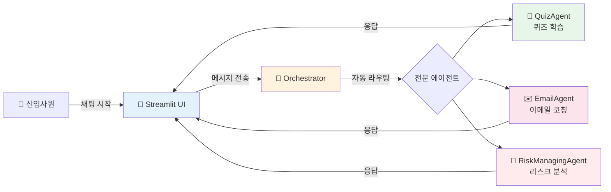
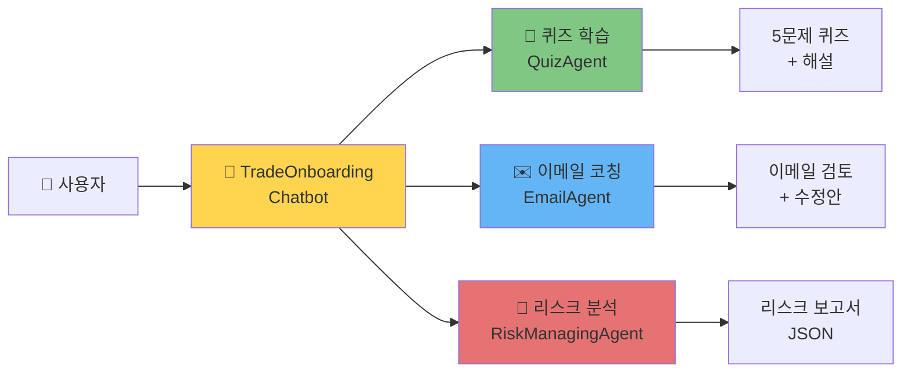
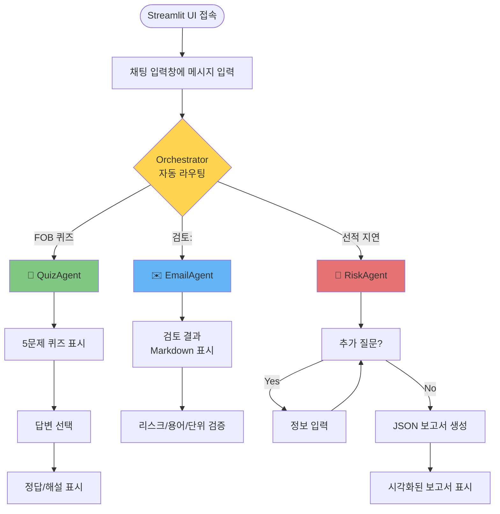
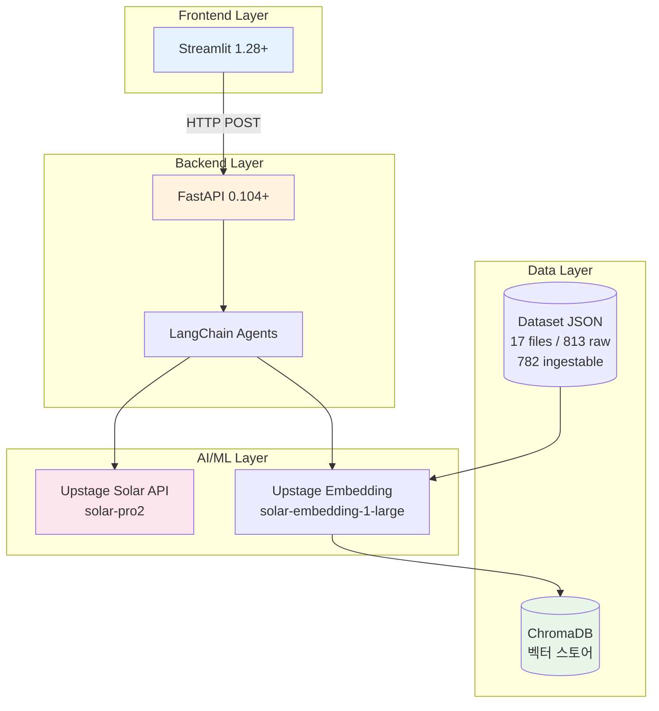

# 🚢 TradeOnboarding Chatbot

**채팅으로 시작하는 무역 실무 온보딩**

무역회사 신입사원을 위한 AI 기반 대화형 온보딩 시뮬레이터

[](https://www.python.org/downloads/)
[](https://fastapi.tiangolo.com/)
[](https://streamlit.io/)

> 이 문서는 사용자/운영자용 가이드입니다. 개발자 구현 규칙과 내부 아키텍처 작업 기준은 `CLAUDE.md`를 기준으로 확인하세요.

---

## 📋 목차

1. [프로젝트 소개](#-프로젝트-소개)
2. [주요 기능](#-주요-기능)
3. [빠른 시작](#-빠른-시작)
4. [API 상태](#-api-상태-2026-02-15-기준)
5. [사용 가이드](#-사용-가이드)
6. [기술 스택](#-기술-스택)
7. [프로젝트 구조](#-프로젝트-구조)
8. [데이터셋](#-데이터셋)
9. [성능 지표](#-성능-지표)

---

## 🚢 프로젝트 소개

### 핵심 가치

**"실무는 교과서가 아니라 대화로 배운다"**

TradeOnboarding Chatbot은 무역회사 신입사원이 **채팅 대화**를 통해 실무 감각을 익히는 AI 온보딩 시뮬레이터입니다.
3개의 전문 AI 에이전트가 퀴즈, 이메일 코칭, 리스크 분석을 실시간 대화로 코칭합니다.

### 주요 특징

🗨️ **대화형 인터페이스**
- Streamlit 채팅 UI로 자연스러운 학습 경험
- 멀티턴 대화 지원으로 심층 코칭 가능
- 실시간 피드백과 구조화된 보고서 제공

🤖 **3개 전문 에이전트**
- QuizAgent: RAG 기반 퀴즈 자동 생성 + 품질 검증
- EmailAgent: 이메일 초안 작성 + 무역 용어/단위 검증
- RiskManagingAgent: 멀티턴 리스크 분석 + JSON 보고서

📚 **데이터 규모 기준(2026-02-15)**
- source files: 17개 JSON
- raw records: 813개
- ingestable records: 782개 (`content` 기반 ingest 기준)
- ICC 무역용어집 284개
- 화성상공회의소 용어사전 169개
- 실무 이메일/실수 사례/클레임 사례 등

🎯 **실전 시뮬레이션**
- 실제 무역 업무 시나리오 기반 훈련
- RAG 기반 정확한 도메인 지식 제공
- LLM 기반 자연어 이해 및 생성

### 시스템 개요



---

## ✨ 주요 기능

### 기능 개요



### 에이전트별 상세 기능

| 에이전트 | 주요 기능 | 사용 시나리오 | 입력 예시 | 출력 형식 |
|---------|----------|--------------|----------|----------|
| 📝 **QuizAgent** | RAG 기반 퀴즈 생성<br/>+ EvalTool 품질 검증 | 무역 용어/프로세스 학습 | "FOB 관련 퀴즈 풀고 싶어요" | JSON (5문제) |
| ✉️ **EmailAgent** | Draft/Review 모드<br/>+ 무역 용어/단위 검증 | 이메일 작성 코칭 | "검토: We will ship via FOV..." | Markdown |
| 🚨 **RiskManagingAgent** | 멀티턴 리스크 분석<br/>+ 구조화된 보고서 | 업무 리스크 상황 대응 | "선적이 지연될 것 같아요" | JSON Report |

---

### 📝 QuizAgent - 퀴즈 학습

**핵심 기능**:
- ✅ RAG 검색으로 실제 무역 용어 기반 퀴즈 생성
- ✅ EvalTool이 5항목 품질 검증 (문제/정답/오답/인덱스/해설)
- ✅ 재시도 + 대체 생성 루프로 고품질 보장
- ✅ ICC 무역용어집 284개 활용

**난이도 조절**:
- `easy`: 용어→설명 위주
- `medium`: 두 유형 혼합
- `hard`: 설명→용어 위주

**예시**:
```
👤: "인코텀즈 퀴즈 쉬운 난이도로 시작해줘"
🤖: [5문제 생성]
    1. FOB란 무엇인가요?
       a) 본선인도조건 ✅
       b) 운임포함조건
       c) 운임보험료포함조건
       d) 관세지급인도조건
```

**참고 문서**: [`docs/quiz_agent.md`](docs/quiz_agent.md) (327줄)

---

### ✉️ EmailAgent - 이메일 코칭

**Phase 6 신규 기능**:
- 🆕 **무역 용어 검증** (TradeTermValidator): FOB/CIF/L/C 등 정확성 검증
- 🆕 **단위 검증** (UnitValidator): MT/CBM/TEU 일관성 검증
- 🆕 **ChromaDB 용어 사전**: ingestable records 782개 기준

**모드**:
- **Draft Mode**: 상황에 맞는 이메일 초안 자동 생성
- **Review Mode**: 이메일 검토 + 리스크 탐지 + 톤 분석 + 용어/단위 검증

**Review Mode 7개 서비스**:
1. **RiskDetector**: Incoterms 오류, 결제 조건 누락 탐지
2. **ToneAnalyzer**: 톤 분석 (professional/casual/formal)
3. **TradeTermValidator**: 무역 용어 정확성 검증
4. **UnitValidator**: 단위 일관성 검증
5. **ResponseFormatter**: 마크다운 응답 포맷팅

**예시 출력**:
```markdown
### 🚨 발견된 리스크 (3건)
1. **[CRITICAL] incoterms_misuse**
   - 현재: "FOV incoterms"
   - 권장: FOB [지정 선적항] 사용

### 🔍 무역 용어 검증
**❌ 오류 발견**:
- FOV → FOB (정확도: 95%)

### 📏 단위 검증
**⚠️ 불일치 발견**:
- 혼용된 무게 단위: 20ton, 20000kg
- 제안: 20 MT (20,000 kg)
```

**참고 문서**: [`docs/email_agent.md`](docs/email_agent.md) (816줄)

---

### 🚨 RiskManagingAgent - 리스크 분석

**핵심 특징**:
- 🔄 **멀티턴 대화**: 정보 부족 시 추가 질문으로 완전한 분석
- 📊 **5단계 처리**: 초기 검토 → 대화 관리 → RAG 검색 → 리스크 평가 → 보고서 생성
- 🎯 **구조화된 보고서**: JSON 형식 RiskReport (손실 시뮬레이션, 예방 전략)

**워크플로우**:
1. 트리거 감지 (리스크 관련 키워드/유사성)
2. ConversationManager가 정보 충분성 판단
3. 불충분 시 → 추가 질문 (멀티턴 계속)
4. 충분 시 → RAG 검색 → 리스크 평가 → 보고서 생성

**보고서 구조**:
```json
{
  "analysis_id": "...",
  "risk_factors": {
    "재정적 손실": {"score": 16, "risk_level": "critical"},
    "생산 차질": {"score": 20, "risk_level": "critical"}
  },
  "prevention_strategy": {
    "short_term": "긴급 대체 운송 검토...",
    "long_term": "복수 공급업체 확보..."
  }
}
```

**참고 문서**: [`docs/riskmanaging_workflow.md`](docs/riskmanaging_workflow.md) (110줄)

---

## 🚀 빠른 시작

### 전제 조건

- **Python 3.11+**
- **uv** (빠른 Python 패키지 매니저)
- **Upstage API Key** ([가입하기](https://www.upstage.ai/))
- LangSmith API Key (선택사항, 트레이싱용)

### 설치 (5분 이내)

#### 1️⃣ uv 패키지 매니저 설치

**macOS/Linux**:
```bash
curl -LsSf https://astral.sh/uv/install.sh | sh
```

**Windows**:
```powershell
powershell -c "irm https://astral.sh/uv/install.ps1 | iex"
```

**설치 확인**:
```bash
uv --version
```

#### 2️⃣ 프로젝트 클론 및 의존성 설치

```bash
# 저장소 클론
git clone <repository-url>
cd trade-onboarding-agent

# 의존성 설치 (.venv 자동 생성)
uv sync
```

#### 3️⃣ 환경 변수 설정

```bash
# .env 파일 생성
cp .env.example .env

# .env 파일 편집
# UPSTAGE_API_KEY=your_actual_api_key_here
```

**.env 파일 예시**:
```env
# 필수
UPSTAGE_API_KEY=your_upstage_api_key

# 선택 (LangSmith 트레이싱)
LANGSMITH_API_KEY=your_langsmith_api_key
LANGSMITH_PROJECT=trade-onboarding
LANGSMITH_TRACING=true

# 선택 (디버깅)
DEBUG=true
```

### 실행 (2개 터미널)

#### 터미널 1: 백엔드 (FastAPI)

```bash
uv run uvicorn backend.main:app --reload
```

✅ 서버 실행 확인:
- API: http://localhost:8000
- Swagger UI: http://localhost:8000/docs
- ReDoc: http://localhost:8000/redoc

#### 터미널 2: 프론트엔드 (Streamlit)

```bash
uv run streamlit run frontend/app.py
```

✅ UI 실행 확인:
- Streamlit UI: http://localhost:8501

### 첫 사용

1. **Streamlit UI 접속**: http://localhost:8501
2. **메시지 입력**: "FOB 관련 퀴즈 풀고 싶어요"
3. **에이전트 자동 라우팅**: Orchestrator가 QuizAgent로 라우팅
4. **응답 확인**: 5문제 퀴즈 생성 및 표시

---

## 🔌 API 상태 (2026-02-15 기준)

| 엔드포인트 | 메서드 | 상태 | 현재 동작 | 비고 |
|-----------|--------|------|-----------|------|
| `/api/chat` | POST | `GA` | Orchestrator 라우팅 기반 응답 | 기본 진입점 |
| `/api/quiz/start` | POST | `Planned` | TODO placeholder 응답 반환 | `backend/api/routes.py`의 TODO 구현 필요 |
| `/api/quiz/answer` | POST | `Planned` | TODO placeholder 응답 반환 | `backend/api/routes.py`의 TODO 구현 필요 |

`Planned` API는 문서상 예정 스펙이며, 현재 프로덕션/데모 경로는 `/api/chat`만 검증 완료 상태입니다.

---

## 📖 사용 가이드

### 채팅 인터페이스 사용법



### 예시 대화 시나리오

---

#### 시나리오 1: 퀴즈 학습

**목적**: 무역 용어 학습

```
👤: "FOB 관련 퀴즈 풀고 싶어요"

🤖: [QuizAgent 실행]
    다음 퀴즈를 풀어보세요:

    1. FOB란 무엇인가요?
       0) 본선인도조건
       1) 운임포함조건
       2) 운임보험료포함조건
       3) 관세지급인도조건

    2. CIF에 포함되는 비용은?
       0) 운임 + 보험료
       1) 운임만
       2) 보험료만
       3) 관세

👤: "0번"

🤖: ✅ 정답입니다!

    **해설**:
    FOB(Free On Board)는 수출자가 지정 선적항에서
    물품을 본선에 인도할 때까지의 책임을 지는 조건입니다.
    이후 운임과 보험료는 수입자가 부담합니다.
```

---

#### 시나리오 2: 이메일 검토

**목적**: 이메일 작성 실수 방지

```
👤: "검토: We will ship via FOV incoterms. Total quantity: 20ton and 20000kg."

🤖: [EmailAgent 실행]

    ### 🚨 발견된 리스크 (3건)

    1. **[CRITICAL] incoterms_misuse**
       - 현재: "FOV incoterms"
       - 리스크: 존재하지 않는 인코텀즈, 계약 오류 가능성
       - 권장: FOB [지정 선적항] 사용

    2. **[CRITICAL] quantity_discrepancy**
       - 현재: "20ton and 20000kg"
       - 리스크: 단위 혼동 가능성
       - 권장: 단일 단위로 통일

    ### 🔍 무역 용어 검증

    **❌ 오류 발견**:
    - FOV → FOB (정확도: 95%)
      - 문맥: ship via FOV incoterms
      - 설명: Free On Board - 본선 인도 조건

    **✅ 올바른 용어**:
    - CBM: Cubic Meter

    ### 📏 단위 검증

    **⚠️ 불일치 발견**:
    - 혼용된 무게 단위 (ton과 kg): 20ton, 20000kg
    - 제안: 일관된 단위 사용 권장 (MT 선호)

    **✅ 표준화 제안**: 20 MT (20,000 kg)

    ### 📝 수정안

    Dear [Buyer's Name],

    We are pleased to confirm shipment details:

    - Product: [Specify]
    - Quantity: 20 metric tons (20,000 kg)
    - Incoterms: FOB [Port Name] Incoterms® 2020

    Best regards,
    [Your Name]
```

---

#### 시나리오 3: 리스크 분석 (멀티턴)

**목적**: 업무 리스크 상황 대응 훈련

**턴 1**:
```
👤: "해외 공급업체로부터 선적이 지연될 것 같다고 통보받았습니다."

🤖: [RiskManagingAgent 실행 - 정보 수집 모드]

    리스크 분석을 위해 추가 정보가 필요합니다:

    1. 어떤 계약 건인지 알려주세요 (계약 상대, 금액)
    2. 계약서상 페널티 조항이 있는지 확인해주세요
    3. 지연으로 인해 예상되는 구체적인 영향을 알려주세요
```

**턴 2**:
```
👤: "A사와의 10만 달러 규모 계약이고, 5일 이상 지연 시 일당 1%의 페널티가 있습니다.
     저희 생산 라인도 멈출 수 있습니다."

🤖: [RiskManagingAgent 실행 - 보고서 생성]

    ### 🛡️ 리스크 분석 보고서

    **종합 리스크 레벨**: CRITICAL (점수: 18.7)

    #### 📊 리스크 요약
    해외 공급업체 선적 지연으로 인해 재정적 손실, 생산 일정 지연,
    생산 차질 등 심각한 복합적 리스크가 예상됩니다.

    #### ⚠️ 주요 리스크 요인 분석

    **재정적 손실** (영향: 4, 발생 가능성: 4, 점수: 16)
    - 5일 초과 지연 시 계약 금액의 5% (5,000달러) 페널티 발생

    **생산 차질** (영향: 5, 발생 가능성: 4, 점수: 20)
    - 생산 라인 중단으로 제조 및 판매 일정 차질
    - 고객사 신뢰도 하락 및 기회비용 손실

    #### ✅ 제안하는 조치

    **단기 전략**:
    - 공급업체와 긴급 협상 (지연 사유 및 확정 납기 확인)
    - 대체 운송 수단 (항공 운송) 긴급 검토 및 비용 산정
    - 내부 생산 일정 조정 및 관련 부서 공지

    **장기 전략**:
    - 복수의 공급업체 확보 및 분산 정책 시행
    - 계약 시 강력한 페널티 조항 명시 및 선급금 조건 강화
    - 공급망 리스크 관리 시스템 구축 및 정기 평가

    #### 🔍 유사 사례 및 근거 자료
    - 2023년 B사 선적 지연 사례: 생산 라인 5일 중단, 5만 달러 손실
    - 해외 계약 지연 페널티 적용 가이드라인
```

---

## 🔧 기술 스택

### 기술 스택 아키텍처



### 레이어별 기술 스택

| 레이어 | 기술 | 버전 | 역할 |
|--------|------|------|------|
| **패키지 관리** | uv | latest | 빠른 Python 패키지 매니저 |
| **프론트엔드** | Streamlit | 1.28+ | 채팅 UI 및 대화 인터페이스 |
| **백엔드 API** | FastAPI | 0.104+ | RESTful API 서버 |
| **언어** | Python | 3.11+ | 주 개발 언어 |
| **LLM** | Upstage Solar API | solar-pro2 | 자연어 이해 및 생성 |
| **임베딩** | Upstage Solar Embedding | solar-embedding-1-large | 문서 벡터화 (1024차원) |
| **벡터 스토어** | ChromaDB | latest | RAG 문서 검색 (영구 저장) |
| **에이전트** | LangChain | latest | 멀티 에이전트 프레임워크 |
| **트레이싱** | LangSmith | (선택) | 에이전트 실행 디버깅 |

### Hexagonal Architecture

**포트 (Ports)** - 추상 인터페이스:
- `backend/ports/llm_gateway.py`: LLM 호출 추상화
- `backend/ports/document_retriever.py`: 벡터 검색 추상화

**어댑터 (Adapters)** - 구현체:
- `backend/infrastructure/upstage_llm.py`: Upstage Solar API 구현 + 재시도 로직
- `backend/infrastructure/chroma_retriever.py`: ChromaDB 구현 + 필터링

**장점**:
- 새 LLM 프로바이더 추가 시 어댑터만 교체
- 비즈니스 로직과 인프라 분리
- 테스트 시 포트 인터페이스 모킹 용이

---

## 📁 프로젝트 구조

### 디렉토리 구조

```
trade-onboarding-agent/
├── backend/                          # 백엔드 로직
│   ├── main.py                      # FastAPI 앱 진입점
│   ├── config.py                    # 환경 설정 (Pydantic)
│   │
│   ├── agents/                      # 에이전트 구현
│   │   ├── orchestrator.py         # 중앙 라우팅 + 세션 관리 (400줄)
│   │   ├── quiz_agent.py           # 퀴즈 생성 + 채점 (231줄)
│   │   │
│   │   ├── email/                  # EmailAgent 모듈 (7개 서비스)
│   │   │   ├── email_agent.py     # Facade (163줄)
│   │   │   ├── draft_service.py   # 초안 생성
│   │   │   ├── review_service.py  # 검토 총괄
│   │   │   ├── risk_detector.py   # 리스크 탐지
│   │   │   ├── tone_analyzer.py   # 톤 분석
│   │   │   ├── trade_term_validator.py  # 무역 용어 검증 🆕
│   │   │   └── unit_validator.py  # 단위 검증 🆕
│   │   │
│   │   └── riskmanaging/           # RiskManagingAgent 모듈 (5개 서비스)
│   │       ├── riskmanaging_agent.py  # 메인 에이전트
│   │       ├── conversation_manager.py  # 대화 관리
│   │       ├── rag_connector.py   # RAG 검색
│   │       ├── risk_engine.py     # 리스크 평가
│   │       └── report_generator.py  # 보고서 생성
│   │
│   ├── rag/                        # RAG 시스템
│   │   ├── ingest.py              # 데이터 임베딩 스크립트
│   │   ├── retriever.py           # 벡터 검색 인터페이스
│   │   ├── embedder.py            # 임베딩 생성
│   │   └── schema.py              # 메타데이터 스키마
│   │
│   ├── ports/                      # 추상 인터페이스 (Hexagonal)
│   │   ├── llm_gateway.py         # LLM 포트
│   │   └── document_retriever.py  # 검색 포트
│   │
│   ├── infrastructure/             # 구현체 (Adapters)
│   │   ├── upstage_llm.py         # Upstage LLM 어댑터
│   │   └── chroma_retriever.py    # ChromaDB 어댑터
│   │
│   ├── prompts/                    # LLM 프롬프트 템플릿
│   │   ├── orchestrator_intent_prompt.txt  # 인텐트 분류
│   │   ├── quiz_prompt.txt        # 퀴즈 생성
│   │   ├── eval_prompt.txt        # 퀴즈 검증
│   │   └── riskmanaging_prompt.txt  # 리스크 분석
│   │
│   ├── api/                        # FastAPI 엔드포인트
│   │   └── routes.py              # API 라우트 (69줄)
│   │
│   └── vectorstore/                # ChromaDB 저장소 (gitignore)
│       └── chroma.sqlite3         # 벡터 DB 파일
│
├── frontend/                        # Streamlit UI
│   └── app.py                      # 채팅 인터페이스 (397줄)
│
├── dataset/                         # 원본 데이터셋 (JSON)
│   ├── icc_trade_terms.json       # ICC 무역용어집 284 records
│   ├── trade_dictionary_full.json  # 화성상공회의소 용어 169개
│   ├── mistakes.json              # 실수 사례 40 records
│   ├── emails.json                # 이메일 템플릿 40 records
│   ├── claims.json                # 클레임 사례 20개
│   ├── country_rules.json         # 국가별 규정 20개
│   └── ...                        # 기타 280 raw records
│
├── docs/                            # 상세 워크플로우 문서
│   ├── quiz_agent.md              # QuizAgent 상세 (327줄)
│   ├── email_agent.md             # EmailAgent 상세 (816줄)
│   ├── riskmanaging_workflow.md   # RiskAgent 플로우 (110줄)
│   └── riskmanaging_agent_REPORT.md  # 문제점 분석 (143줄)
│
├── tests/                           # 테스트 코드
│   ├── test_orchestrator.py       # Orchestrator 테스트
│   ├── test_intent_classifier.py  # 인텐트 분류 테스트
│   └── test_e2e_orchestrator.py   # 엔드투엔드 테스트
│
├── pyproject.toml                   # uv 프로젝트 설정
├── uv.lock                         # 의존성 락 파일
├── .env.example                    # 환경 변수 예시
└── README.md                       # 이 문서
```

### 주요 파일 설명

| 파일 | 라인 수 | 설명 |
|------|--------|------|
| `backend/agents/orchestrator.py` | 400줄 | 중앙 라우팅, LLM 인텐트 분류, 세션 관리 |
| `frontend/app.py` | 397줄 | Streamlit 채팅 UI, 메시지 표시, 보고서 시각화 |
| `backend/agents/quiz_agent.py` | 231줄 | RAG 기반 퀴즈 생성, EvalTool 품질 검증 |
| `backend/agents/email/email_agent.py` | 163줄 | EmailAgent Facade, Draft/Review 라우팅 |

---

## 📚 데이터셋

### 데이터 파이프라인

```mermaid
flowchart LR
    A[📁 dataset/*.json<br/>17 files / 813 raw<br/>782 ingestable] --> B[🔧 ingest.py<br/>Upstage Embedding]
    B --> C[(🗃️ ChromaDB<br/>backend/vectorstore/)]
    C --> D[🔍 retriever.py<br/>search()]
    D --> E1[📝 QuizAgent<br/>k=10]
    D --> E2[✉️ EmailAgent<br/>k=5]
    D --> E3[🚨 RiskAgent<br/>k=5]

    style A fill:#FFF9C4
    style C fill:#E8F5E9
    style D fill:#BBDEFB
```

### 데이터 규모 기준 (2026-02-15)

| 지표 | 값 | 정의 |
|------|----|------|
| `source_files` | 17 | `dataset/*.json` 파일 수 |
| `raw_records` | 813 | JSON 배열 원소 총합 |
| `ingestable_records` | 782 | `content`가 비어있지 않은 ingest 대상 레코드 수 |

### 주요 데이터셋 현황 (raw records)

| 데이터셋 | raw records | document_type | 주요 용도 |
|---------|-------------|---------------|----------|
| **icc_trade_terms.json** | 284 | trade_terminology | 무역 용어 퀴즈 + 검증 |
| **trade_dictionary_full.json** | 169 | trade_terminology | 무역 용어 검증 |
| **mistakes.json** | 40 | common_mistake | 이메일 리스크 탐지 |
| **emails.json** | 40 | email | 이메일 톤/작성 사례 |
| **기타 13개 파일** | 280 | 다양 | 리스크/규정/협상/QA 참고 |
| **총합** | **813** | - | - |

### 메타데이터 구조

모든 문서는 정규화된 메타데이터를 가집니다:

```python
{
    "document": "FOB (Free On Board)는 본선인도조건...",
    "metadata": {
        "source_dataset": "icc_trade_terms.json",
        "document_type": "trade_terminology",
        "category": "Incoterms",
        "priority": "high",
        "level": "basic",
        "topic": ["shipping", "incoterms"],
        "situation": "contract"
    }
}
```

### RAG 검색 예시

**기본 검색**:
```python
from backend.rag.retriever import search

results = search(query="FOB란 무엇인가?", k=5)
# 상위 5개 유사 문서 반환
```

**필터링 검색**:
```python
from backend.rag.retriever import search_with_filter

results = search_with_filter(
    query="FOB",
    k=3,
    document_type="trade_terminology",
    category="Incoterms"
)
# Incoterms 카테고리만 검색
```

### 데이터 임베딩

**자동 임베딩** (첫 실행 시):
```bash
# .env 파일
AUTO_INGEST_ON_STARTUP=true
```

**수동 임베딩**:
```bash
# 전체 재임베딩
uv run python backend/rag/ingest.py --reset

# 증분 임베딩
uv run python backend/rag/ingest.py
```

**임베딩 정보**:
- **모델**: Upstage Solar Embedding (`solar-embedding-1-large`)
- **차원**: 1024
- **소스 파일 수**: 17개
- **Raw Records**: 813개
- **Ingestable Records**: 782개
- **평균 임베딩 시간**: ~5분 (첫 실행)

---

## 🛠️ 개발 명령어

### 패키지 관리

```bash
# 패키지 추가
uv add <package-name>

# 개발 의존성 추가
uv add --dev <package-name>

# 의존성 업데이트
uv sync
```

### 테스트

```bash
# 전체 테스트
uv run pytest

# 특정 파일 테스트
uv run pytest tests/test_orchestrator.py

# 상세 출력
uv run pytest -v
```

### 코드 품질

```bash
# 포맷팅
uv run black backend/ frontend/

# 린팅
uv run ruff check backend/ frontend/
```

---

## 📊 성능 지표

> 아래 수치의 상태는 `예상치`입니다. 재현 가능한 공식 수치로 확정하려면 측정 자동화 실행 결과를 함께 기록해야 합니다.

### 응답 시간

| 에이전트 | 기준 값 | 상태 | 측정일 | 환경 | 샘플 수 | 측정 방법 | 재현 명령 |
|---------|--------|------|--------|------|---------|-----------|-----------|
| QuizAgent | 약 8초 | 예상치 | 미기록 | 로컬 개발 환경 | 미기록 | 수동 관찰 | `uv run pytest tests/test_orchestrator_performance.py -v` |
| EmailAgent | 약 15초 | 예상치 | 미기록 | 로컬 개발 환경 | 미기록 | 수동 관찰 | `uv run pytest tests/test_orchestrator_performance.py -v` |
| RiskManagingAgent | 약 20초 | 예상치 | 미기록 | 로컬 개발 환경 | 미기록 | 수동 관찰 | `uv run pytest tests/test_orchestrator_performance.py -v` |

### 정확도

| 검증 항목 | 기준 값 | 상태 | 측정일 | 환경 | 샘플 수 | 측정 방법 | 재현 명령 |
|----------|--------|------|--------|------|---------|-----------|-----------|
| 퀴즈 품질 (EvalTool) | 약 90% | 예상치 | 미기록 | 로컬 개발 환경 | 미기록 | 내부 수동 평가 | 평가 스크립트 미구축 |
| 무역 용어 검증 | 약 90% | 예상치 | 미기록 | 로컬 개발 환경 | 미기록 | 내부 수동 평가 | 평가 스크립트 미구축 |
| 단위 검증 | 약 95% | 예상치 | 미기록 | 로컬 개발 환경 | 미기록 | 규칙 기반 수동 점검 | 평가 스크립트 미구축 |
| 리스크 탐지 | 약 85% | 예상치 | 미기록 | 로컬 개발 환경 | 미기록 | 내부 수동 평가 | 평가 스크립트 미구축 |

---

## 🔧 트러블슈팅

### 일반적인 문제

**❌ uv 명령어를 찾을 수 없음**:
```bash
# macOS/Linux
curl -LsSf https://astral.sh/uv/install.sh | sh
source ~/.bashrc  # 또는 ~/.zshrc

# Windows
powershell -c "irm https://astral.sh/uv/install.ps1 | iex"
```

**❌ Import 오류**:
```bash
# uv run 사용 확인
uv run python backend/main.py
```

**❌ 환경 변수 로드 실패**:
```bash
# .env 파일 확인
cat .env

# UPSTAGE_API_KEY가 설정되었는지 확인
```

**❌ ChromaDB 오류**:
```bash
# 재임베딩
uv run python backend/rag/ingest.py --reset
```

**❌ 포트 충돌**:
```bash
# 다른 포트 사용
uv run uvicorn backend.main:app --reload --port 8001
uv run streamlit run frontend/app.py --server.port 8502
```

---

## 📄 라이선스

MIT License

---

## 🙏 Acknowledgments

- **Upstage**: Solar API 및 Embedding 제공
- **LangChain**: 에이전트 프레임워크
- **FastAPI**: 고성능 백엔드 프레임워크
- **Streamlit**: 빠른 프론트엔드 프로토타이핑

---

## 📞 Contact

문의 사항은 GitHub Issues로 남겨주세요.

---

**버전**: 2.0
**작성일**: 2026-02-15
**대상 독자**: 일반 개발자 및 사용자
**챗봇 정체성**: ✅ 타이틀부터 강조
