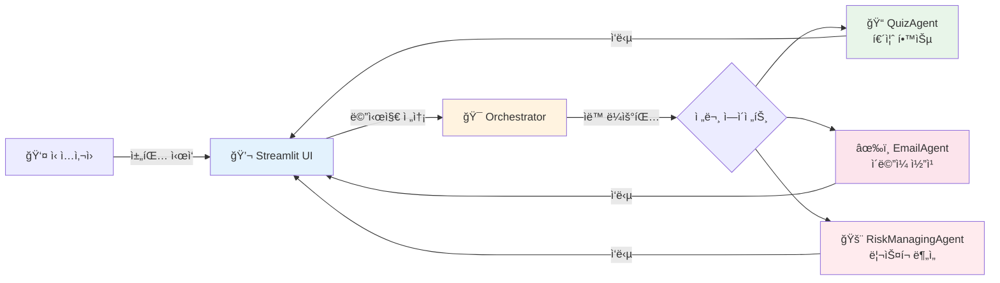
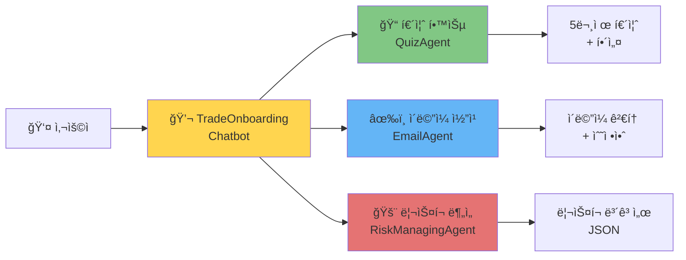
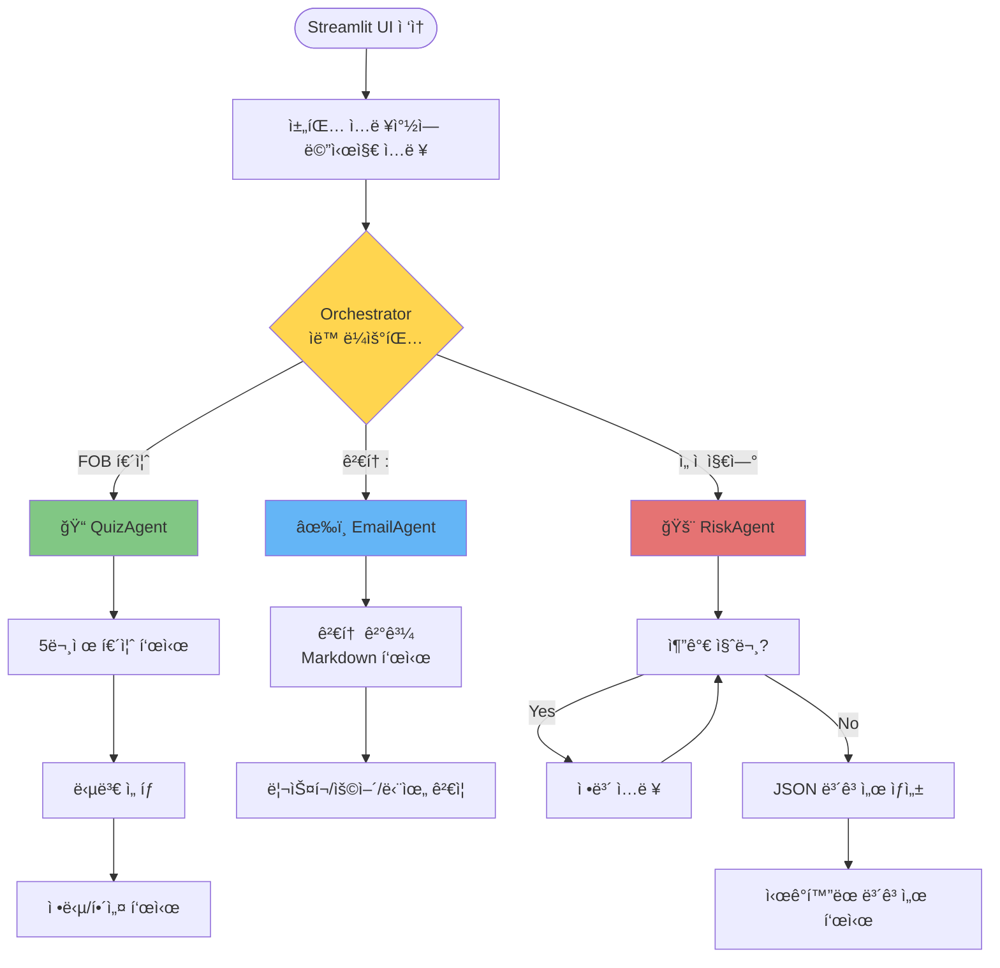

# 🚢 TradeOnboarding Chatbot

**채팅으로 ì‹œì‘하는 무역 실무 온보딩**

무역회사 ì‹ ì…사ì›ì„ 위한 AI 기반 대화형 온보딩 시뮬레ì´í„°

[](https://www.python.org/downloads/)
[](https://fastapi.tiangolo.com/)
[](https://streamlit.io/)

> ì´ ë¬¸ì„œëŠ” 사용ì/ìš´ì˜ììš© ê°€ì´ë“œì…니다. 개발ì 구현 규칙과 내부 아키í…처 ì‘ì—… ê¸°ì¤€ì€ `CLAUDE.md`를 기준으로 확ì¸í•˜ì„¸ìš”.

---

## 📋 목차

1. [프로ì íŠ¸ 소개](#-프로ì íŠ¸-소개)
2. [주요 기능](#-주요-기능)
3. [빠른 ì‹œì‘](#-빠른-ì‹œì‘)
4. [API ìƒíƒœ](#-api-ìƒíƒœ-2026-02-15-기준)
5. [사용 ê°€ì´ë“œ](#-사용-ê°€ì´ë“œ)
6. [기술 스íƒ](#-기술-스íƒ)
7. [프로ì íŠ¸ 구조](#-프로ì íŠ¸-구조)
8. [ë°ì´í„°ì…‹](#-ë°ì´í„°ì…‹)
9. [성능 지표](#-성능-지표)

---

## 🚢 프로ì íŠ¸ 소개

### 핵심 가치

**"실무는 êµê³¼ì„œê°€ ì•„ë‹ˆë¼ ëŒ€í™”ë¡œ 배운다"**

TradeOnboarding Chatbotì€ ë¬´ì—­íšŒì‚¬ ì‹ ì…사ì›ì´ **채팅 대화**를 통해 실무 ê°ê°ì„ ìµíˆëŠ” AI 온보딩 시뮬레ì´í„°ì…니다.
3ê°œì˜ ì „ë¬¸ AI ì—ì´ì „트가 퀴즈, ì´ë©”ì¼ ì½”ì¹­, ë¦¬ìŠ¤í¬ ë¶„ì„ì„ ì‹¤ì‹œê°„ 대화로 코칭합니다.

### 주요 특징

ğŸ—¨ï¸ **대화형 ì¸í„°í˜ì´ìŠ¤**
- Streamlit 채팅 UIë¡œ ì연스러운 학습 경험
- 멀티턴 대화 지ì›ìœ¼ë¡œ 심층 코칭 가능
- 실시간 피드백과 êµ¬ì¡°í™”ëœ ë³´ê³ ì„œ 제공

🤖 **3ê°œ 전문 ì—ì´ì „트**
- QuizAgent: RAG 기반 퀴즈 ìë™ ìƒì„± + 품질 ê²€ì¦
- EmailAgent: ì´ë©”ì¼ ì´ˆì•ˆ ì‘성 + 무역 ìš©ì–´/단위 ê²€ì¦
- RiskManagingAgent: 멀티턴 ë¦¬ìŠ¤í¬ ë¶„ì„ + JSON ë³´ê³ ì„œ

📚 **ë°ì´í„° 규모 기준(2026-02-15)**
- source files: 17개 JSON
- raw records: 813개
- ingestable records: 782개 (`content` 기반 ingest 기준)
- ICC 무역용어집 284개
- 화성ìƒê³µíšŒì˜ì†Œ 용어사전 169ê°œ
- 실무 ì´ë©”ì¼/실수 사례/í´ë ˆì„ 사례 등

🯠**실전 시뮬레ì´ì…˜**
- 실제 무역 업무 시나리오 기반 훈련
- RAG 기반 정확한 ë„ë©”ì¸ ì§€ì‹ ì œê³µ
- LLM 기반 ìì—°ì–´ ì´í•´ ë° ìƒì„±

### 시스템 개요



---

## ✨ 주요 기능

### 기능 개요



### ì—ì´ì „트별 ìƒì„¸ 기능

| ì—ì´ì „트 | 주요 기능 | 사용 시나리오 | ì…ë ¥ 예시 | 출력 í˜•ì‹ |
|---------|----------|--------------|----------|----------|
| 📠**QuizAgent** | RAG 기반 퀴즈 ìƒì„±<br/>+ EvalTool 품질 ê²€ì¦ | 무역 ìš©ì–´/프로세스 학습 | "FOB 관련 퀴즈 풀고 싶어요" | JSON (5문제) |
| âœ‰ï¸ **EmailAgent** | Draft/Review 모드<br/>+ 무역 ìš©ì–´/단위 ê²€ì¦ | ì´ë©”ì¼ ì‘성 코칭 | "검토: We will ship via FOV..." | Markdown |
| 🚨 **RiskManagingAgent** | 멀티턴 ë¦¬ìŠ¤í¬ ë¶„ì„<br/>+ êµ¬ì¡°í™”ëœ ë³´ê³ ì„œ | 업무 ë¦¬ìŠ¤í¬ ìƒí™© ëŒ€ì‘ | "ì„ ì ì´ ì§€ì—°ë  ê²ƒ 같아요" | JSON Report |

---

### 📠QuizAgent - 퀴즈 학습

**핵심 기능**:
- ✅ RAG 검색으로 실제 무역 ìš©ì–´ 기반 퀴즈 ìƒì„±
- ✅ EvalToolì´ 5항목 품질 ê²€ì¦ (문제/정답/오답/ì¸ë±ìŠ¤/해설)
- ✅ ì¬ì‹œë„ + 대체 ìƒì„± 루프로 고품질 ë³´ì¥
- ✅ ICC 무역용어집 284개 활용

**ë‚œì´ë„ ì¡°ì ˆ**:
- `easy`: 용어→설명 위주
- `medium`: ë‘ ìœ í˜• 혼합
- `hard`: 설명→용어 위주

**예시**:
```
👤: "ì¸ì½”텀즈 퀴즈 쉬운 ë‚œì´ë„ë¡œ ì‹œì‘해줘"
🤖: [5문제 ìƒì„±]
    1. FOBë€ ë¬´ì—‡ì¸ê°€ìš”?
       a) 본선ì¸ë„ì¡°ê±´ ✅
       b) ìš´ì„í¬í•¨ì¡°ê±´
       c) ìš´ì„보험료í¬í•¨ì¡°ê±´
       d) 관세지급ì¸ë„ì¡°ê±´
```

**참고 문서**: [`docs/quiz_agent.md`](docs/quiz_agent.md) (327줄)

---

### âœ‰ï¸ EmailAgent - ì´ë©”ì¼ ì½”ì¹­

**Phase 6 신규 기능**:
- 🆕 **무역 ìš©ì–´ ê²€ì¦** (TradeTermValidator): FOB/CIF/L/C 등 정확성 ê²€ì¦
- 🆕 **단위 ê²€ì¦** (UnitValidator): MT/CBM/TEU ì¼ê´€ì„± ê²€ì¦
- 🆕 **ChromaDB 용어 사전**: ingestable records 782개 기준

**모드**:
- **Draft Mode**: ìƒí™©ì— ë§ëŠ” ì´ë©”ì¼ ì´ˆì•ˆ ìë™ ìƒì„±
- **Review Mode**: ì´ë©”ì¼ ê²€í†  + ë¦¬ìŠ¤í¬ íƒì§€ + 톤 ë¶„ì„ + ìš©ì–´/단위 ê²€ì¦

**Review Mode 7개 서비스**:
1. **RiskDetector**: Incoterms 오류, ê²°ì œ ì¡°ê±´ ëˆ„ë½ íƒì§€
2. **ToneAnalyzer**: 톤 ë¶„ì„ (professional/casual/formal)
3. **TradeTermValidator**: 무역 ìš©ì–´ 정확성 ê²€ì¦
4. **UnitValidator**: 단위 ì¼ê´€ì„± ê²€ì¦
5. **ResponseFormatter**: 마í¬ë‹¤ìš´ ì‘답 í¬ë§·íŒ…

**예시 출력**:
```markdown
### 🚨 ë°œê²¬ëœ ë¦¬ìŠ¤í¬ (3ê±´)
1. **[CRITICAL] incoterms_misuse**
   - 현ì¬: "FOV incoterms"
   - 권ì¥: FOB [지정 ì„ ì í•­] 사용

### 🔠무역 ìš©ì–´ ê²€ì¦
**⌠오류 발견**:
- FOV → FOB (정확ë„: 95%)

### 📠단위 ê²€ì¦
**âš ï¸ ë¶ˆì¼ì¹˜ 발견**:
- í˜¼ìš©ëœ ë¬´ê²Œ 단위: 20ton, 20000kg
- 제안: 20 MT (20,000 kg)
```

**참고 문서**: [`docs/email_agent.md`](docs/email_agent.md) (816줄)

---

### 🚨 RiskManagingAgent - ë¦¬ìŠ¤í¬ ë¶„ì„

**핵심 특징**:
- 🔄 **멀티턴 대화**: ì •ë³´ 부족 ì‹œ 추가 질문으로 완전한 분ì„
- 📊 **5단계 처리**: 초기 검토 → 대화 관리 → RAG 검색 → ë¦¬ìŠ¤í¬ í‰ê°€ → ë³´ê³ ì„œ ìƒì„±
- 🯠**êµ¬ì¡°í™”ëœ ë³´ê³ ì„œ**: JSON í˜•ì‹ RiskReport (ì†ì‹¤ 시뮬레ì´ì…˜, 예방 ì „ëµ)

**워í¬í”Œë¡œìš°**:
1. 트리거 ê°ì§€ (ë¦¬ìŠ¤í¬ ê´€ë ¨ 키워드/유사성)
2. ConversationManagerê°€ ì •ë³´ 충분성 íŒë‹¨
3. 불충분 ì‹œ → 추가 질문 (멀티턴 계ì†)
4. 충분 ì‹œ → RAG 검색 → ë¦¬ìŠ¤í¬ í‰ê°€ → ë³´ê³ ì„œ ìƒì„±

**보고서 구조**:
```json
{
  "analysis_id": "...",
  "risk_factors": {
    "ì¬ì •ì  ì†ì‹¤": {"score": 16, "risk_level": "critical"},
    "ìƒì‚° 차질": {"score": 20, "risk_level": "critical"}
  },
  "prevention_strategy": {
    "short_term": "긴급 대체 운송 검토...",
    "long_term": "복수 공급업체 확보..."
  }
}
```

**참고 문서**: [`docs/riskmanaging_workflow.md`](docs/riskmanaging_workflow.md) (110줄)

---

## 🚀 빠른 ì‹œì‘

### 전제 조건

- **Python 3.11+**
- **uv** (빠른 Python 패키지 매니저)
- **Upstage API Key** ([ê°€ì…하기](https://www.upstage.ai/))
- LangSmith API Key (ì„ íƒì‚¬í•­, 트레ì´ì‹±ìš©)

### 설치 (5분 ì´ë‚´)

#### 1ï¸âƒ£ uv 패키지 매니저 설치

**macOS/Linux**:
```bash
curl -LsSf https://astral.sh/uv/install.sh | sh
```

**Windows**:
```powershell
powershell -c "irm https://astral.sh/uv/install.ps1 | iex"
```

**설치 확ì¸**:
```bash
uv --version
```

#### 2ï¸âƒ£ 프로ì íŠ¸ í´ë¡  ë° ì˜ì¡´ì„± 설치

```bash
# ì €ì¥ì†Œ í´ë¡ 
git clone <repository-url>
cd trade-onboarding-agent

# ì˜ì¡´ì„± 설치 (.venv ìë™ ìƒì„±)
uv sync
```

#### 3ï¸âƒ£ 환경 변수 설정

```bash
# .env íŒŒì¼ ìƒì„±
cp .env.example .env

# .env íŒŒì¼ í¸ì§‘
# UPSTAGE_API_KEY=your_actual_api_key_here
```

**.env íŒŒì¼ ì˜ˆì‹œ**:
```env
# 필수
UPSTAGE_API_KEY=your_upstage_api_key

# ì„ íƒ (LangSmith 트레ì´ì‹±)
LANGSMITH_API_KEY=your_langsmith_api_key
LANGSMITH_PROJECT=trade-onboarding
LANGSMITH_TRACING=true

# ì„ íƒ (디버깅)
DEBUG=true
```

### 실행 (2ê°œ 터미ë„)

#### í„°ë¯¸ë„ 1: 백엔드 (FastAPI)

```bash
uv run uvicorn backend.main:app --reload
```

✅ 서버 실행 확ì¸:
- API: http://localhost:8000
- Swagger UI: http://localhost:8000/docs
- ReDoc: http://localhost:8000/redoc

#### í„°ë¯¸ë„ 2: 프론트엔드 (Streamlit)

```bash
uv run streamlit run frontend/app.py
```

✅ UI 실행 확ì¸:
- Streamlit UI: http://localhost:8501

### 첫 사용

1. **Streamlit UI ì ‘ì†**: http://localhost:8501
2. **메시지 ì…ë ¥**: "FOB 관련 퀴즈 풀고 싶어요"
3. **ì—ì´ì „트 ìë™ ë¼ìš°íŒ…**: Orchestratorê°€ QuizAgentë¡œ ë¼ìš°íŒ…
4. **ì‘답 확ì¸**: 5문제 퀴즈 ìƒì„± ë° í‘œì‹œ

---

## 🔌 API ìƒíƒœ (2026-02-15 기준)

| 엔드í¬ì¸íŠ¸ | 메서드 | ìƒíƒœ | í˜„ì¬ ë™ì‘ | 비고 |
|-----------|--------|------|-----------|------|
| `/api/chat` | POST | `GA` | Orchestrator ë¼ìš°íŒ… 기반 ì‘답 | 기본 진ì…ì  |
| `/api/quiz/start` | POST | `Planned` | TODO placeholder ì‘답 반환 | `backend/api/routes.py`ì˜ TODO 구현 í•„ìš” |
| `/api/quiz/answer` | POST | `Planned` | TODO placeholder ì‘답 반환 | `backend/api/routes.py`ì˜ TODO 구현 í•„ìš” |

`Planned` API는 ë¬¸ì„œìƒ ì˜ˆì • 스í™ì´ë©°, í˜„ì¬ í”„ë¡œë•ì…˜/ë°ëª¨ 경로는 `/api/chat`만 ê²€ì¦ ì™„ë£Œ ìƒíƒœì…니다.

---

## 📖 사용 ê°€ì´ë“œ

### 채팅 ì¸í„°í˜ì´ìŠ¤ 사용법



### 예시 대화 시나리오

---

#### 시나리오 1: 퀴즈 학습

**목ì **: 무역 ìš©ì–´ 학습

```
👤: "FOB 관련 퀴즈 풀고 싶어요"

🤖: [QuizAgent 실행]
    ë‹¤ìŒ í€´ì¦ˆë¥¼ 풀어보세요:

    1. FOBë€ ë¬´ì—‡ì¸ê°€ìš”?
       0) 본선ì¸ë„ì¡°ê±´
       1) ìš´ì„í¬í•¨ì¡°ê±´
       2) ìš´ì„보험료í¬í•¨ì¡°ê±´
       3) 관세지급ì¸ë„ì¡°ê±´

    2. CIFì— í¬í•¨ë˜ëŠ” 비용ì€?
       0) ìš´ì„ + 보험료
       1) ìš´ì„만
       2) 보험료만
       3) 관세

👤: "0번"

🤖: ✅ 정답ì…니다!

    **해설**:
    FOB(Free On Board)는 수출ìê°€ 지정 ì„ ì í•­ì—ì„œ
    ë¬¼í’ˆì„ ë³¸ì„ ì— ì¸ë„í•  ë•Œê¹Œì§€ì˜ ì±…ì„ì„ ì§€ëŠ” ì¡°ê±´ì…니다.
    ì´í›„ ìš´ì„ê³¼ 보험료는 수ì…ìê°€ 부담합니다.
```

---

#### 시나리오 2: ì´ë©”ì¼ ê²€í† 

**목ì **: ì´ë©”ì¼ ì‘성 실수 방지

```
👤: "검토: We will ship via FOV incoterms. Total quantity: 20ton and 20000kg."

🤖: [EmailAgent 실행]

    ### 🚨 ë°œê²¬ëœ ë¦¬ìŠ¤í¬ (3ê±´)

    1. **[CRITICAL] incoterms_misuse**
       - 현ì¬: "FOV incoterms"
       - 리스í¬: ì¡´ì¬í•˜ì§€ 않는 ì¸ì½”텀즈, 계약 오류 가능성
       - 권ì¥: FOB [지정 ì„ ì í•­] 사용

    2. **[CRITICAL] quantity_discrepancy**
       - 현ì¬: "20ton and 20000kg"
       - 리스í¬: 단위 í˜¼ë™ ê°€ëŠ¥ì„±
       - 권ì¥: ë‹¨ì¼ ë‹¨ìœ„ë¡œ 통ì¼

    ### 🔠무역 ìš©ì–´ ê²€ì¦

    **⌠오류 발견**:
    - FOV → FOB (정확ë„: 95%)
      - 문맥: ship via FOV incoterms
      - 설명: Free On Board - 본선 ì¸ë„ ì¡°ê±´

    **✅ 올바른 용어**:
    - CBM: Cubic Meter

    ### 📠단위 ê²€ì¦

    **âš ï¸ ë¶ˆì¼ì¹˜ 발견**:
    - í˜¼ìš©ëœ ë¬´ê²Œ 단위 (tonê³¼ kg): 20ton, 20000kg
    - 제안: ì¼ê´€ëœ 단위 사용 ê¶Œì¥ (MT 선호)

    **✅ 표준화 제안**: 20 MT (20,000 kg)

    ### 📠수정안

    Dear [Buyer's Name],

    We are pleased to confirm shipment details:

    - Product: [Specify]
    - Quantity: 20 metric tons (20,000 kg)
    - Incoterms: FOB [Port Name] Incoterms® 2020

    Best regards,
    [Your Name]
```

---

#### 시나리오 3: ë¦¬ìŠ¤í¬ ë¶„ì„ (멀티턴)

**목ì **: 업무 ë¦¬ìŠ¤í¬ ìƒí™© ëŒ€ì‘ í›ˆë ¨

**í„´ 1**:
```
👤: "해외 공급업체로부터 ì„ ì ì´ ì§€ì—°ë  ê²ƒ 같다고 통보받았습니다."

🤖: [RiskManagingAgent 실행 - 정보 수집 모드]

    ë¦¬ìŠ¤í¬ ë¶„ì„ì„ ìœ„í•´ 추가 ì •ë³´ê°€ 필요합니다:

    1. ì–´ë–¤ 계약 ê±´ì¸ì§€ 알려주세요 (계약 ìƒëŒ€, 금액)
    2. ê³„ì•½ì„œìƒ í˜ë„í‹° ì¡°í•­ì´ ìˆëŠ”지 확ì¸í•´ì£¼ì„¸ìš”
    3. 지연으로 ì¸í•´ 예ìƒë˜ëŠ” 구체ì ì¸ ì˜í–¥ì„ 알려주세요
```

**í„´ 2**:
```
👤: "Aì‚¬ì™€ì˜ 10만 달러 규모 계약ì´ê³ , 5ì¼ ì´ìƒ 지연 ì‹œ ì¼ë‹¹ 1%ì˜ í˜ë„í‹°ê°€ ìˆìŠµë‹ˆë‹¤.
     ì €í¬ ìƒì‚° ë¼ì¸ë„ 멈출 수 ìˆìŠµë‹ˆë‹¤."

🤖: [RiskManagingAgent 실행 - ë³´ê³ ì„œ ìƒì„±]

    ### ğŸ›¡ï¸ ë¦¬ìŠ¤í¬ ë¶„ì„ ë³´ê³ ì„œ

    **종합 ë¦¬ìŠ¤í¬ ë ˆë²¨**: CRITICAL (ì ìˆ˜: 18.7)

    #### 📊 ë¦¬ìŠ¤í¬ ìš”ì•½
    해외 공급업체 ì„ ì  ì§€ì—°ìœ¼ë¡œ ì¸í•´ ì¬ì •ì  ì†ì‹¤, ìƒì‚° ì¼ì • 지연,
    ìƒì‚° 차질 등 심ê°í•œ ë³µí•©ì  ë¦¬ìŠ¤í¬ê°€ 예ìƒë©ë‹ˆë‹¤.

    #### âš ï¸ ì£¼ìš” ë¦¬ìŠ¤í¬ ìš”ì¸ ë¶„ì„

    **ì¬ì •ì  ì†ì‹¤** (ì˜í–¥: 4, ë°œìƒ ê°€ëŠ¥ì„±: 4, ì ìˆ˜: 16)
    - 5ì¼ ì´ˆê³¼ 지연 ì‹œ 계약 ê¸ˆì•¡ì˜ 5% (5,000달러) í˜ë„í‹° ë°œìƒ

    **ìƒì‚° 차질** (ì˜í–¥: 5, ë°œìƒ ê°€ëŠ¥ì„±: 4, ì ìˆ˜: 20)
    - ìƒì‚° ë¼ì¸ 중단으로 제조 ë° íŒë§¤ ì¼ì • 차질
    - ê³ ê°ì‚¬ ì‹ ë¢°ë„ í•˜ë½ ë° ê¸°íšŒë¹„ìš© ì†ì‹¤

    #### ✅ 제안하는 조치

    **단기 ì „ëµ**:
    - 공급업체와 긴급 í˜‘ìƒ (지연 사유 ë° í™•ì • 납기 확ì¸)
    - 대체 운송 수단 (í•­ê³µ 운송) 긴급 검토 ë° ë¹„ìš© ì‚°ì •
    - 내부 ìƒì‚° ì¼ì • ì¡°ì • ë° ê´€ë ¨ 부서 공지

    **ì¥ê¸° ì „ëµ**:
    - ë³µìˆ˜ì˜ ê³µê¸‰ì—…ì²´ 확보 ë° ë¶„ì‚° ì •ì±… 시행
    - 계약 ì‹œ 강력한 í˜ë„í‹° ì¡°í•­ 명시 ë° ì„ ê¸‰ê¸ˆ ì¡°ê±´ ê°•í™”
    - ê³µê¸‰ë§ ë¦¬ìŠ¤í¬ ê´€ë¦¬ 시스템 구축 ë° ì •ê¸° í‰ê°€

    #### 🔠유사 사례 ë° ê·¼ê±° ì료
    - 2023ë…„ B사 ì„ ì  ì§€ì—° 사례: ìƒì‚° ë¼ì¸ 5ì¼ ì¤‘ë‹¨, 5만 달러 ì†ì‹¤
    - 해외 계약 지연 í˜ë„í‹° ì ìš© ê°€ì´ë“œë¼ì¸
```

---

## 🔧 기술 스íƒ

### 기술 ìŠ¤íƒ ì•„í‚¤í…처


### ë ˆì´ì–´ë³„ 기술 스íƒ

| ë ˆì´ì–´ | 기술 | 버전 | ì—­í•  |
|--------|------|------|------|
| **패키지 관리** | uv | latest | 빠른 Python 패키지 매니저 |
| **프론트엔드** | Streamlit | 1.28+ | 채팅 UI ë° ëŒ€í™” ì¸í„°í˜ì´ìŠ¤ |
| **백엔드 API** | FastAPI | 0.104+ | RESTful API 서버 |
| **언어** | Python | 3.11+ | 주 개발 언어 |
| **LLM** | Upstage Solar API | solar-pro2 | ìì—°ì–´ ì´í•´ ë° ìƒì„± |
| **ì„베딩** | Upstage Solar Embedding | solar-embedding-1-large | 문서 벡터화 (1024ì°¨ì›) |
| **벡터 스토어** | ChromaDB | latest | RAG 문서 검색 (ì˜êµ¬ ì €ì¥) |
| **ì—ì´ì „트** | LangChain | latest | 멀티 ì—ì´ì „트 프레ì„ì›Œí¬ |
| **트레ì´ì‹±** | LangSmith | (ì„ íƒ) | ì—ì´ì „트 실행 디버깅 |

### Hexagonal Architecture

**í¬íŠ¸ (Ports)** - ì¶”ìƒ ì¸í„°í˜ì´ìŠ¤:
- `backend/ports/llm_gateway.py`: LLM 호출 추ìƒí™”
- `backend/ports/document_retriever.py`: 벡터 검색 추ìƒí™”

**어댑터 (Adapters)** - 구현체:
- `backend/infrastructure/upstage_llm.py`: Upstage Solar API 구현 + ì¬ì‹œë„ ë¡œì§
- `backend/infrastructure/chroma_retriever.py`: ChromaDB 구현 + í•„í„°ë§

**ì¥ì **:
- 새 LLM 프로바ì´ë” 추가 ì‹œ 어댑터만 êµì²´
- 비즈니스 ë¡œì§ê³¼ ì¸í”„ë¼ ë¶„ë¦¬
- 테스트 ì‹œ í¬íŠ¸ ì¸í„°í˜ì´ìŠ¤ 모킹 ìš©ì´

---

## 📠프로ì íŠ¸ 구조

### 디렉토리 구조

```
trade-onboarding-agent/
├── backend/                          # 백엔드 ë¡œì§
│   ├── main.py                      # FastAPI 앱 진ì…ì 
│   ├── config.py                    # 환경 설정 (Pydantic)
│   │
│   ├── agents/                      # ì—ì´ì „트 구현
│   │   ├── orchestrator.py         # 중앙 ë¼ìš°íŒ… + 세션 관리 (400줄)
│   │   ├── quiz_agent.py           # 퀴즈 ìƒì„± + ì±„ì  (231줄)
│   │   │
│   │   ├── email/                  # EmailAgent 모듈 (7개 서비스)
│   │   │   ├── email_agent.py     # Facade (163줄)
│   │   │   ├── draft_service.py   # 초안 ìƒì„±
│   │   │   ├── review_service.py  # 검토 ì´ê´„
│   │   │   ├── risk_detector.py   # ë¦¬ìŠ¤í¬ íƒì§€
│   │   │   ├── tone_analyzer.py   # 톤 분ì„
│   │   │   ├── trade_term_validator.py  # 무역 ìš©ì–´ ê²€ì¦ ğŸ†•
│   │   │   └── unit_validator.py  # 단위 ê²€ì¦ ğŸ†•
│   │   │
│   │   └── riskmanaging/           # RiskManagingAgent 모듈 (5개 서비스)
│   │       ├── riskmanaging_agent.py  # ë©”ì¸ ì—ì´ì „트
│   │       ├── conversation_manager.py  # 대화 관리
│   │       ├── rag_connector.py   # RAG 검색
│   │       ├── risk_engine.py     # ë¦¬ìŠ¤í¬ í‰ê°€
│   │       └── report_generator.py  # ë³´ê³ ì„œ ìƒì„±
│   │
│   ├── rag/                        # RAG 시스템
│   │   ├── ingest.py              # ë°ì´í„° ì„베딩 스í¬ë¦½íŠ¸
│   │   ├── retriever.py           # 벡터 검색 ì¸í„°í˜ì´ìŠ¤
│   │   ├── embedder.py            # ì„베딩 ìƒì„±
│   │   └── schema.py              # 메타ë°ì´í„° 스키마
│   │
│   ├── ports/                      # ì¶”ìƒ ì¸í„°í˜ì´ìŠ¤ (Hexagonal)
│   │   ├── llm_gateway.py         # LLM í¬íŠ¸
│   │   └── document_retriever.py  # 검색 í¬íŠ¸
│   │
│   ├── infrastructure/             # 구현체 (Adapters)
│   │   ├── upstage_llm.py         # Upstage LLM 어댑터
│   │   └── chroma_retriever.py    # ChromaDB 어댑터
│   │
│   ├── prompts/                    # LLM 프롬프트 템플릿
│   │   ├── orchestrator_intent_prompt.txt  # ì¸í…트 분류
│   │   ├── quiz_prompt.txt        # 퀴즈 ìƒì„±
│   │   ├── eval_prompt.txt        # 퀴즈 ê²€ì¦
│   │   └── riskmanaging_prompt.txt  # ë¦¬ìŠ¤í¬ ë¶„ì„
│   │
│   ├── api/                        # FastAPI 엔드í¬ì¸íŠ¸
│   │   └── routes.py              # API ë¼ìš°íŠ¸ (69줄)
│   │
│   └── vectorstore/                # ChromaDB ì €ì¥ì†Œ (gitignore)
│       └── chroma.sqlite3         # 벡터 DB 파ì¼
│
├── frontend/                        # Streamlit UI
│   └── app.py                      # 채팅 ì¸í„°í˜ì´ìŠ¤ (397줄)
│
├── dataset/                         # ì›ë³¸ ë°ì´í„°ì…‹ (JSON)
│   ├── icc_trade_terms.json       # ICC 무역용어집 284 records
│   ├── trade_dictionary_full.json  # 화성ìƒê³µíšŒì˜ì†Œ ìš©ì–´ 169ê°œ
│   ├── mistakes.json              # 실수 사례 40 records
│   ├── emails.json                # ì´ë©”ì¼ í…œí”Œë¦¿ 40 records
│   ├── claims.json                # í´ë ˆì„ 사례 20ê°œ
│   ├── country_rules.json         # 국가별 규정 20개
│   └── ...                        # 기타 280 raw records
│
├── docs/                            # ìƒì„¸ 워í¬í”Œë¡œìš° 문서
│   ├── quiz_agent.md              # QuizAgent ìƒì„¸ (327줄)
│   ├── email_agent.md             # EmailAgent ìƒì„¸ (816줄)
│   ├── riskmanaging_workflow.md   # RiskAgent 플로우 (110줄)
│   └── riskmanaging_agent_REPORT.md  # ë¬¸ì œì  ë¶„ì„ (143줄)
│
├── tests/                           # 테스트 코드
│   ├── test_orchestrator.py       # Orchestrator 테스트
│   ├── test_intent_classifier.py  # ì¸í…트 분류 테스트
│   └── test_e2e_orchestrator.py   # 엔드투엔드 테스트
│
├── pyproject.toml                   # uv 프로ì íŠ¸ 설정
├── uv.lock                         # ì˜ì¡´ì„± ë½ íŒŒì¼
├── .env.example                    # 환경 변수 예시
└── README.md                       # ì´ ë¬¸ì„œ
```

### 주요 íŒŒì¼ ì„¤ëª…

| íŒŒì¼ | ë¼ì¸ 수 | 설명 |
|------|--------|------|
| `backend/agents/orchestrator.py` | 400줄 | 중앙 ë¼ìš°íŒ…, LLM ì¸í…트 분류, 세션 관리 |
| `frontend/app.py` | 397줄 | Streamlit 채팅 UI, 메시지 표시, ë³´ê³ ì„œ ì‹œê°í™” |
| `backend/agents/quiz_agent.py` | 231줄 | RAG 기반 퀴즈 ìƒì„±, EvalTool 품질 ê²€ì¦ |
| `backend/agents/email/email_agent.py` | 163줄 | EmailAgent Facade, Draft/Review ë¼ìš°íŒ… |

---

## 📚 ë°ì´í„°ì…‹

### ë°ì´í„° 파ì´í”„ë¼ì¸

```mermaid
flowchart LR
    A[📠dataset/*.json<br/>17 files / 813 raw<br/>782 ingestable] --> B[🔧 ingest.py<br/>Upstage Embedding]
    B --> C[(ğŸ—ƒï¸ ChromaDB<br/>backend/vectorstore/)]
    C --> D[🔠retriever.py<br/>search()]
    D --> E1[📠QuizAgent<br/>k=10]
    D --> E2[âœ‰ï¸ EmailAgent<br/>k=5]
    D --> E3[🚨 RiskAgent<br/>k=5]

    style A fill:#FFF9C4
    style C fill:#E8F5E9
    style D fill:#BBDEFB
```

### ë°ì´í„° 규모 기준 (2026-02-15)

| 지표 | ê°’ | ì •ì˜ |
|------|----|------|
| `source_files` | 17 | `dataset/*.json` íŒŒì¼ ìˆ˜ |
| `raw_records` | 813 | JSON ë°°ì—´ ì›ì†Œ ì´í•© |
| `ingestable_records` | 782 | `content`ê°€ 비어ìˆì§€ ì•Šì€ ingest ëŒ€ìƒ ë ˆì½”ë“œ 수 |

### 주요 ë°ì´í„°ì…‹ 현황 (raw records)

| ë°ì´í„°ì…‹ | raw records | document_type | 주요 ìš©ë„ |
|---------|-------------|---------------|----------|
| **icc_trade_terms.json** | 284 | trade_terminology | 무역 ìš©ì–´ 퀴즈 + ê²€ì¦ |
| **trade_dictionary_full.json** | 169 | trade_terminology | 무역 ìš©ì–´ ê²€ì¦ |
| **mistakes.json** | 40 | common_mistake | ì´ë©”ì¼ ë¦¬ìŠ¤í¬ íƒì§€ |
| **emails.json** | 40 | email | ì´ë©”ì¼ í†¤/ì‘성 사례 |
| **기타 13ê°œ 파ì¼** | 280 | 다양 | 리스í¬/규정/협ìƒ/QA 참고 |
| **ì´í•©** | **813** | - | - |

### 메타ë°ì´í„° 구조

모든 문서는 ì •ê·œí™”ëœ ë©”íƒ€ë°ì´í„°ë¥¼ 가집니다:

```python
{
    "document": "FOB (Free On Board)는 본선ì¸ë„ì¡°ê±´...",
    "metadata": {
        "source_dataset": "icc_trade_terms.json",
        "document_type": "trade_terminology",
        "category": "Incoterms",
        "priority": "high",
        "level": "basic",
        "topic": ["shipping", "incoterms"],
        "situation": "contract"
    }
}
```

### RAG 검색 예시

**기본 검색**:
```python
from backend.rag.retriever import search

results = search(query="FOBë€ ë¬´ì—‡ì¸ê°€?", k=5)
# ìƒìœ„ 5ê°œ 유사 문서 반환
```

**í•„í„°ë§ ê²€ìƒ‰**:
```python
from backend.rag.retriever import search_with_filter

results = search_with_filter(
    query="FOB",
    k=3,
    document_type="trade_terminology",
    category="Incoterms"
)
# Incoterms 카테고리만 검색
```

### ë°ì´í„° ì„베딩

**ìë™ ì„베딩** (첫 실행 ì‹œ):
```bash
# .env 파ì¼
AUTO_INGEST_ON_STARTUP=true
```

**ìˆ˜ë™ ì„베딩**:
```bash
# ì „ì²´ ì¬ì„베딩
uv run python backend/rag/ingest.py --reset

# ì¦ë¶„ ì„베딩
uv run python backend/rag/ingest.py
```

**ì„베딩 ì •ë³´**:
- **모ë¸**: Upstage Solar Embedding (`solar-embedding-1-large`)
- **ì°¨ì›**: 1024
- **소스 íŒŒì¼ ìˆ˜**: 17ê°œ
- **Raw Records**: 813개
- **Ingestable Records**: 782개
- **í‰ê·  ì„베딩 시간**: ~5분 (첫 실행)

---

## ğŸ› ï¸ ê°œë°œ 명령어

### 패키지 관리

```bash
# 패키지 추가
uv add <package-name>

# 개발 ì˜ì¡´ì„± 추가
uv add --dev <package-name>

# ì˜ì¡´ì„± ì—…ë°ì´íŠ¸
uv sync
```

### 테스트

```bash
# 전체 테스트
uv run pytest

# 특정 íŒŒì¼ í…ŒìŠ¤íŠ¸
uv run pytest tests/test_orchestrator.py

# ìƒì„¸ 출력
uv run pytest -v
```

### 코드 품질

```bash
# í¬ë§·íŒ…
uv run black backend/ frontend/

# 린팅
uv run ruff check backend/ frontend/
```

---

## 📊 성능 지표

> ì•„ë˜ ìˆ˜ì¹˜ì˜ ìƒíƒœëŠ” `예ìƒì¹˜`ì…니다. ì¬í˜„ 가능한 ê³µì‹ ìˆ˜ì¹˜ë¡œ 확정하려면 측정 ìë™í™” 실행 결과를 함께 기ë¡í•´ì•¼ 합니다.

### ì‘답 시간

| ì—ì´ì „트 | 기준 ê°’ | ìƒíƒœ | ì¸¡ì •ì¼ | 환경 | 샘플 수 | 측정 방법 | ì¬í˜„ 명령 |
|---------|--------|------|--------|------|---------|-----------|-----------|
| QuizAgent | 약 8ì´ˆ | 예ìƒì¹˜ | ë¯¸ê¸°ë¡ | 로컬 개발 환경 | ë¯¸ê¸°ë¡ | ìˆ˜ë™ ê´€ì°° | `uv run pytest tests/test_orchestrator_performance.py -v` |
| EmailAgent | 약 15ì´ˆ | 예ìƒì¹˜ | ë¯¸ê¸°ë¡ | 로컬 개발 환경 | ë¯¸ê¸°ë¡ | ìˆ˜ë™ ê´€ì°° | `uv run pytest tests/test_orchestrator_performance.py -v` |
| RiskManagingAgent | 약 20ì´ˆ | 예ìƒì¹˜ | ë¯¸ê¸°ë¡ | 로컬 개발 환경 | ë¯¸ê¸°ë¡ | ìˆ˜ë™ ê´€ì°° | `uv run pytest tests/test_orchestrator_performance.py -v` |

### 정확ë„

| ê²€ì¦ í•­ëª© | 기준 ê°’ | ìƒíƒœ | ì¸¡ì •ì¼ | 환경 | 샘플 수 | 측정 방법 | ì¬í˜„ 명령 |
|----------|--------|------|--------|------|---------|-----------|-----------|
| 퀴즈 품질 (EvalTool) | 약 90% | 예ìƒì¹˜ | ë¯¸ê¸°ë¡ | 로컬 개발 환경 | ë¯¸ê¸°ë¡ | 내부 ìˆ˜ë™ í‰ê°€ | í‰ê°€ 스í¬ë¦½íŠ¸ 미구축 |
| 무역 ìš©ì–´ ê²€ì¦ | 약 90% | 예ìƒì¹˜ | ë¯¸ê¸°ë¡ | 로컬 개발 환경 | ë¯¸ê¸°ë¡ | 내부 ìˆ˜ë™ í‰ê°€ | í‰ê°€ 스í¬ë¦½íŠ¸ 미구축 |
| 단위 ê²€ì¦ | 약 95% | 예ìƒì¹˜ | ë¯¸ê¸°ë¡ | 로컬 개발 환경 | ë¯¸ê¸°ë¡ | 규칙 기반 ìˆ˜ë™ ì ê²€ | í‰ê°€ 스í¬ë¦½íŠ¸ 미구축 |
| ë¦¬ìŠ¤í¬ íƒì§€ | 약 85% | 예ìƒì¹˜ | ë¯¸ê¸°ë¡ | 로컬 개발 환경 | ë¯¸ê¸°ë¡ | 내부 ìˆ˜ë™ í‰ê°€ | í‰ê°€ 스í¬ë¦½íŠ¸ 미구축 |

---

## 🔧 트러블슈팅

### ì¼ë°˜ì ì¸ 문제

**⌠uv 명령어를 ì°¾ì„ ìˆ˜ ì—†ìŒ**:
```bash
# macOS/Linux
curl -LsSf https://astral.sh/uv/install.sh | sh
source ~/.bashrc  # ë˜ëŠ” ~/.zshrc

# Windows
powershell -c "irm https://astral.sh/uv/install.ps1 | iex"
```

**⌠Import 오류**:
```bash
# uv run 사용 확ì¸
uv run python backend/main.py
```

**⌠환경 변수 로드 실패**:
```bash
# .env íŒŒì¼ í™•ì¸
cat .env

# UPSTAGE_API_KEYê°€ 설정ë˜ì—ˆëŠ”지 확ì¸
```

**⌠ChromaDB 오류**:
```bash
# ì¬ì„베딩
uv run python backend/rag/ingest.py --reset
```

**⌠í¬íŠ¸ 충ëŒ**:
```bash
# 다른 í¬íŠ¸ 사용
uv run uvicorn backend.main:app --reload --port 8001
uv run streamlit run frontend/app.py --server.port 8502
```

---

## 📄 ë¼ì´ì„ ìŠ¤

MIT License

---

## 🙠Acknowledgments

- **Upstage**: Solar API ë° Embedding 제공
- **LangChain**: ì—ì´ì „트 프레ì„워í¬
- **FastAPI**: 고성능 백엔드 프레ì„워í¬
- **Streamlit**: 빠른 프론트엔드 프로토타ì´í•‘

---

## 📠Contact

ë¬¸ì˜ ì‚¬í•­ì€ GitHub Issuesë¡œ 남겨주세요.

---

**버전**: 2.0
**ì‘성ì¼**: 2026-02-15
**ëŒ€ìƒ ë…ì**: ì¼ë°˜ 개발ì ë° ì‚¬ìš©ì
**ì±—ë´‡ 정체성**: ✅ 타ì´í‹€ë¶€í„° ê°•ì¡°
