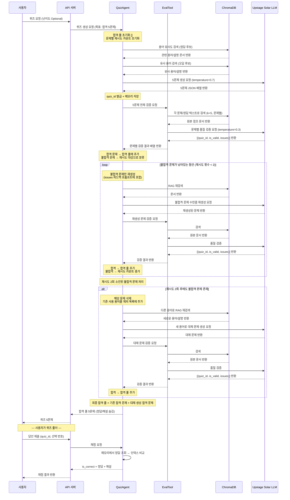

# Quiz Agent & Eval Agent 기획서

## 1. 프로젝트 개요

신입사원 무역 교육을 위해 RAG(검색 증강 생성) 기반으로 **용어 퀴즈를 자동 생성**하고, 생성된 퀴즈의 품질을 **Tool 기반 평가**로 검증하는 시스템입니다.

| 구성 요소 | 역할 |
|---------|------|
| **QuizAgent** | RAG 검색 기반으로 무역 용어 퀴즈(4지선다)를 생성하고 사용자 답안을 채점 |
| **EvalTool** | 생성된 퀴즈가 RAG 원본 데이터를 올바르게 반영했는지 품질 검증 |

**데이터 소스:** 크롤링 CSV + PDF → ChromaDB 벡터 DB 구축 → QuizAgent RAG 연결

**기술 스택:** FastAPI + ChromaDB(RAG) + Upstage Solar LLM + LangChain

---

## 2. QuizAgent — 용어 퀴즈 생성 및 채점

### 2.1 에이전트 페르소나

- **역할:** 무역 실무 용어 교육 전문 출제자
- **핵심 미션:** RAG로 검색한 실제 무역 용어 데이터를 기반으로, 혼동하기 쉬운 오답 선택지를 포함한 고품질 4지선다 용어 퀴즈를 출제

### 2.2 용어 퀴즈 유형

용어 퀴즈는 두 가지 방향으로 출제됩니다.

| 유형 | 문제(question) | 선택지(choices) | 예시 |
|-----|--------------|---------------|------|
| **용어 → 설명** | 무역 용어 | 해당 용어의 설명 4개 | 문제: "FOB란?" → 선택지: 용어 설명 4개 |
| **설명 → 용어** | 용어에 대한 설명 | 무역 용어 4개 | 문제: "본선 인도 조건으로 수출자가 선적항에서 화물을 선박에 적재할 때까지 비용을 부담하는 인코텀즈는?" → 선택지: FOB, CFR, CIF, EXW |

### 2.3 오답 선택지 생성 전략

오답 선택지는 단순 랜덤이 아닌, 정답과 유사한 선택지로 구성하여 난이도를 높입니다.

| 방법 | 설명 |
|-----|------|
| **RAG 기반** | ChromaDB에서 정답 용어와 유사한 다른 용어/설명을 검색하여 오답으로 채택 |
| **LLM 생성** | 정답 선택지를 바탕으로 LLM이 의미상 혼동될 수 있는 유사 선택지를 생성 |

> **고도화 포인트:** RAG로 검색한 유사 용어를 오답으로 사용할수록, 실제로 혼동하기 쉬운 용어끼리 비교하게 되어 학습 효과가 높아짐

### 2.4 핵심 기능

#### 기능 A: 퀴즈 생성 (generate)

| 항목 | 내용 |
|------|------|
| **Input** | `difficulty` (난이도, Optional) |
| **Output** | 5문제 배열 — 각 문제에 `quiz_id`, `question`, `choices`, `quiz_type`, `difficulty` 포함 |
| **RAG 검색** | ChromaDB에서 무역 용어 관련 문서 검색, 정답 기반 유사 용어 추가 검색 (오답 생성용) |
| **LLM** | Upstage Solar (temperature=0.7), 1회 호출로 5문제 JSON 배열 생성 |

#### 기능 B: 답안 채점 (evaluate)

| 항목 | 내용 |
|------|------|
| **Input** | `quiz_id`, `answer` (0~3 인덱스) |
| **Output** | `is_correct`, `correct_answer`, `correct_choice`, `explanation` |
| **RAG 검색** | 없음 (메모리 저장 데이터로 비교) |
| **LLM** | 없음 (단순 인덱스 비교) |

### 2.5 데이터 소스 및 RAG 구성

| 데이터 | 형식 | ChromaDB 활용 |
|--------|------|--------------|
| 크롤링 무역 용어 데이터 | CSV | 용어-설명 쌍으로 청킹 후 임베딩 |
| 무역 실무 문서 | PDF | 페이지 단위 청킹 후 임베딩 |

- 쿼리: 무역 용어 이름 또는 설명 텍스트
- 검색 방식: 유사도 기반 검색 (코사인 유사도)
- 정답 용어와 유사한 상위 N개 결과 → 오답 후보로 활용

### 2.6 난이도 조절

| difficulty | 출제 기준 |
|------------|----------|
| easy | 용어→설명 유형 위주, 오답 선택지가 정답과 의미상 거리가 먼 것 |
| medium | 설명→용어 유형 혼합, 오답 선택지가 유사 카테고리 용어 |
| hard | 설명→용어 유형 위주, RAG 기반 오답으로 혼동 극대화 |
| 미지정 | easy 2개 + medium 2개 + hard 1개 혼합 출제 |

### 2.7 출력 형식

```json
[
  {
    "question": "수출자가 선적항에서 본선에 화물을 적재하는 시점까지 모든 비용과 위험을 부담하는 인코텀즈 조건은?",
    "choices": ["FOB", "CIF", "DDP", "CFR"],
    "answer": 0,
    "explanation": "FOB(Free On Board)는 수출자가 지정 선적항에서 화물을 본선에 적재할 때까지 비용과 위험을 부담합니다.",
    "quiz_type": "설명→용어",
    "difficulty": "medium"
  }
]
```

---

## 3. EvalTool — 퀴즈 품질 검증

### 3.1 역할 변경: Agent → Tool

EvalAgent는 독립 에이전트가 아닌 **Tool**로 동작합니다.

- QuizAgent가 퀴즈 생성 후 내부적으로 호출하거나, 별도 API 엔드포인트로 호출
- 지표 점수 방식(3축 채점) 대신 **RAG 원본 데이터와의 일치 여부**를 LLM이 판단

### 3.2 품질 검증 항목

EvalTool은 생성된 퀴즈를 RAG 검색 결과와 대조하여 **문제별**로 아래 항목을 확인합니다.

| 검증 항목 | 내용 |
|----------|------|
| **문제(question)** | RAG 원본 데이터의 용어/설명을 올바르게 반영했는지 |
| **선택지(choices)** | 정답 선택지가 원본 데이터와 일치하는지 |
| **오답 선택지** | 임의 오답이 실제 존재하는 다른 용어나 설명 기반인지 (완전 허구 여부 확인) |
| **정답(answer)** | 정답 인덱스가 실제로 올바른지 RAG 검색으로 재확인 |
| **해설(explanation)** | 해설이 RAG 원본 내용과 부합하는지 |

### 3.3 핵심 기능

| 항목 | 내용 |
|------|------|
| **Input** | `quiz_list` (문제 배열 — 문제, 선택지, 정답, 해설 포함) |
| **Output** | 문제별 결과 배열 `[{quiz_id, is_valid, issues}]` |
| **RAG 검색** | 각 문제/정답 텍스트로 ChromaDB 검색 (유사도 기반, k=5) |
| **LLM** | Upstage Solar (temperature=0.3 — 일관된 판단을 위해 낮은 온도) |

### 3.4 검증 로직

```
1. 각 문제의 question + 정답 선택지 텍스트로 ChromaDB 검색 (k=5)
2. 검색된 원본 문서와 해당 문제 데이터를 함께 LLM에 전달
3. LLM이 문제/선택지/오답/정답/해설 항목별로 원본 반영 여부 판단
4. 문제별 결과 반환: {quiz_id, is_valid, issues: ["실패한 항목 및 사유"]}
```

### 3.5 재시도 및 대체 생성 로직 (MAX_RETRY = 2)

평가 결과를 문제 단위로 처리합니다.

| 단계 | 조건 | 동작 |
|-----|------|------|
| **합격** | `is_valid=true` | 합격 풀에 보관 |
| **재시도** | `is_valid=false` AND 재시도 횟수 < 2 | 불합격 문제만 재생성 (EvalTool feedback 포함) |
| **대체 생성** | `is_valid=false` AND 재시도 횟수 = 2 | 해당 문제 삭제 → **다른 용어**로 새 문제 생성 → EvalTool 재검증 |
| **최종 출력** | — | 합격 풀의 문제만 유저에게 반환 (총 5문제 목표) |

- 재시도 시 EvalTool의 `issues`를 프롬프트에 포함 → LLM이 실패 원인을 인지하고 개선
- 대체 생성 시 기존 용어를 프롬프트에서 **제외 목록**으로 명시 → 다른 용어 선택 유도
- 합격 풀이 5문제에 도달하면 즉시 루프 종료

### 3.6 출력 형식

```json
[
  {
    "quiz_id": "a1b2c3d4",
    "is_valid": true,
    "issues": []
  },
  {
    "quiz_id": "e5f6g7h8",
    "is_valid": false,
    "issues": ["explanation: 원본에서는 '선적항 기준'이나 생성된 해설은 '도착항 기준'으로 기술됨"]
  }
]
```

---

## 4. 서비스 전체 워크플로우



---

## 5. 사용 방법 (API 호출)

### 5.1 퀴즈 생성

```bash
# 난이도 미지정 — easy 2 + medium 2 + hard 1 혼합
curl -X POST http://localhost:8000/api/quiz/start \
  -H "Content-Type: application/json" \
  -d '{}'

# 난이도 지정
curl -X POST http://localhost:8000/api/quiz/start \
  -H "Content-Type: application/json" \
  -d '{"difficulty": "hard"}'
```

**응답 예시:**
```json
{
  "response": [
    {
      "quiz_id": "a1b2c3d4",
      "question": "수출자가 지정 선적항에서 본선에 화물을 적재할 때까지 비용과 위험을 부담하는 인코텀즈 조건은?",
      "choices": ["FOB", "CIF", "DDP", "CFR"],
      "quiz_type": "설명→용어",
      "difficulty": "medium"
    }
  ],
  "agent_type": "quiz",
  "metadata": {"difficulty": null, "count": 5}
}
```

### 5.2 답안 채점

```bash
curl -X POST http://localhost:8000/api/quiz/answer \
  -H "Content-Type: application/json" \
  -d '{"quiz_id": "a1b2c3d4", "answer": 0}'
```

**응답 예시:**
```json
{
  "response": {
    "quiz_id": "a1b2c3d4",
    "is_correct": true,
    "correct_answer": 0,
    "correct_choice": "FOB",
    "explanation": "FOB(Free On Board)는 수출자가 지정 선적항에서 화물을 본선에 적재할 때까지 비용과 위험을 부담합니다."
  }
}
```

---

## 6. 핵심 로직 요약

### 데이터 저장 구조 (`_quiz_store`)

```
_quiz_store = {
    "a1b2c3d4": {
        "question": "수출자가 선적항에서...",
        "choices": ["FOB", "CIF", "DDP", "CFR"],
        "answer": 0,
        "explanation": "FOB(Free On Board)는...",
        "quiz_type": "설명→용어",
        "difficulty": "medium"
    },
    ...
}
```

- 서버 메모리에 저장 (서버 재시작 시 초기화)
- 퀴즈 생성 시 `quiz_id` 별로 저장 → 채점 시 조회

### LLM temperature 전략

| 용도 | temperature | 이유 |
|------|------------|------|
| 퀴즈 생성 | 0.7 | 다양한 문제 유형과 오답 선택지 생성 |
| 품질 검증 | 0.3 | 일관되고 엄격한 원본 대조 판단 |

### EvalTool 호출 시점

- 퀴즈 생성 직후 자동 호출 (내부 검증)
- 또는 별도 API `/quiz/evaluate` 엔드포인트로 수동 호출 가능
