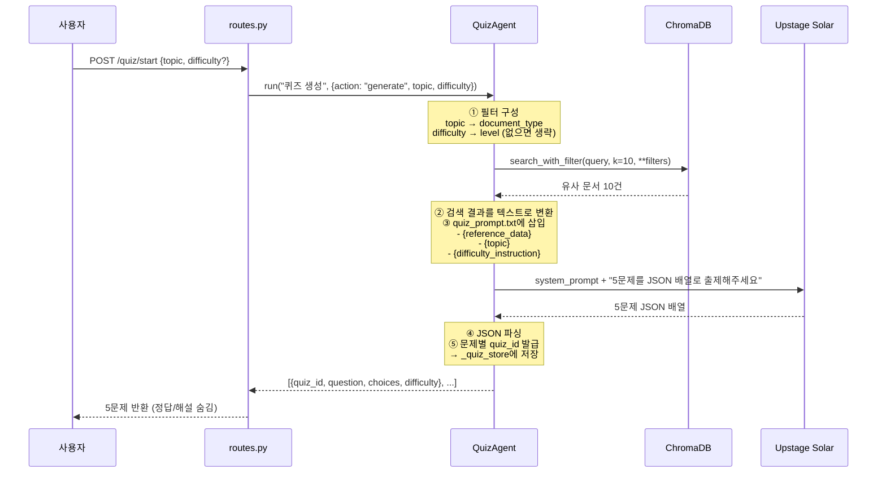
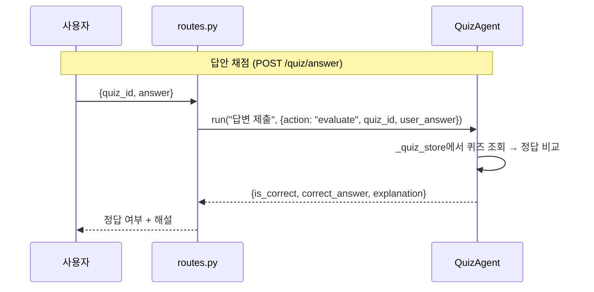
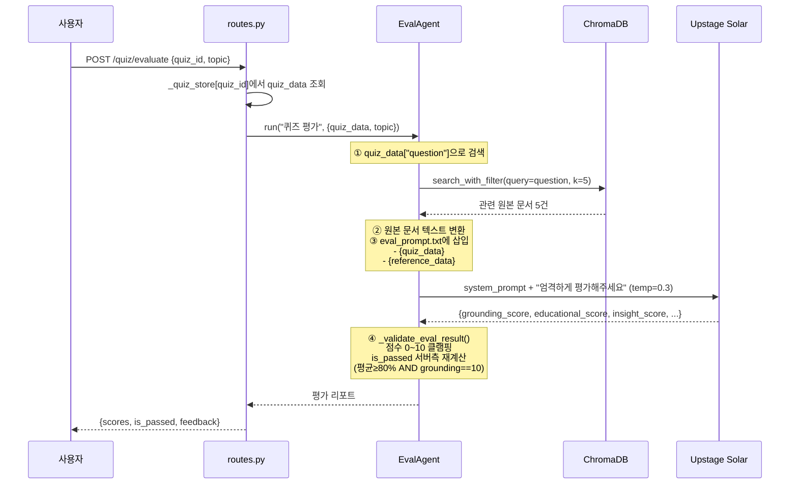

# Quiz Agent & Eval Agent 기획서

## 1. 개요

무역·물류 신입사원 교육을 위한 두 가지 AI 에이전트.

| 에이전트 | 역할 |
|---------|------|
| **QuizAgent** | RAG 검색 기반으로 4지선다 퀴즈 5문제를 생성하고, 사용자 답안을 채점 |
| **EvalAgent** | QuizAgent가 만든 퀴즈의 품질(사실 정확도, 교육 적합도, 실무 팁)을 자동 검증 |

**기술 스택:** FastAPI + ChromaDB(RAG) + Upstage Solar LLM + LangChain

---

## 2. QuizAgent — 퀴즈 생성 및 채점

### 2.1 핵심 기능

#### 기능 A: 퀴즈 생성 (generate)

| 항목 | 내용 |
|------|------|
| **Input** | `topic` (주제), `difficulty` (난이도, Optional) |
| **Output** | 5문제 배열 — 각 문제에 `quiz_id`, `question`, `choices`, `difficulty` 포함 |
| **RAG 검색** | ChromaDB에서 topic별 `document_type` 필터 + difficulty별 `level` 필터로 유사 문서 10건 검색 |
| **LLM** | Upstage Solar (temperature=0.7), 1회 호출로 5문제 JSON 배열 생성 |

**난이도 처리 로직:**
- difficulty 지정 시 → 5문제 모두 해당 난이도로 생성
- difficulty 미지정 시 → easy 2개 + medium 2개 + hard 1개 혼합 구성

**RAG 필터 매핑:**

| topic | ChromaDB document_type 필터 |
|-------|---------------------------|
| general | (필터 없음 — 전체 문서 검색) |
| mistakes | `common_mistake` |
| negotiation | `negotiation_strategy` |
| country | `country_guideline` |
| documents | `error_checklist` |

| difficulty | ChromaDB level 필터 |
|------------|-------------------|
| easy | `beginner` |
| medium | `working` |
| hard | `manager` |
| 미지정 | (level 필터 없음) |

#### 기능 B: 답안 채점 (evaluate)

| 항목 | 내용 |
|------|------|
| **Input** | `quiz_id`, `answer` (0~3 인덱스) |
| **Output** | `is_correct`, `correct_answer`, `correct_choice`, `explanation` |
| **RAG 검색** | 없음 (메모리 저장된 데이터로 비교) |
| **LLM** | 없음 (단순 인덱스 비교) |

### 2.2 퀴즈 생성 파이프라인





### 2.3 LLM 응답 포맷 (quiz_prompt.txt가 요구하는 형식)

```json
[
  {
    "question": "상황 설명 및 질문",
    "choices": ["보기1", "보기2", "보기3", "보기4"],
    "answer": 0,
    "explanation": "정답 해설",
    "difficulty": "easy"
  },
  ...
]
```

- `answer`: 정답 보기의 인덱스 (0~3)
- `difficulty`: 해당 문제의 난이도 (easy / medium / hard)

---

## 3. EvalAgent — 퀴즈 품질 평가

### 3.1 핵심 기능

| 항목 | 내용 |
|------|------|
| **Input** | `quiz_id` (평가 대상 퀴즈), `topic` (원본 대조용) |
| **Output** | `grounding_score`, `educational_score`, `insight_score`, `is_passed`, `feedback` |
| **RAG 검색** | 퀴즈 question 텍스트로 ChromaDB 검색 (필터 없이 유사도 기반, 5건) |
| **LLM** | Upstage Solar (temperature=0.3 — 일관된 평가를 위해 낮은 온도) |

### 3.2 평가 기준 (3축 채점)

| 점수 | 기준 | 만점 조건 |
|------|------|----------|
| **grounding_score** (0~10) | 원본 데이터 일치도 | 사실, 숫자, 용어, 날짜 100% 정확 |
| **educational_score** (0~10) | 교육 적합도 | 신입사원 이해 가능 + 실무 적용 가능 |
| **insight_score** (0~10) | 실무 팁 품질 | "실무에서는~", "주의할 점은~" 등 구체적 조언 포함 |

### 3.3 통과/불합격 판정 알고리즘 (`_validate_eval_result`)

```python
# 1) 점수 클램핑 (LLM이 범위 벗어난 값 줄 수 있으므로)
gs  = clamp(grounding_score, 0, 10)
es  = clamp(educational_score, 0, 10)
ins = clamp(insight_score, 0, 10)

# 2) 통과 조건: 두 가지 모두 만족해야 pass
total_ratio = (gs + es + ins) / 30
is_passed = (total_ratio >= 0.8) AND (gs == 10)
```

**핵심:** grounding(사실 정확도)이 만점이 아니면 나머지 점수가 아무리 높아도 불합격.
LLM이 반환한 `is_passed`는 신뢰하지 않고, 서버에서 재계산한다.

### 3.4 퀴즈 평가 파이프라인



---

## 4. 사용 방법 (API 호출)

### 4.1 퀴즈 생성

```bash
# 난이도 지정 — 5문제 모두 easy
curl -X POST http://localhost:8000/api/quiz/start \
  -H "Content-Type: application/json" \
  -d '{"topic": "general", "difficulty": "easy"}'

# 난이도 미지정 — easy 2 + medium 2 + hard 1 혼합
curl -X POST http://localhost:8000/api/quiz/start \
  -H "Content-Type: application/json" \
  -d '{"topic": "mistakes"}'
```

**응답 예시:**
```json
{
  "response": [
    {
      "quiz_id": "a1b2c3d4",
      "question": "FOB 조건에서 운송 보험료를 부담하는 주체는?",
      "choices": ["수출자", "수입자", "포워더", "선사"],
      "difficulty": "easy"
    },
    {
      "quiz_id": "e5f6g7h8",
      "question": "...",
      "choices": ["...", "...", "...", "..."],
      "difficulty": "medium"
    }
  ],
  "agent_type": "quiz",
  "metadata": {"topic": "general", "difficulty": null, "count": 5}
}
```

### 4.2 답안 채점

```bash
curl -X POST http://localhost:8000/api/quiz/answer \
  -H "Content-Type: application/json" \
  -d '{"quiz_id": "a1b2c3d4", "answer": 1}'
```

**응답 예시:**
```json
{
  "response": {
    "quiz_id": "a1b2c3d4",
    "is_correct": true,
    "user_answer": 1,
    "correct_answer": 1,
    "correct_choice": "수입자",
    "explanation": "FOB 조건에서 수입자가 운송 보험료를 부담합니다..."
  },
  "agent_type": "quiz",
  "metadata": {"quiz_id": "a1b2c3d4"}
}
```

### 4.3 퀴즈 품질 평가

```bash
curl -X POST http://localhost:8000/api/quiz/evaluate \
  -H "Content-Type: application/json" \
  -d '{"quiz_id": "a1b2c3d4", "topic": "general"}'
```

**응답 예시:**
```json
{
  "response": {
    "grounding_score": 10,
    "educational_score": 9,
    "insight_score": 8,
    "is_passed": true,
    "feedback": "원본 데이터와 100% 일치하며, 실무 팁이 구체적으로 포함되어 있습니다."
  },
  "agent_type": "eval",
  "metadata": {"topic": "general"}
}
```

### 4.4 코드에서 직접 호출

```python
from backend.agents.quiz_agent import QuizAgent
from backend.agents.eval_agent import EvalAgent

quiz_agent = QuizAgent()
eval_agent = EvalAgent()

# 퀴즈 생성
result = await quiz_agent.run("퀴즈 생성", {
    "action": "generate",
    "topic": "general",
    "difficulty": "easy"       # 생략하면 혼합 출제
})

# 답안 채점
result = await quiz_agent.run("답변 제출", {
    "action": "evaluate",
    "quiz_id": "a1b2c3d4",
    "user_answer": 1
})

# 퀴즈 품질 평가
result = await eval_agent.run("퀴즈 평가", {
    "quiz_data": {"question": "...", "choices": [...], "answer": 0, "explanation": "..."},
    "topic": "general"
})
```

---

## 5. 핵심 로직 요약

### 데이터 저장 구조 (`_quiz_store`)

```
_quiz_store = {
    "a1b2c3d4": {
        "question": "FOB 조건에서...",
        "choices": ["수출자", "수입자", "포워더", "선사"],
        "answer": 1,
        "explanation": "FOB 조건에서 수입자가...",
        "difficulty": "easy"
    },
    "e5f6g7h8": { ... },
    ...
}
```

- 서버 메모리에 저장 (서버 재시작 시 초기화)
- 퀴즈 생성 시 quiz_id별로 개별 저장 → 채점/평가 시 quiz_id로 조회

### LLM temperature 사용 전략

| 용도 | temperature | 이유 |
|------|------------|------|
| 퀴즈 생성 | 0.7 (기본) | 다양하고 창의적인 문제 출제 필요 |
| 퀴즈 평가 | 0.3 | 일관되고 엄격한 채점 필요 |
