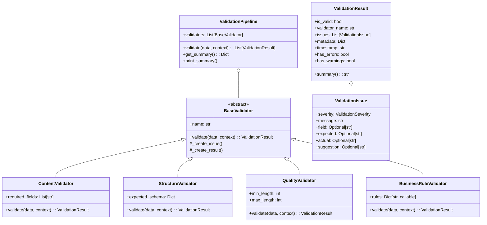

# Validation Framework Guide

**작성일**: 2026-02-16
**버전**: 1.0
**목적**: 시스템 전체의 검증 로직 표준화 및 재사용

---

## 📋 목차

1. [개요](#개요)
2. [아키텍처](#아키텍처)
3. [핵심 컴포넌트](#핵심-컴포넌트)
4. [사용 가이드](#사용-가이드)
5. [에이전트별 적용 예시](#에이전트별-적용-예시)
6. [커스텀 Validator 작성](#커스텀-validator-작성)
7. [테스트](#테스트)

---

## 개요

### 문제점 (Before)

Task #8 이전 상태:
- ❌ 각 에이전트가 독립적으로 검증 로직 구현
- ❌ 공통 패턴(LLM 호출, RAG 검색, 결과 파싱) 중복
- ❌ 검증 결과 형식이 비표준화됨
- ❌ 시스템 전체 품질 보증 부재

### 해결책 (After)

통합 검증 프레임워크:
- ✅ 표준화된 검증 인터페이스 (`BaseValidator`)
- ✅ 재사용 가능한 검증 컴포넌트 (Content, Structure, Quality, BusinessRule)
- ✅ 검증 파이프라인으로 복합 검증 지원
- ✅ 일관된 검증 결과 형식 (`ValidationResult`)

---

## 아키텍처

### 클래스 다이어그램



### 파일 구조

```
backend/validation/
├── __init__.py              # 패키지 export
├── base.py                  # 기본 클래스 (BaseValidator, ValidationResult, ValidationIssue)
├── pipeline.py              # ValidationPipeline, ConditionalPipeline
├── validators.py            # 구체적인 validator 구현
└── examples.py              # 에이전트별 사용 예시
```

---

## 핵심 컴포넌트

### 1. ValidationSeverity (Enum)

문제의 심각도를 나타냅니다.

```python
class ValidationSeverity(str, Enum):
    INFO = "info"           # 정보성 (개선 권장)
    WARNING = "warning"     # 경고 (주의 필요)
    ERROR = "error"         # 오류 (수정 필요)
    CRITICAL = "critical"   # 치명적 (즉시 수정 필수)
```

### 2. ValidationIssue

개별 검증 문제를 나타냅니다.

```python
class ValidationIssue(BaseModel):
    severity: ValidationSeverity    # 심각도
    message: str                    # 문제 설명
    field: Optional[str]            # 문제 필드
    expected: Optional[str]         # 기대값
    actual: Optional[str]           # 실제값
    suggestion: Optional[str]       # 수정 제안
    context: Optional[Dict]         # 추가 컨텍스트
```

### 3. ValidationResult

검증 결과를 나타냅니다.

```python
class ValidationResult(BaseModel):
    is_valid: bool                  # 전체 검증 통과 여부
    validator_name: str             # 검증기 이름
    issues: List[ValidationIssue]   # 발견된 문제 목록
    metadata: Dict[str, Any]        # 추가 메타데이터
    timestamp: str                  # 검증 시각

    # Properties
    has_errors: bool                # 오류/치명적 문제 존재 여부
    has_warnings: bool              # 경고 존재 여부
    summary(): str                  # 사람이 읽을 수 있는 요약
```

### 4. BaseValidator (Abstract)

모든 validator의 기본 클래스입니다.

```python
class BaseValidator(ABC):
    def __init__(self, name: Optional[str] = None):
        self.name = name or self.__class__.__name__

    @abstractmethod
    async def validate(
        self,
        data: Any,
        context: Optional[Dict[str, Any]] = None
    ) -> ValidationResult:
        """검증 수행 (서브클래스에서 구현)"""
        pass

    # Helper methods
    def _create_issue(...) -> ValidationIssue: ...
    def _create_result(...) -> ValidationResult: ...
```

### 5. 구체적인 Validators

#### ContentValidator

내용 정확성 검증 (필수 필드, 참조 데이터 일치 등).

```python
validator = ContentValidator(
    required_fields=["field1", "field2"]
)
result = await validator.validate(data)
```

#### StructureValidator

데이터 구조 검증 (JSON 스키마, 타입 등).

```python
validator = StructureValidator(
    expected_schema={
        "type": "dict",
        "fields": {
            "name": {"type": "str", "required": True},
            "age": {"type": "int", "required": False}
        }
    }
)
result = await validator.validate(data)
```

#### QualityValidator

품질 검증 (길이, 문법, 플레이스홀더 등).

```python
validator = QualityValidator(
    min_length=10,
    max_length=1000
)
result = await validator.validate(text_data)
```

#### BusinessRuleValidator

비즈니스 규칙 검증 (커스텀 규칙 함수).

```python
def check_incoterms(data, context):
    # ... validation logic ...
    return is_valid, message

validator = BusinessRuleValidator(
    rules={"incoterms": check_incoterms}
)
result = await validator.validate(data)
```

### 6. ValidationPipeline

여러 validator를 순차 실행합니다.

```python
pipeline = ValidationPipeline(
    validators=[
        ContentValidator(...),
        StructureValidator(...),
        QualityValidator(...)
    ],
    stop_on_critical=True,  # 치명적 오류 발생 시 중단
    name="MyPipeline"
)

results = await pipeline.validate(data)
summary = pipeline.get_summary(results)
pipeline.print_summary(results)
```

---

## 사용 가이드

### 기본 사용법

```python
import asyncio
from backend.validation import ContentValidator

async def validate_data():
    # 1. Validator 생성
    validator = ContentValidator(
        required_fields=["name", "email"]
    )

    # 2. 데이터 검증
    data = {"name": "John", "email": "john@example.com"}
    result = await validator.validate(data)

    # 3. 결과 확인
    if result.is_valid:
        print("✅ 검증 통과")
    else:
        print("❌ 검증 실패")
        for issue in result.issues:
            print(f"  - {issue.severity}: {issue.message}")

asyncio.run(validate_data())
```

### Pipeline 사용법

```python
from backend.validation import ValidationPipeline
from backend.validation.validators import (
    ContentValidator,
    QualityValidator,
    BusinessRuleValidator
)

async def validate_with_pipeline():
    # 1. Pipeline 생성
    pipeline = ValidationPipeline(
        validators=[
            ContentValidator(required_fields=["content"]),
            QualityValidator(min_length=50),
            BusinessRuleValidator(rules={...})
        ],
        name="EmailValidation"
    )

    # 2. 검증 실행
    results = await pipeline.validate(data)

    # 3. 요약 출력
    pipeline.print_summary(results)

asyncio.run(validate_with_pipeline())
```

---

## 에이전트별 적용 예시

### QuizAgent 검증

```python
from backend.validation.examples import create_quiz_validation_pipeline

async def validate_quiz():
    pipeline = create_quiz_validation_pipeline()

    quiz_data = {
        "question": "What is FOB?",
        "choices": ["Free On Board", "CIF", "EXW", "FCA"],
        "correct_answer": 0,
        "explanation": "FOB means Free On Board"
    }

    results = await pipeline.validate(quiz_data)

    # 검증 결과 확인
    if all(r.is_valid for r in results):
        print("✅ 퀴즈가 모든 검증을 통과했습니다")
    else:
        pipeline.print_summary(results)
```

**검증 항목**:
1. ✅ QuizQuestionValidator: 필수 필드, choices 개수, correct_answer 범위
2. ✅ QuestionQuality: 문제 길이, 품질
3. ✅ QuizStructure: JSON 구조 검증

### EmailAgent 검증

```python
from backend.validation.examples import create_email_validation_pipeline

async def validate_email():
    pipeline = create_email_validation_pipeline()

    email_data = {
        "subject": "Shipping Confirmation",
        "content": "We will ship via FOB Shanghai..."
    }

    results = await pipeline.validate(email_data)
    pipeline.print_summary(results)
```

**검증 항목**:
1. ✅ EmailContent: 필수 필드 (subject, content)
2. ✅ EmailQuality: 길이 제한 (50-5000자)
3. ✅ EmailBusinessRules: Incoterms 유효성

### RiskManagingAgent 검증

```python
from backend.validation.examples import create_risk_validation_pipeline

async def validate_risk():
    pipeline = create_risk_validation_pipeline()

    risk_data = {
        "risk_factors": {
            "financial_loss": {
                "impact": 4,
                "likelihood": 3,
                "score": 12  # Must be impact * likelihood
            }
        },
        "risk_scoring": {...},
        "prevention_strategy": {...}
    }

    results = await pipeline.validate(risk_data)
```

**검증 항목**:
1. ✅ RiskContent: 필수 필드
2. ✅ RiskBusinessRules: 리스크 점수 계산 정확성 (score = impact × likelihood)
3. ✅ RiskStructure: JSON 구조 검증

---

## 커스텀 Validator 작성

### 방법 1: BaseValidator 상속

```python
from backend.validation import BaseValidator, ValidationResult, ValidationSeverity

class MyCustomValidator(BaseValidator):
    def __init__(self, custom_param: str):
        super().__init__(name="MyCustomValidator")
        self.custom_param = custom_param

    async def validate(self, data, context=None):
        issues = []

        # 커스텀 검증 로직
        if not self._check_custom_rule(data):
            issues.append(
                self._create_issue(
                    ValidationSeverity.ERROR,
                    "Custom rule failed",
                    suggestion="Fix the data according to custom rule"
                )
            )

        return self._create_result(
            is_valid=len(issues) == 0,
            issues=issues,
            metadata={"custom_param": self.custom_param}
        )

    def _check_custom_rule(self, data):
        # 실제 검증 로직
        return True
```

### 방법 2: 기존 Validator 확장

```python
from backend.validation.validators import ContentValidator

class EnhancedContentValidator(ContentValidator):
    async def _validate_against_reference(self, data, reference):
        """Override to add custom reference validation"""
        issues = []

        # 커스텀 참조 데이터 검증
        if "term" in data:
            term = data["term"]
            if term not in reference:
                issues.append(
                    self._create_issue(
                        ValidationSeverity.WARNING,
                        f"Term '{term}' not found in reference data"
                    )
                )

        return issues
```

---

## 테스트

### 단위 테스트

```bash
# Pytest로 전체 테스트 실행
uv run pytest tests/test_validation_framework.py -v

# 특정 테스트만 실행
uv run pytest tests/test_validation_framework.py::TestContentValidator -v
```

### 빠른 검증 테스트

```bash
# 수동 테스트 스크립트
uv run python scripts/quick/test_validation_quick.py
```

**실행 결과 예시**:

```
=== Testing Validation Framework ===

1. Testing Basic Validators...
   ✓ ContentValidator (valid): True
   ✓ ContentValidator (missing field): True
     Issues: 1

2. Testing QualityValidator...
   ✓ QualityValidator (valid length): True
   ✓ QualityValidator (too short): True

...

============================================================
✅ All validation framework tests passed!
============================================================
```

---

## 통합 예시: 전체 워크플로우

```python
import asyncio
from backend.validation import ValidationPipeline
from backend.validation.validators import (
    ContentValidator,
    StructureValidator,
    QualityValidator,
    BusinessRuleValidator
)

# 1. 커스텀 비즈니스 규칙 정의
def check_trade_term(data, context):
    valid_terms = ["FOB", "CIF", "EXW", "DDP"]
    term = data.get("term", "")
    if term in valid_terms:
        return True, "Valid trade term"
    return False, f"Invalid term: {term}"

# 2. Pipeline 구성
pipeline = ValidationPipeline(
    validators=[
        # 단계 1: 내용 검증
        ContentValidator(
            required_fields=["term", "definition", "example"]
        ),

        # 단계 2: 구조 검증
        StructureValidator(
            expected_schema={
                "type": "dict",
                "fields": {
                    "term": {"type": "str", "required": True},
                    "definition": {"type": "str", "required": True},
                    "example": {"type": "str", "required": False}
                }
            }
        ),

        # 단계 3: 품질 검증
        QualityValidator(min_length=20, max_length=500),

        # 단계 4: 비즈니스 규칙 검증
        BusinessRuleValidator(
            rules={"trade_term": check_trade_term}
        )
    ],
    stop_on_critical=True,
    name="TradeTermValidation"
)

# 3. 데이터 검증
async def main():
    data = {
        "term": "FOB",
        "definition": "Free On Board - 본선 인도 조건",
        "example": "FOB Shanghai Incoterms 2020"
    }

    results = await pipeline.validate(data)

    # 4. 결과 분석
    summary = pipeline.get_summary(results)
    print(f"Overall valid: {summary['overall_valid']}")
    print(f"Passed: {summary['validators']['passed']}/{summary['validators']['total']}")

    # 5. 상세 리포트
    pipeline.print_summary(results)

asyncio.run(main())
```

---

## API 참조

### BaseValidator

| 메서드 | 설명 | 반환 |
|--------|------|------|
| `validate(data, context)` | 데이터 검증 (abstract) | `ValidationResult` |
| `_create_issue(severity, message, ...)` | ValidationIssue 생성 | `ValidationIssue` |
| `_create_result(is_valid, issues, metadata)` | ValidationResult 생성 | `ValidationResult` |

### ValidationResult

| 속성/메서드 | 설명 | 타입 |
|------------|------|------|
| `is_valid` | 전체 검증 통과 여부 | `bool` |
| `issues` | 발견된 문제 목록 | `List[ValidationIssue]` |
| `has_errors` | 오류/치명적 문제 존재 | `bool` |
| `has_warnings` | 경고 존재 | `bool` |
| `get_issues_by_severity(severity)` | 특정 심각도 문제 필터링 | `List[ValidationIssue]` |
| `summary()` | 사람이 읽을 수 있는 요약 | `str` |

### ValidationPipeline

| 메서드 | 설명 | 반환 |
|--------|------|------|
| `validate(data, context)` | 모든 validator 순차 실행 | `List[ValidationResult]` |
| `get_summary(results)` | 집계된 요약 생성 | `Dict` |
| `print_summary(results)` | 사람이 읽을 수 있는 요약 출력 | `None` |

---

## 모범 사례

### ✅ DO

1. **표준 validator 사용**: 가능하면 ContentValidator, StructureValidator 등 재사용
2. **Pipeline 활용**: 복합 검증은 Pipeline으로 구성
3. **적절한 Severity 사용**:
   - `CRITICAL`: 데이터 손실, 시스템 중단
   - `ERROR`: 비즈니스 로직 위반
   - `WARNING`: 개선 권장
   - `INFO`: 참고 사항
4. **명확한 메시지**: 사용자가 이해하고 수정할 수 있도록
5. **Suggestion 제공**: 가능하면 수정 제안 포함

### ❌ DON'T

1. **과도한 검증**: 필요한 것만 검증
2. **Validator 중복**: 동일한 검증을 여러 곳에서 구현
3. **Blocking 검증**: async/await 패턴 유지
4. **무의미한 메시지**: "Validation failed" 대신 구체적인 이유 제공

---

## 문제 해결

### Q: Validator가 실행되지 않음

**A**: async/await 확인

```python
# ❌ Wrong
result = validator.validate(data)  # Coroutine object returned

# ✅ Correct
result = await validator.validate(data)
# or
result = asyncio.run(validator.validate(data))
```

### Q: Pipeline이 중간에 멈춤

**A**: `stop_on_critical=True` 설정 확인

```python
pipeline = ValidationPipeline(
    validators=[...],
    stop_on_critical=False  # 모든 validator 실행
)
```

### Q: Custom validator에서 helper 메서드 사용

**A**: `_create_issue`, `_create_result` 활용

```python
class MyValidator(BaseValidator):
    async def validate(self, data, context):
        issues = []

        if not data:
            issues.append(
                self._create_issue(  # Helper 사용
                    ValidationSeverity.ERROR,
                    "Data is empty"
                )
            )

        return self._create_result(len(issues) == 0, issues)
```

---

## 참고 자료

### 생성된 파일
- `backend/validation/base.py` - 기본 클래스
- `backend/validation/validators.py` - 구체적인 validator
- `backend/validation/pipeline.py` - ValidationPipeline
- `backend/validation/examples.py` - 사용 예시
- `tests/test_validation_framework.py` - 단위 테스트
- `scripts/quick/test_validation_quick.py` - 빠른 검증 스크립트

### 외부 참조
- [Pydantic Documentation](https://docs.pydantic.dev/)
- [Python Type Hints](https://docs.python.org/3/library/typing.html)

---

**문서 버전**: 1.0
**최종 수정**: 2026-02-16
**작성자**: Task #8 완료 시점
