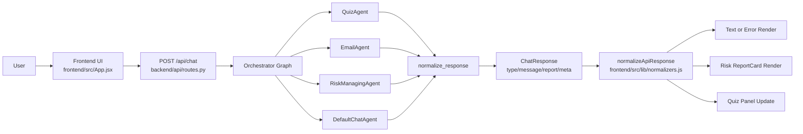
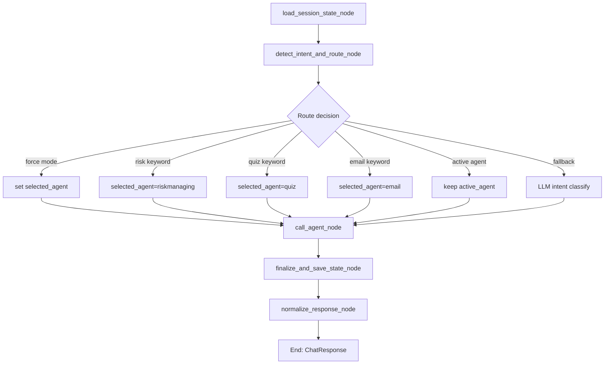
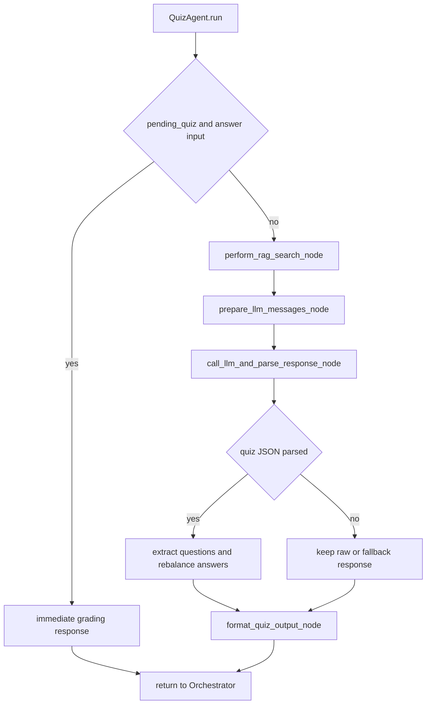
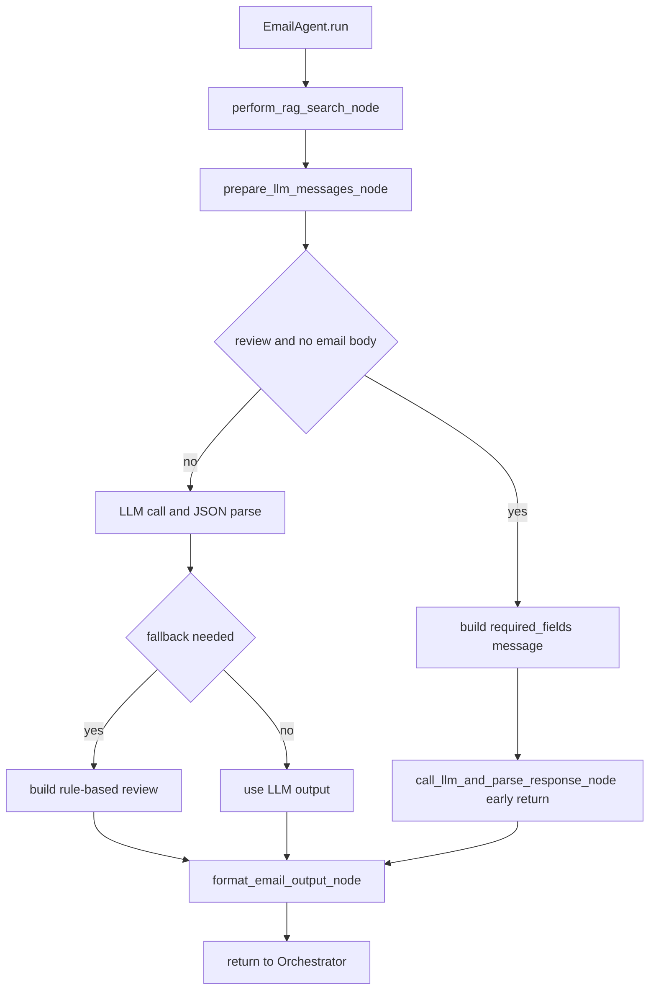
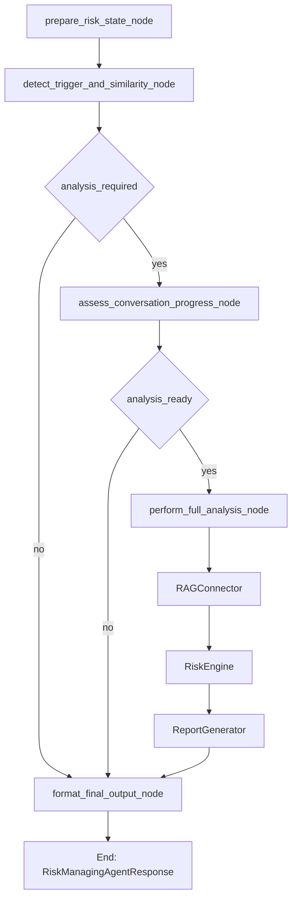
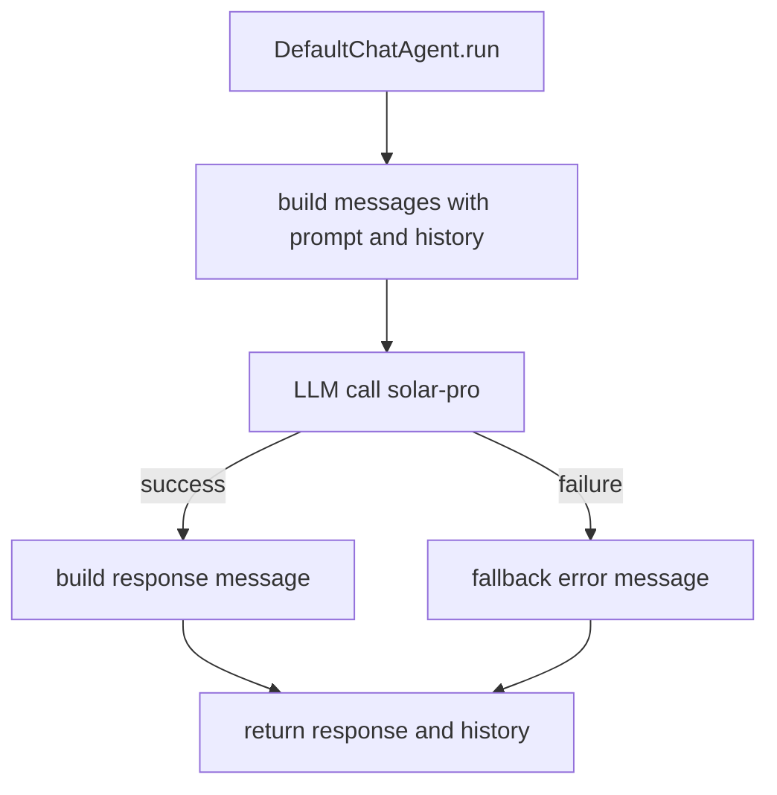

# Workflow Diagrams

이 문서는 현재 코드 기준의 워크플로우를 Mermaid 다이어그램으로 정리한 문서입니다.

## 목차

- [전체 시스템 워크플로우](#전체-시스템-워크플로우)
- [Orchestrator 워크플로우](#orchestrator-워크플로우)
- [QuizAgent 워크플로우](#quizagent-워크플로우)
- [EmailAgent 워크플로우](#emailagent-워크플로우)
- [RiskManagingAgent 워크플로우](#riskmanagingagent-워크플로우)
- [DefaultChatAgent 워크플로우](#defaultchatagent-워크플로우)

## 전체 시스템 워크플로우

## Orchestrator 워크플로우

## QuizAgent 워크플로우

## EmailAgent 워크플로우

fallback 예시:
- LLM API 오류
- 리뷰 응답이 원문 echo인 경우
- 수신국가 미지정인데 국가 가정 리뷰가 섞인 경우
- LLM 미초기화 + 리뷰 본문 존재

## RiskManagingAgent 워크플로우

## DefaultChatAgent 워크플로우

## 코드 기준 파일

- `backend/api/routes.py`
- `backend/agents/orchestrator/graph.py`
- `backend/agents/orchestrator/nodes.py`
- `backend/agents/quiz_agent/graph.py`
- `backend/agents/quiz_agent/quiz_agent.py`
- `backend/agents/quiz_agent/nodes.py`
- `backend/agents/email_agent/graph.py`
- `backend/agents/email_agent/email_agent.py`
- `backend/agents/email_agent/nodes.py`
- `backend/agents/riskmanaging/graph.py`
- `backend/agents/riskmanaging/nodes.py`
- `backend/agents/default_chat/default_chat_agent.py`
- `frontend/src/App.jsx`
- `frontend/src/lib/normalizers.js`
