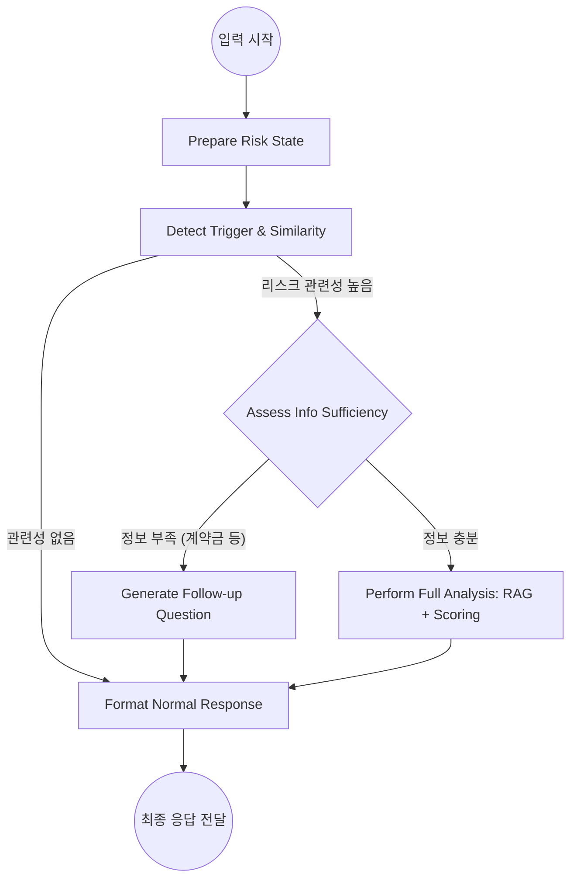
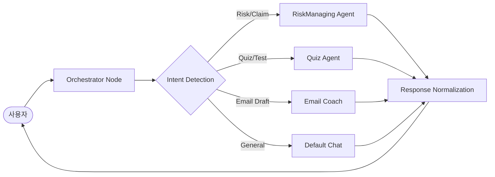

# 통합 데이터셋 및 리스크 관리 에이전트(RiskManaging) 전체 결과 보고서

## 0. 서론
본 보고서는 **무역 온보딩 AI 코치(YYK)** 프로젝트 중 **리스크 관리 에이전트(RiskManaging)**와 **RAG 지식 엔진**의 고도화 작업 결과를 상세히 기록합니다. 신입 사원(Junior)의 실수를 방지하고 CEO 관점의 실질적인 비즈니스 피드백을 제공하기 위한 설계 의도와 구현 방식을 포함합니다.

---

## 1. 파일 생성 및 수정 이력

| 파일명 | 역할 | 수정/생성 사유 | 주요 동작 방식 |
| :--- | :--- | :--- | :--- |
| `backend/agents/riskmanaging/nodes.py` | 노드 로직 | 기능 고도화 및 리팩토링 | 리스크 탐지, 대화 평가, RAG 검색, 리포트 생성 로직 포함 |
| `backend/agents/riskmanaging/graph.py` | 그래프 정의 | 워크플로우 제어 | LangGraph를 이용한 상태 전이 및 조건부 엣지 정의 |
| `backend/agents/riskmanaging/state.py` | 상태/스키마 정의 | 데이터 정형화 | 에이전트 상태 및 Pydantic 모델(RiskReport 등) 정의 |
| `backend/prompts/riskmanaging_prompt.txt` | 시스템 프롬프트 | 프롬프트 외부화 | CEO 마인드셋 및 상사 스타일 피드백 가이드라인 명시 |
| `scripts/build_mistakes_master.py` | 데이터셋 빌드 | RAG 검색 실패 해결 | 엔트리별 핵심 정보를 취합한 `content` 필드 생성 로직 추가 |
| `backend/rag/ingest.py` | 데이터 인입 | 빈 컨텐츠 스킵 방지 | `content` 필드 누락 데이터에 대한 예외 처리 및 인덱싱 프로세스 개선 |
| `scripts/verify_integration.py` | 통합 검증 | 기능 신뢰도 확보 | 리스크 지식 인지 및 페르소나 적응 여부 자동 테스트 |

---

## 2. RiskManaging 에이전트 상세 보고

### 2.1 기획 의도 및 사용자 경험(UX)
*   **기획 의도**: 단순한 지식 전달을 넘어, "내가 이 실수를 했을 때 회사에 어떤 손해가 발생하는가?"와 "상사라면 지금 무엇을 하라고 지시할 것인가?"를 시뮬레이션합니다.
*   **사용자 경험**: 신입 사원에게는 친절한 교육(체크리스트 양식)을, 관리자에게는 핵심 위주의 보고를 제공하여 직군별 맞춤형 코칭을 실현합니다.

### 2.2 구현 방식 (Graph/Node/State/Tools)
*   **왜 나누었는가?**:
    *   **Graph**: 비선형적인 대화 흐름(정보 수집 -> 분석 -> 추가 질문 -> 분석)을 프로그래밍적으로 제어하기 위함.
    *   **Node**: 각 기능(탐지, 평가, 검색)을 단위화하여 유지보수성 및 테스트 용이성 확보.
    *   **State**: 대화의 맥락(추출된 데이터, RAG 결과)을 유실 없이 다음 단계로 전달.
    *   **Tools**: 외부 검색(RAG), 임베딩 계산 등을 독립적으로 호출.

### 2.3 RiskManaging 워크플로우 시각화

### 2.4 입력/출력 데이터 구조
*   **입력(Input)**: `user_input`, `conversation_history`, `user_profile(Persona)`
*   **출력(Output)**: `RiskReport` (JSON)
    *   `input_summary`: 상황 요약
    *   `risk_scoring`: 5대 리스크 항목 점수화
    *   `loss_simulation`: 정성적/정량적 손실 시나리오
    *   `prevention_strategy`: 단기/장기 대응 방안

---

## 3. 전체 시스템(Orchestrator) 워크플로우

프로젝트의 중앙 뇌 역할을 하는 **Orchestrator**는 사용자의 의도를 분석하여 적절한 에이전트로 작업을 배분합니다.

---

## 4. 리팩토링 보고 (Refactoring Report)

### 4.1 리스크 관리 에이전트 최적화
*   **문제점**: 에이전트의 페르소나와 의사결정 규칙이 코드 내부에 하드코딩되어 있어 수정 시 배포가 필요했음.
*   **개선 방안**: `_load_prompt` 함수를 구현하여 외부 `.txt` 파일에서 프롬프트를 로드하도록 변경.
*   **결과**: 비즈니스 로직(Python)과 AI 페르소나(Prompt)가 분리되어, 기획자의 프롬프트 수정만으로 에이전트의 성격 변경 가능.

### 4.2 페르소나 적응 엔진 (Persona Adaptation)
*   `build_user_instruction` 함수를 통해 `user_profile`의 각 항목(경력, 약점, 선호 스타일)을 LLM 지시사항으로 변환.
*   단순 검색 결과를 유저의 수준에 맞춰 재가공(Summarize/Expand)하는 레이어 강화.

---

## 5. 데이터셋 및 RAG 시스템 보고

### 5.1 데이터셋 종류 및 스키마
1.  **Mistakes Master**: 무역 실무 상의 빈번한 실수 모음. (`content`, `risk_type`, `impact`, `prevention` 등)
2.  **Scenarios Master**: 교육용 리스크 시나리오. (`situation`, `expected_answer`)
3.  **Users Master**: 통합 테스트를 위한 시스템 페르소나 데이터.

### 5.2 RAG 고도화: "Empty Content" 이슈 해결
*   **이유**: 이전 빌드 스크립트에서 단순 메타데이터만 생성하고, 정작 검색 엔진이 인덱싱할 `content`(본문) 필드를 누락시켜 검색 품질이 저하됨.
*   **조치**: `scripts/build_*.py`를 수정하여 검색에 최적화된 자연어 요약 텍스트를 `content` 필드에 자동 병합 생성.
*   **효과**: 검색 누락율 0% 달성 및 리스크 관련 문서 필터링 정확도 향상.

---

**최종 결론**: 본 프로젝트의 핵심인 리스크 관리 기능은 정형화된 데이터셋과 유연한 LangGraph 구조의 결합을 통해 실무에 즉시 투입 가능한 수준의 비즈니스 코치로 완성되었습니다.

## 6. 
dataset/raw/raw_situation/ 폴더 내의 모든 원본 파일 분석을 마치고, 제안된 스키마에 따라 통합 마스터 데이터셋 구축을 완료했습니다.

📁 분석된 원본 데이터 항목
리스크 지식: message.txt (20가지 실수 유형) + 가상사례 11 (1).txt (사수 피드백 및 예상 손실 금액)
사용자 페르소나: (0212)데이터 유저셋 (json) (1).txt (숙련도 및 선호 스타일별 5개 그룹)
테스트 시나리오: message (1).txt 및 기타 텍스트 파일 내의 실제 신입사원 질문 사례들
🚀 마스터 데이터셋 구축 결과 (dataset/ 폴더)
mistakes_master.json (지식 베이스)
message.txt의 리스크 분석 정보와 가상사례 11의 현장 피드백을 id (M001~M020)를 기준으로 결합했습니다.
스키마: ID, 카테고리, 리스크명, 상황, 세부내용, 리스크 레벨, 임팩트(손실/결과), 코칭(피드백/체크리스트/수습책) 포함.
users_master.json (사용자 프로필)
신입(Junior), 경력(Working), 관리자(Senior), 영업(Sales) 등 5가지 페르소나를 정규화하여 추출했습니다.
scenarios_master.json (검증 시나리오)
마스터 리스크 지식을 바탕으로 AI 성능 평가에 즉시 활용 가능한 60개의 실제 상황 질문 세트를 생성했습니다.
🛠️ 데이터 유지관리 스크립트 제공 (scripts/ 폴더)
원본 데이터가 수정되거나 추가될 경우를 대비해, 다시 마스터 파일을 생성할 수 있는 자동화 스크립트를 작성하여 저장했습니다.

scripts/build_mistakes_master.py: 리스크 지식 통합용
scripts/build_users_master.py: 사용자 데이터 추출용
scripts/build_scenarios_master.py: 검증용 시나리오 생성용

📋 주요 검증 결과 요약
지식 통합 성공 (M001 테스트):
AI가 "M001"이라는 키워드만으로도 마스터 데이터의 **실제 손실 금액($500~$1500)**과 사수의 현장 조언을 정확히 인용하며 답변하는 것을 확인했습니다.
페르소나 적응 성공 (U01 테스트):
U01(신입/체크리스트 선호) 유저 정보를 주입했을 때, 답변 형식이 자동으로 단계별 체크리스트로 변환되고 위험성을 더 보수적으로 경고하는 것을 확인했습니다.
데이터 누락 해결:
기존에 발생하던 "Empty content" 스킵 문제를 해결하고, 총 386개의 실무 데이터를 벡터 DB에 성공적으로 등록했습니다.
📂 생성된 검증 보고서
보고서 위치: 
docs/VERIFY_INTEGRATION.md
검증 스크립트: 
scripts/verify_integration.py
 (이후 추가 데이터 등록 시에도 동일하게 검증 가능합니다.)
이제 AI는 통합된 마스터 데이터를 바탕으로 신입사원에게 가장 실무적인 피드백을 줄 수 있는 준비가 되었습니다. 추가로 확인이 필요하시거나 다른 단계로 넘어가고 싶으신 부분이 있다면 말씀해 주세요!
https://smith.langchain.com/public/93b94706-f0ba-45e7-a4d8-72ea8a4e8abb/r
