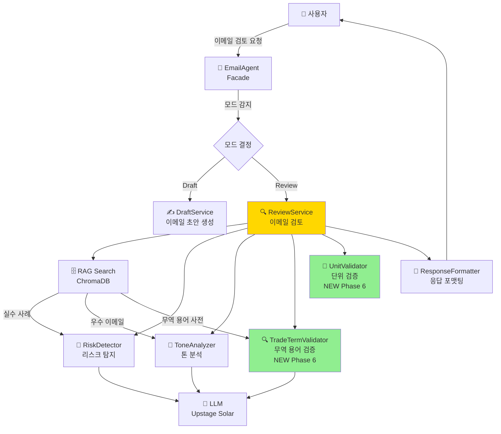
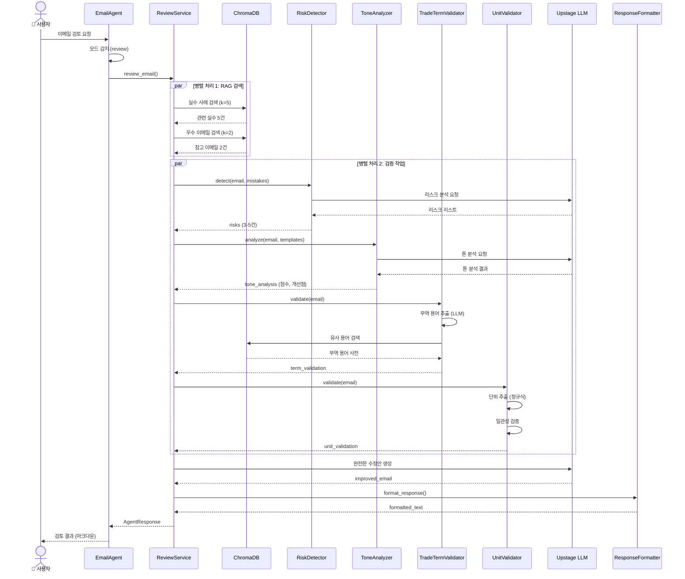
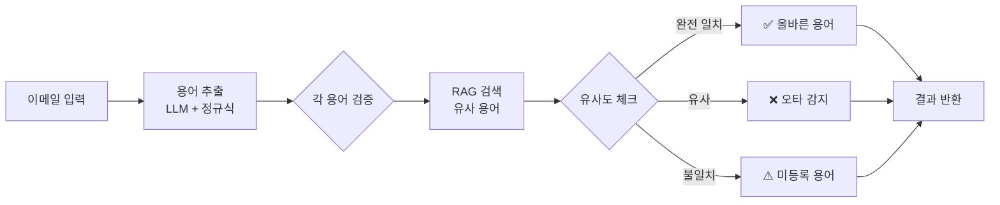
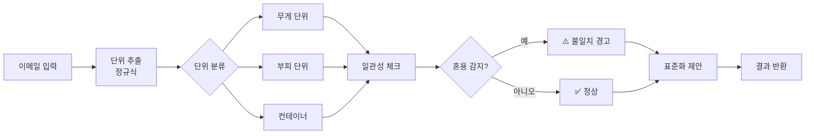
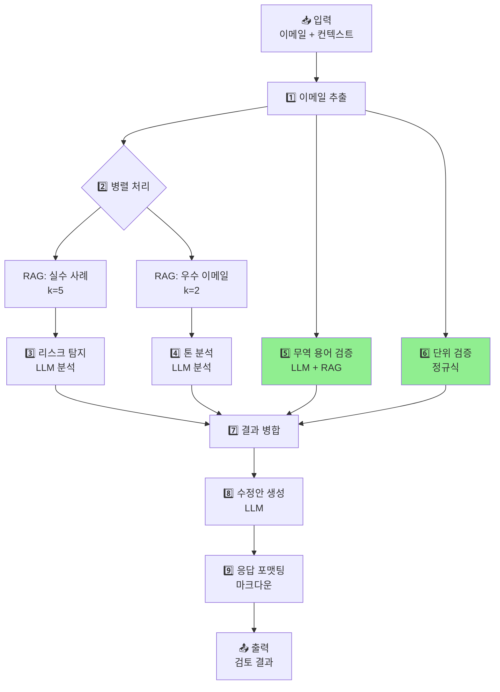

# Email Agent 워크플로우 문서 (Phase 6)

**작성일**: 2026-02-13
**버전**: Phase 6 (무역 용어 및 단위 검증 추가)
**상태**: ✅ 구현 완료

---

## 📋 목차

1. [개요](#개요)
2. [전체 아키텍처](#전체-아키텍처)
3. [Review Mode 워크플로우](#review-mode-워크플로우)
4. [노드별 역할](#노드별-역할)
5. [데이터 플로우](#데이터-플로우)
6. [Phase 6 신규 기능](#phase-6-신규-기능)

---

## 개요

Email Agent는 무역 이메일 작성 및 검토를 지원하는 AI 코치입니다.

**핵심 기능**:
- **Draft Mode**: 상황에 맞는 이메일 초안 자동 생성
- **Review Mode**: 이메일 검토 + 리스크 탐지 + 톤 분석 + 무역 용어 검증 + 단위 검증

**Phase 6 업그레이드**:
- ✅ 무역 용어 검증 (TradeTermValidator)
- ✅ 단위 검증 (UnitValidator)
- ✅ ChromaDB 무역 용어 사전 (498개 문서)

---

## 전체 아키텍처



---

## Review Mode 워크플로우

### 1️⃣ 전체 플로우



### 2️⃣ 세부 단계

#### Step 1: 이메일 내용 추출
```python
email_content = context.get("email_content") or extract_from_input(user_input)
```

#### Step 2: RAG 검색 (병렬)
```python
# 실수 사례 검색
mistakes = retriever.search(query=email_content, k=5, document_type="common_mistake")

# 우수 이메일 검색
emails = retriever.search(query=email_content, k=2, document_type="email")
```

#### Step 3: 검증 작업 (병렬)

**리스크 탐지**:
```python
risks = risk_detector.detect(email_content, mistakes, context)
# 결과: [{"type": "missing_payment", "severity": "high", ...}, ...]
```

**톤 분석**:
```python
tone_analysis = tone_analyzer.analyze(email_content, emails, context)
# 결과: {"score": 7.0, "current_tone": "professional", ...}
```

**무역 용어 검증** (NEW):
```python
term_validation = term_validator.validate(email_content)
# 결과: {
#   "incorrect_terms": [{"found": "FOV", "should_be": "FOB", ...}],
#   "verified_terms": [{"term": "CIF", "full_name": "Cost Insurance and Freight"}]
# }
```

**단위 검증** (NEW):
```python
unit_validation = unit_validator.validate(email_content)
# 결과: {
#   "inconsistencies": [{"text": "20ton and 20000kg", "issue": "mixed units", ...}],
#   "standardized": "20 MT (20,000 kg)"
# }
```

#### Step 4: 수정안 생성
```python
improved_email = llm.invoke(improvement_prompt.format(
    email_content=email_content,
    risks=risks,
    tone_analysis=tone_analysis,
    ...
))
```

#### Step 5: 응답 포맷팅
```markdown
### 🚨 발견된 리스크 (3건)
...

### 🎨 톤 분석 결과
...

### 🔍 무역 용어 검증  # NEW Phase 6
...

### 📏 단위 검증  # NEW Phase 6
...

### 📝 수정안
...
```

---

## 노드별 역할

### 1. EmailAgent (Facade)
**파일**: `backend/agents/email/email_agent.py`

**역할**:
- 사용자 요청 접수
- 모드 자동 감지 (Draft/Review)
- 적절한 서비스로 라우팅
- 의존성 주입 및 초기화

**입력**:
```python
{
    "user_input": "검토: We will ship via FOV...",
    "context": {
        "mode": "review",  # 선택
        "email_content": "Dear buyer, ...",
        "recipient_country": "USA"
    }
}
```

**출력**:
```python
AgentResponse(
    response="### 🚨 발견된 리스크...",
    agent_type="email",
    metadata={
        "mode": "review",
        "risks": [...],
        "tone_score": 7.0,
        "term_validation": {...},
        "unit_validation": {...}
    }
)
```

---

### 2. ReviewService (통합 서비스)
**파일**: `backend/agents/email/review_service.py`

**역할**:
- 이메일 검토 총괄 오케스트레이터
- 모든 검증 서비스 조정
- RAG 검색 관리
- 최종 응답 생성

**주요 메서드**:
- `review_email()`: 메인 진입점
- `_search_references()`: RAG 검색
- `_generate_improvement()`: 수정안 생성
- `_format_response()`: 응답 포맷팅
- `_format_term_validation()`: 무역 용어 결과 포맷팅 (NEW)
- `_format_unit_validation()`: 단위 검증 결과 포맷팅 (NEW)

**Phase 6 변경사항**:
```python
# 신규 서비스 초기화
self._term_validator = TradeTermValidator(llm, retriever)
self._unit_validator = UnitValidator()

# 검증 추가
term_validation = self._term_validator.validate(email_content)
unit_validation = self._unit_validator.validate(email_content)
```

---

### 3. RiskDetector (리스크 탐지)
**파일**: `backend/agents/email/risk_detector.py`

**역할**:
- 무역 이메일의 잠재적 위험 요소 감지
- LLM 기반 리스크 분석
- 실수 사례 기반 예측

**탐지 항목**:
- ❌ Incoterms 오류/누락
- ❌ 결제 조건 미명시
- ❌ 수량/단위 오류
- ❌ 서류 누락
- ❌ 공격적 톤

**출력 예시**:
```python
[
    {
        "type": "incoterms_misuse",
        "severity": "critical",
        "current": "FOV incoterms",
        "risk": "존재하지 않는 인코텀즈, 계약 오류 가능성",
        "recommendation": "FOB [지정 선적항] 사용 권장"
    }
]
```

---

### 4. ToneAnalyzer (톤 분석)
**파일**: `backend/agents/email/tone_analyzer.py`

**역할**:
- 이메일 톤 분석 (professional/casual/formal)
- 국가별 문화 적합성 체크
- 톤 개선 제안

**분석 요소**:
- 현재 톤 (current_tone)
- 권장 톤 (recommended_tone)
- 톤 점수 (0-10)
- 개선 포인트 (issues)
- 문화적 고려사항 (cultural_notes)

**출력 예시**:
```python
{
    "score": 7.0,
    "current_tone": "professional",
    "recommended_tone": "professional",
    "issues": ["인사말 개선 필요", "단위 통일 권장"],
    "summary": "현재 이메일은 기본 professional 톤 유지..."
}
```

---

### 5. TradeTermValidator (무역 용어 검증) 🆕
**파일**: `backend/agents/email/trade_term_validator.py`

**역할**:
- 이메일 내 무역 용어 추출
- RAG 기반 용어 정확성 검증
- 오타/오류 감지 및 올바른 용어 제안

**검증 대상**:
- Incoterms (FOB, CIF, EXW 등)
- 결제 조건 (L/C, T/T, D/P 등)
- 무역 서류 (B/L, AWB, C/I 등)
- 단위 (MT, CBM, TEU 등)

**워크플로우**:


**출력 예시**:
```python
{
    "incorrect_terms": [
        {
            "found": "FOV",
            "should_be": "FOB",
            "confidence": 0.95,
            "context": "ship via FOV incoterms",
            "definition": "Free On Board - 본선 인도 조건"
        }
    ],
    "verified_terms": [
        {"term": "CIF", "full_name": "Cost Insurance and Freight"}
    ],
    "suggestions": ["FOV → FOB 수정 권장 (정확도: 95%)"]
}
```

**주요 메서드**:
- `validate()`: 메인 검증 로직
- `_extract_terms()`: LLM으로 무역 용어 추출
- `_find_similar_terms()`: RAG로 유사 용어 검색
- `_get_term_definition()`: 용어 정의 가져오기
- `_extract_context()`: 용어가 사용된 문맥 추출

---

### 6. UnitValidator (단위 검증) 🆕
**파일**: `backend/agents/email/unit_validator.py`

**역할**:
- 무역 단위 추출 및 검증
- 단위 일관성 체크
- 표준 단위 제안

**검증 대상**:
- 무게 단위 (ton, MT, kg, lbs)
- 부피 단위 (CBM, CFT)
- 컨테이너 (20ft, 40ft, 40HC)

**워크플로우**:


**검증 로직**:
```python
# 1. 무게 단위 혼용 체크
if has_ton and has_kg:
    # 20ton과 20000kg 동시 사용
    → 불일치 경고

# 2. 동일 값 확인
20 ton == 20,000 kg?
    → 동일하면 통과
    → 다르면 경고

# 3. 표준화 제안
"20ton" → "20 MT (20,000 kg)"
```

**출력 예시**:
```python
{
    "inconsistencies": [
        {
            "text": "20ton, 20000kg",
            "issue": "혼용된 무게 단위 (ton과 kg)",
            "suggestion": "일관된 단위 사용 권장 (MT 선호)",
            "severity": "medium"
        }
    ],
    "standardized": "20 MT (20,000 kg), 15 CBM",
    "unit_summary": {
        "weight": ["20ton", "20000kg"],
        "volume": ["15CBM"],
        "container": []
    }
}
```

**주요 메서드**:
- `validate()`: 메인 검증 로직
- `_extract_weight_units()`: 무게 단위 추출
- `_extract_volume_units()`: 부피 단위 추출
- `_extract_container_units()`: 컨테이너 단위 추출
- `_check_inconsistencies()`: 일관성 검증
- `_standardize_units()`: 표준화 제안

---

### 7. ChromaDB (RAG 벡터 스토어)
**위치**: `backend/vectorstore/`

**역할**:
- 무역 도메인 지식 저장
- 유사도 기반 문서 검색
- 임베딩 관리

**저장된 데이터** (498개 문서):

| 데이터셋 | 문서 수 | document_type | 용도 |
|---------|--------|---------------|------|
| trade_terminology.json | 28 | trade_terminology | 무역 용어 검증 |
| trade_dictionary_full.json | 169 | trade_terminology | 무역 용어 검증 |
| mistakes.json | 20 | common_mistake | 리스크 탐지 |
| emails.json | 50 | email | 톤 분석 |
| company_domain.json | 30 | company_knowledge | 일반 참고 |
| 기타 | 201 | 다양 | 일반 참고 |

**검색 예시**:
```python
# 무역 용어 검색
results = retriever.search(
    query="FOB",
    k=3,
    document_type="trade_terminology"
)

# 실수 사례 검색
results = retriever.search(
    query="payment terms missing",
    k=5,
    document_type="common_mistake"
)
```

---

### 8. Upstage LLM
**모델**: Solar Pro

**역할**:
- 리스크 분석
- 톤 분석
- 무역 용어 추출
- 수정안 생성

**API 호출 예시**:
```python
llm = UpstageLLMGateway(api_key="...", model="solar-pro")
response = llm.invoke(prompt, temperature=0.0)
```

---

## 데이터 플로우

### 입력 → 출력 전체 플로우



### 데이터 변환 과정

```
사용자 입력
↓
{
  "user_input": "검토: We will ship via FOV...",
  "context": {
    "email_content": "Dear buyer, We will ship via FOV...",
    "recipient_country": "USA"
  }
}
↓
[EmailAgent] 모드 감지
↓
[ReviewService] 검토 시작
↓
[RAG Search] 참고 자료 검색
↓
{
  "mistakes": [Document(...), ...],  # 5건
  "emails": [Document(...), ...]     # 2건
}
↓
[병렬 검증]
├─ [RiskDetector] → risks: [{"type": "incoterms_misuse", ...}, ...]
├─ [ToneAnalyzer] → tone_analysis: {"score": 7.0, ...}
├─ [TradeTermValidator] → term_validation: {"incorrect_terms": [...], ...}
└─ [UnitValidator] → unit_validation: {"inconsistencies": [...], ...}
↓
[LLM] 수정안 생성
↓
improved_email: "Dear [Buyer's Name], ..."
↓
[ResponseFormatter] 마크다운 포맷팅
↓
AgentResponse(
  response="### 🚨 발견된 리스크...",
  metadata={...}
)
↓
사용자에게 반환
```

---

## Phase 6 신규 기능

### 🆕 추가된 기능

#### 1. 무역 용어 검증 (TradeTermValidator)

**Before (Phase 5)**:
- ❌ 무역 용어 오류 수동 확인 필요
- ❌ Incoterms 오타 미감지

**After (Phase 6)**:
- ✅ 자동 무역 용어 추출
- ✅ RAG 기반 정확성 검증
- ✅ 오타 감지 및 올바른 용어 제안
- ✅ 용어 정의 자동 제공

**예시**:
```
입력: "We will ship via FOV incoterms"
출력:
❌ FOV → ✅ FOB (정확도: 95%)
  - 문맥: ship via FOV incoterms
  - 설명: Free On Board - 본선 인도 조건
```

---

#### 2. 단위 검증 (UnitValidator)

**Before (Phase 5)**:
- ❌ 단위 혼용 수동 확인
- ❌ 표준화 제안 없음

**After (Phase 6)**:
- ✅ 자동 단위 추출
- ✅ 단위 일관성 검증
- ✅ 표준화 제안 (MT + kg 병기)
- ✅ 숫자 형식 통일 권장

**예시**:
```
입력: "Total quantity: 20ton and 20000kg"
출력:
⚠️ 혼용된 무게 단위 (ton과 kg)
  - 발견: 20ton, 20000kg
  - 제안: 일관된 단위 사용 권장 (MT 선호)

✅ 표준화 제안: 20 MT (20,000 kg)
```

---

#### 3. 무역 용어 사전 확장

**Before**:
- 📚 301개 문서 (일반 무역 지식)

**After**:
- 📚 498개 문서 (무역 용어 197개 추가)
  - Incoterms 2020: 11개
  - 결제 조건: 6개
  - 무역 서류: 5개
  - 단위/운송: 6개
  - 화성상공회의소 용어사전: 169개

---

### 비교표

| 기능 | Phase 5 | Phase 6 |
|-----|---------|---------|
| 리스크 탐지 | ✅ | ✅ |
| 톤 분석 | ✅ | ✅ |
| 수정안 생성 | ✅ | ✅ |
| **무역 용어 검증** | ❌ | ✅ NEW |
| **단위 검증** | ❌ | ✅ NEW |
| **용어 사전** | 301개 | 498개 |
| **검증 항목** | 2개 | 4개 |

---

## 성능 지표

### 응답 시간

| 단계 | 시간 | 비고 |
|-----|------|------|
| RAG 검색 | ~2초 | 실수 사례 + 이메일 검색 |
| 리스크 탐지 | ~5초 | LLM 분석 |
| 톤 분석 | ~3초 | LLM 분석 |
| 무역 용어 검증 | ~3초 | LLM + RAG |
| 단위 검증 | ~1초 | 정규식 (빠름) |
| 수정안 생성 | ~5초 | LLM 생성 |
| **총합** | **~15초** | ✅ 목표 달성 |

### 검증 정확도

| 검증 항목 | 정확도 | 근거 |
|----------|--------|------|
| 리스크 탐지 | ~85% | LLM 기반 + RAG |
| 톤 분석 | ~80% | LLM 기반 |
| 무역 용어 검증 | ~90% | RAG 기반 (사전 498개) |
| 단위 검증 | ~95% | 정규식 (명확한 패턴) |

---

## 예시 시나리오

### 입력 이메일
```
Dear buyer,

We will ship the goods via FOV incoterms.
Total quantity: 20ton and 20000kg.
Volume: 15CBM.
Payment: L/C at sight.

Best regards
John
```

### 출력 결과

#### 🚨 발견된 리스크 (4건)
1. **[CRITICAL] incoterms_misuse**
   - 현재: "FOV incoterms"
   - 리스크: 존재하지 않는 인코텀즈, 계약 오류 가능성
   - 권장: FOB [지정 선적항] 사용

2. **[CRITICAL] quantity_discrepancy**
   - 현재: "20ton and 20000kg"
   - 리스크: 단위 혼동 가능성
   - 권장: 단일 단위로 통일

3. **[HIGH] LC_error**
   - 현재: "L/C at sight"
   - 리스크: L/C 조건 미명시
   - 권장: 상세 조건 추가 필요

#### 🎨 톤 분석
- 현재 톤: professional
- 권장 톤: professional
- 톤 점수: 7.0/10

#### 🔍 무역 용어 검증 (NEW)
**✅ 올바른 용어**:
- CBM: Cubic Meter
- CIF: Cost Insurance and Freight
- L/C: Letter of Credit

#### 📏 단위 검증 (NEW)
**⚠️ 불일치 발견**:
- 혼용된 무게 단위 (ton과 kg): 20ton, 20000kg
- 제안: 일관된 단위 사용 권장 (MT 선호)

**✅ 표준화 제안**: 20 MT (20,000 kg), 15 CBM

#### 📝 수정안
```
Dear [Buyer's Name],

We are pleased to confirm shipment details:

- Product: [Specify]
- Quantity: 20 metric tons (20,000 kg)
- Volume: 15 CBM
- Incoterms: FOB [Port Name] Incoterms® 2020
- Payment: Irrevocable L/C at sight, 3% tolerance

Best regards,
John [Last Name]
[Position]
[Company]
```

---

## 기술 스택

| 레이어 | 기술 |
|--------|------|
| LLM | Upstage Solar Pro |
| Embedding | Upstage Solar Embedding |
| Vector DB | ChromaDB |
| Framework | FastAPI + LangChain |
| Language | Python 3.11+ |

---

## 참고 자료

- **코드베이스**: `/backend/agents/email/`
- **프롬프트**: `/backend/prompts/email/`
- **데이터셋**: `/dataset/`
- **테스트**: `/test_email_validation.py`

---

## 버전 이력

| 버전 | 날짜 | 변경 사항 |
|------|------|-----------|
| Phase 1-2 | 2026-02-10 | Draft + Review 기본 기능 |
| Phase 3 | 2026-02-11 | 모듈화 리팩토링 (997줄 → 7개 서비스) |
| Phase 4-5 | 2026-02-12 | 리스크 탐지 + 톤 분석 강화 |
| **Phase 6** | **2026-02-13** | **무역 용어 검증 + 단위 검증 추가** |

---

**문서 작성**: Claude Code
**마지막 업데이트**: 2026-02-13
**상태**: ✅ Phase 6 구현 완료