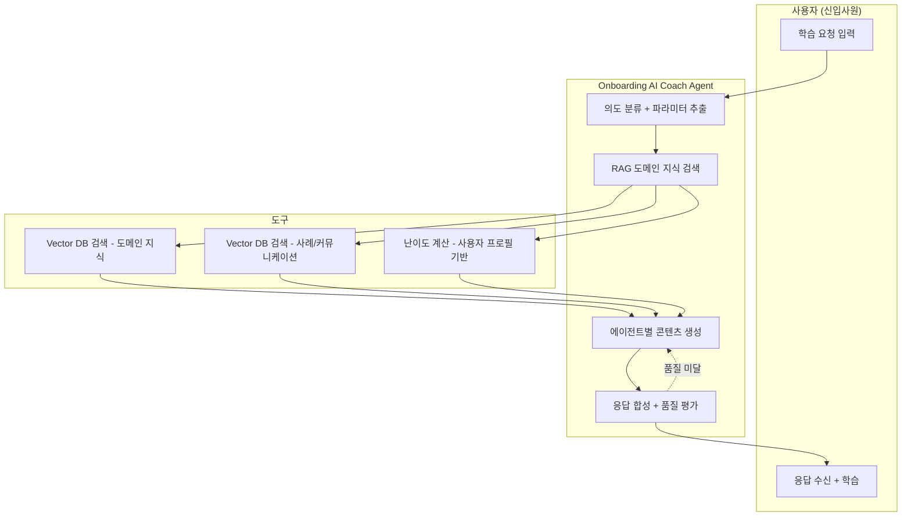
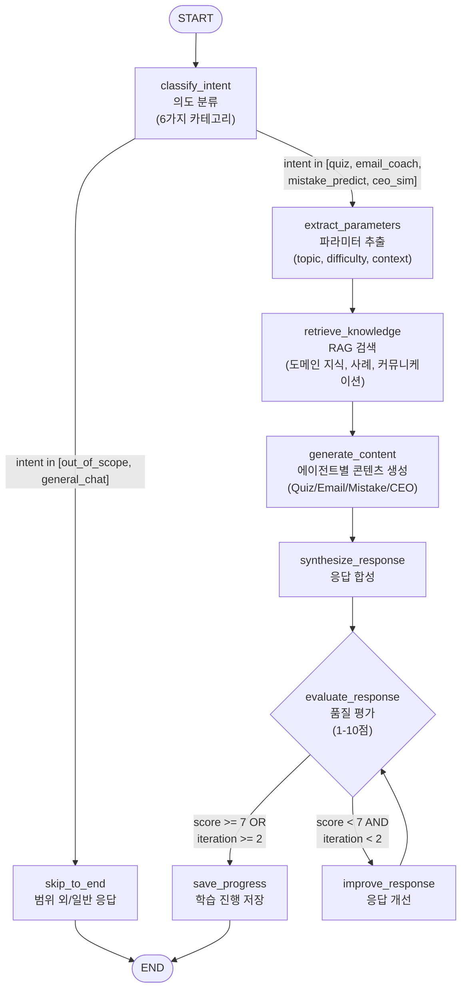

# Agentic Workflow 설계서: 물류·무역 온보딩 AI 코치

---

## 1. 서비스 개요

### 1.1 핵심 목적

#### 식별된 사용자의 수동 작업

에이전트가 대신할 사용자의 수동 작업을 구체적으로 분석합니다.

| 유형 | 현재 상황 | 소요 시간 | 어려운 점 | 에이전트 대체 |
|------|-----------|-----------|-----------|---------------|
| 용어 학습 노동 | 무역 전문용어(BL, LC, FOB 등)를 매뉴얼·검색으로 개별 학습 | 매일 1~2시간 | 용어는 외워도 실무 상황과 연결 안됨, 맥락 없는 암기 | RAG 기반 상황형 퀴즈로 용어-실무 자동 연결 학습 |
| 실무 흐름 파악 노동 | 계약→선적→통관→입고 프로세스를 문서로 반복 읽기 | 주 3~5시간 | 문서 속 흐름과 실제 업무 간 괴리, 예외 상황 파악 불가 | AI 시나리오 시뮬레이션으로 실전 흐름 체험 |
| 이메일 작성 노동 | 포워더·거래처 이메일을 선배 참고하며 작성·수정 | 건당 30분~1시간 | 무역 영문 표현 미숙, 리스크 인지 부족, 톤 부적절 | Email Coach Agent가 리스크 탐지·톤 보정·수정안 즉시 제공 |
| 판단/보고 준비 노동 | 대표 보고 전 상황 정리, 예상 질문 준비 | 건당 20~40분 | 대표 의사결정 스타일 파악 부족, 보고 포맷 미숙 | CEO Simulator Agent로 보고 연습·피드백 |
| 실수 예방 노동 | 체크리스트 수기 확인, 선배에게 반복 질문 | 지속적 | 같은 질문 반복 눈치, 실수 발생 후에야 인지 | Mistake Predictor Agent가 상황별 예상 실수·예방법 사전 제공 |

#### 핵심 목적 문장

> **물류·무역 신입사원의 실무 상황 경험 부재를 해결하여, 선배·매뉴얼 의존(직접 검색, 반복 질문, 수동 체크) 없이 개인 맞춤형 실무 훈련과 즉각적 업무 코칭을 제공하는 Agentic Onboarding Coach 구축.**

#### 핵심 효용

| 효용 | 설명 |
|------|------|
| 실무 시뮬레이션 | 실제 무역 업무 시나리오(BL 오류 발견, 선적 지연 대응 등)를 AI가 자동 생성하여, "연습 없이 실전 투입"되는 구조를 "시뮬레이션 후 실전"으로 전환합니다. |
| 개인 맞춤 학습 | 사용자의 퀴즈 점수, 약점 영역, 학습 이력을 기반으로 난이도와 주제를 자동 조정하여, 일괄 교육이 아닌 1:1 코칭 경험을 제공합니다. |
| 실수 사전 예방 | 업무 상황 입력 시 신입이 범하기 쉬운 실수 3가지와 예방 체크리스트를 즉시 제공하여, 실수 발생 전에 리스크를 차단합니다. |
| 조직 지식 데이터화 | 대표의 의사결정 스타일, 회사 내부 프로세스, 실수 사례 등 암묵지를 구조화된 데이터로 축적하여, 교육 품질 편차를 해소합니다. |

---

### 1.2 해결 과제

#### 과제 1: 도메인 특화 할루시네이션 방지 [Critical]

**문제 상황**
- 무역·물류는 전문 용어와 프로세스가 엄격하여, LLM이 부정확한 정보를 생성하면 실무 오류로 직결됨
- 일반 LLM 학습 데이터에 커피 생두 무역 특화 정보가 부족
- 잘못된 Incoterms 설명이나 통관 절차 안내는 금전적 손실 유발 가능

**발생 위험**
- 사용자에게 잘못된 실무 지식 제공 → 실제 업무 실수 유발
- BL, LC 등 서류 관련 오안내 → 통관 지연·클레임

**해결 방안**

| 전략 | 구현 방법 |
|------|-----------|
| RAG 우선 검색 | Vector DB에 검증된 도메인 지식·사내 데이터를 저장하고, 모든 응답을 RAG 결과 기반으로 생성 |
| 출처 명시 | 퀴즈 해설·코칭 응답에 참조 데이터 출처(용어 DB, 사례 DB 등) 반드시 포함 |
| 확신도 표시 | 응답 신뢰도가 낮을 경우 "확인 필요" 마크와 함께 선배·팀장 확인 권고 |
| 구조화된 출력 | Pydantic 기반 Structured Output으로 응답 형식 제약 |

**워크플로우 반영**
- `retrieve_knowledge` 노드: RAG 검색으로 검증된 데이터 우선 조회
- `synthesize_response` 노드: 출처·확신도 포함한 응답 생성
- `evaluate_response` 노드: 도메인 정확성 사후 검증

#### 과제 2: 복잡한 멀티에이전트 경로 안정성 [High]

**문제 상황**
- 4개 에이전트(Quiz, Email Coach, Mistake Predictor, CEO Simulator)로 분기하는 다중 경로 워크플로우
- 의도 오분류 시 전혀 다른 에이전트가 실행되어 사용자 경험 저하
- 에이전트 내부 처리 중 무한 루프 진입 가능성

**발생 위험**
- 퀴즈 요청을 이메일 코칭으로 오분류 → 엉뚱한 응답
- 품질 평가 루프 무한 반복 → 비용 급증, 응답 지연

**해결 방안**

| 전략 | 구현 방법 |
|------|-----------|
| 명확한 의도 분류 | 6가지 카테고리 + Few-shot 예시로 정확한 라우팅 |
| 최대 반복 제한 | 개선 루프 최대 2회로 제한 (iteration >= 2) |
| State 기반 제어 | LangGraph State 객체로 전체 흐름 상태 관리 |
| 폴백 처리 | 분류 신뢰도 0.5 미만 시 general_chat으로 안전하게 처리 |

**워크플로우 반영**
- `classify_intent` 노드: 6가지 카테고리로 명확한 분류 + 신뢰도 점수
- `evaluate_response` 노드: score >= 7 OR iteration >= 2 조건으로 강제 종료
- 전체 흐름: State 객체를 통한 노드 간 데이터 전달

#### 과제 3: 도구 호출 실패 대응 [High]

**문제 상황**
- RAG 검색 결과 부족 시 응답 품질 저하
- 외부 LLM API 장애 시 서비스 중단

**해결 방안**

| 전략 | 구현 방법 |
|------|-----------|
| 재시도 + 폴백 | 3회 재시도(exponential backoff), 실패 시 캐시된 결과 활용 |
| RAG 결과 보완 | 검색 결과 부족 시 일반 도메인 지식으로 보완 응답 생성 |
| 타임아웃 | 각 도구 호출 5초 타임아웃 설정 |

---

### 1.3 주요 기능

#### 기능 모듈 매핑

| 서비스 기획 기능 | 워크플로우 모듈 | 상세 설명 |
|------------------|-----------------|-----------|
| 질문/요청 이해 | 의도 분류 (classify_intent) | 사용자 입력을 6가지 카테고리(quiz, email_coach, mistake_predict, ceo_sim, general_chat, out_of_scope)로 분류 |
| 상황 파악 | 파라미터 추출 (extract_parameters) | Structured Output으로 업무단계, 난이도, 주제, 상황 맥락 등 실행 변수 추출 |
| 도메인 지식 검색 | RAG 검색 (retrieve_knowledge) | Vector DB에서 무역 용어, 내부 프로세스, 사고 사례, 커뮤니케이션 템플릿 등 검색 |
| 퀴즈 생성/평가 | Quiz Agent (generate_content) | 난이도별 무역 용어 퀴즈, 상황형 문제 생성 및 채점·해설 |
| 이메일 코칭 | Email Coach Agent (generate_content) | 이메일 리스크 탐지, 톤 보정, 수정안 생성, 대표 스타일 반영 |
| 실수 예측 | Mistake Predictor Agent (generate_content) | 상황별 예상 실수 3개 + 예방 체크리스트 생성 |
| 대표 시뮬레이션 | CEO Simulator Agent (generate_content) | 대표 페르소나 기반 질문 생성, 보고 평가, 의사결정 피드백 |
| 응답 구성 | 응답 합성 (synthesize_response) | 에이전트 결과 + RAG 컨텍스트를 종합한 최종 응답 생성 |
| 품질 보증 | 품질 평가 (evaluate_response) | 7점 척도 자가 검증, 최대 2회 개선 |
| 학습 기록 | 진행 저장 (save_progress) | 퀴즈 점수, 약점 영역, 학습 이력 저장 |

#### 기능 간 의존 관계

```
[classify_intent] 의도 분류
│
↓ intent 전달
[extract_parameters] 파라미터 추출
│
↓ topic, difficulty, context 전달
[retrieve_knowledge] RAG 검색
│
↓ domain_context 전달
[generate_content] 에이전트별 콘텐츠 생성 (Quiz/Email/Mistake/CEO)
│
↓ agent_output 전달
[synthesize_response] 응답 합성
│
↓ final_response 전달
[evaluate_response] 품질 평가
│
├─→ (score >= 7 OR iteration >= 2) → [save_progress] → END
│
└─→ (score < 7 AND iteration < 2) → [improve_response] → 재평가
```

---

## 2. 시스템 아키텍처

### 2.1 사용자-시스템 상호작용

#### 상호작용 단계 정의

| 단계 | 내용 |
|------|------|
| 1. 입력 | 사용자가 자연어로 학습 요청 입력 (예: "오늘 퀴즈 풀고 싶어", "buyer에게 선적지연 메일 써줘", "BL 확인할 때 실수할 수 있는 거 알려줘") |
| 2. 처리 | 의도 분류 → 파라미터 추출 → RAG 검색 → 에이전트별 콘텐츠 생성 → 응답 합성 → 품질 평가 |
| 3. 출력 | 퀴즈 문제/이메일 수정안/실수 예측/대표 시뮬레이션 등 에이전트별 맞춤 응답 |
| 4. 피드백 | 퀴즈 점수·약점 영역을 프로필에 저장하여 다음 학습에 난이도·주제 반영 |

#### 시스템 상호작용 다이어그램 (Mermaid)



### 2.2 워크플로우 흐름도

#### 노드 목록

| 노드명 | 한글명 | 역할 요약 |
|--------|--------|-----------|
| classify_intent | 의도 분류 | 사용자 입력을 6가지 카테고리로 분류 |
| extract_parameters | 파라미터 추출 | 업무단계, 난이도, 주제, 상황 맥락 등 추출 |
| retrieve_knowledge | 지식 검색 | RAG 기반 도메인 지식·사례·커뮤니케이션 데이터 검색 |
| generate_content | 콘텐츠 생성 | 분류된 의도에 따라 적절한 에이전트 로직 실행 |
| synthesize_response | 응답 합성 | 에이전트 출력 + RAG 컨텍스트를 종합하여 최종 응답 생성 |
| evaluate_response | 품질 평가 | 1-10점 척도로 응답 품질 평가 |
| improve_response | 응답 개선 | 피드백 반영하여 응답 보완 |
| save_progress | 진행 저장 | 사용자 학습 이력·점수·약점 업데이트 |

#### 분기 조건 정의

| 분기 지점 (노드) | 조건 | 다음 노드 | 설명 |
|------------------|------|-----------|------|
| classify_intent | intent == "out_of_scope" | skip_to_end → END | 범위 외 안내 메시지 후 종료 |
| classify_intent | intent == "general_chat" | skip_to_end → END | 간단 응답 후 종료 |
| classify_intent | intent in [quiz, email_coach, mistake_predict, ceo_sim] | extract_parameters | 본격 처리 시작 |
| evaluate_response | score >= 7 OR iteration >= 2 | save_progress | 통과 또는 최대 반복 도달 |
| evaluate_response | score < 7 AND iteration < 2 | improve_response | 개선 필요 |

#### 워크플로우 흐름도 (Mermaid)



---

## 3. 워크플로우 상세 설계

### 3.1 이용자 관점 흐름

#### 대표 시나리오 1: 퀴즈 학습

**시나리오: "오늘 물류 퀴즈 풀고 싶어"**

1. **사용자 입력**: 사용자가 "오늘 물류 퀴즈 풀고 싶어"라는 요청을 입력합니다.
2. **의도 및 파라미터 파악**: 시스템은 퀴즈 요청임을 파악하고, 사용자 프로필에서 현재 학습 단계(초급)와 약점 영역(통관 절차)을 확인합니다.
3. **지식 검색**: RAG에서 통관 관련 도메인 지식과 실수 사례를 검색합니다.
4. **퀴즈 생성**: Quiz Agent가 난이도 조정된 상황형 퀴즈를 생성합니다.
5. **응답 생성 및 검증**: 퀴즈 문제·선택지·해설을 포함한 응답을 생성하고 품질 검증합니다.
6. **최종 응답**: 사용자에게 퀴즈를 제공하고, 답변 후 점수·해설·실무 팁을 안내합니다.

**사용자가 받는 응답 예시:**

> **오늘의 물류 미션 [통관 절차 - 초급]**
>
> **상황:** 브라질에서 커피 생두 20톤을 수입 중입니다. 선적이 완료되어 BL을 받았는데, consignee 이름에 오타가 있습니다. 화물 도착까지 3일 남았습니다.
>
> **질문:** 이 상황에서 가장 먼저 해야 할 행동은?
>
> 1. 화물 도착 후 통관 시 수정 요청
> 2. 즉시 포워더에게 BL 수정(amendment) 요청
> 3. 대표에게 보고 후 지시 대기
> 4. 관세사에게 통관 가능 여부 먼저 확인
>
> *참조: 회사 도메인 지식 DB - BL 오류 대응 프로세스*

#### 대표 시나리오 2: 이메일 코칭

**시나리오: "buyer에게 선적 지연 안내 메일 써줘"**

1. **사용자 입력**: "buyer에게 선적 지연 안내 메일 써줘"
2. **의도 파악**: 이메일 코칭 요청으로 분류, 상황(선적 지연), 상대(buyer) 추출
3. **지식 검색**: 이메일 로그에서 선적 지연 안내 템플릿, 대표 커뮤니케이션 스타일 검색
4. **이메일 코칭**: Email Coach Agent가 초안 생성 + 리스크 탐지 + 톤 보정
5. **최종 응답**: 수정된 이메일, 리스크 포인트, 개선 이유를 함께 제공

#### 예상 사용자 발화

| 의도 | 예상 발화 |
|------|-----------|
| quiz | "퀴즈 풀고 싶어", "오늘 물류 미션", "무역 용어 테스트", "BL 관련 문제 내줘" |
| email_coach | "메일 검토해줘", "buyer에게 선적지연 메일 써줘", "클레임 대응 메일 도와줘" |
| mistake_predict | "BL 확인할 때 주의할 점", "이 상황에서 실수할 수 있는 거", "통관 전 체크리스트" |
| ceo_sim | "대표 보고 연습", "대표님이 이렇게 물어보면 어떻게 답해야 해?", "보고 연습시켜줘" |
| general_chat | "안녕", "고마워", "도움이 됐어" |
| out_of_scope | "오늘 날씨 어때?", "맛집 추천해줘", "코드 작성해줘" |

### 3.2 시스템 관점 흐름

#### State 객체 설계

```python
from typing import TypedDict, Annotated, Literal
from operator import add

class AgentState(TypedDict):
    # === 단일 값 필드 (덮어쓰기) ===
    user_input: str                    # 사용자 원본 입력
    intent: Literal[
        "quiz", "email_coach", "mistake_predict",
        "ceo_sim", "general_chat", "out_of_scope"
    ]
    topic: str                         # 추출된 주제 (예: "통관", "BL", "선적")
    difficulty: Literal["beginner", "intermediate", "advanced"]  # 난이도
    context: dict                      # 상황 맥락 (업무단계, 상대방 등)
    execution_plan: list[str]          # 실행할 도구/에이전트 순서
    agent_output: str                  # 에이전트 생성 콘텐츠
    final_response: str                # 최종 응답 문장
    quality_score: int                 # 품질 평가 점수 (1-10)
    iteration: int                     # 개선 루프 반복 횟수
    user_profile: dict                 # 사용자 프로필 (점수, 약점, 이력)

    # === 누적 값 필드 (add) ===
    messages: Annotated[list, add]     # 대화 이력 누적
    tool_results: Annotated[list, add] # 도구 호출 결과 누적
```

#### 노드별 상태 변화

| 노드 | 역할 | Input (읽는 필드) | Output (쓰는 필드) | 처리 로직 |
|------|------|-------------------|---------------------|-----------|
| classify_intent | 사용자 의도를 6가지 카테고리로 분류 | user_input | intent, messages | LLM에 사용자 입력 + 6가지 카테고리 정의 전달, Few-shot 예시로 분류 정확도 향상, 신뢰도 0.5 미만 시 general_chat 처리 |
| extract_parameters | 학습 파라미터 추출 | user_input, messages, user_profile | topic, difficulty, context | Structured Output으로 주제/난이도/맥락 추출, 사용자 프로필의 약점 영역 반영하여 난이도 자동 조정 |
| retrieve_knowledge | RAG 기반 도메인 지식 검색 | topic, context, intent | tool_results | intent에 따라 적절한 데이터 카테고리 검색 (Quiz→용어+사례, Email→이메일로그+스타일, Mistake→사고사례+체크리스트, CEO→의사결정스타일) |
| generate_content | 에이전트별 콘텐츠 생성 | user_input, intent, topic, difficulty, context, tool_results, user_profile | agent_output | intent에 따라 Quiz/Email/Mistake/CEO 에이전트 프롬프트 실행 |
| synthesize_response | 최종 응답 합성 | user_input, agent_output, tool_results, user_profile | final_response, messages | 에이전트 출력 + RAG 컨텍스트를 종합, 출처 정보 포함, 사용자 수준에 맞게 재구성 |
| evaluate_response | 응답 품질 1-10점 평가 | user_input, final_response, intent | quality_score, iteration | 도메인 정확성, 교육 효과, 실무 적합성, 가독성 기준 평가 |
| improve_response | 피드백 반영 응답 개선 | user_input, final_response, quality_score | final_response, messages | 평가 피드백을 반영하여 부족한 부분 보완 |
| save_progress | 학습 진행 저장 | user_input, intent, topic, quality_score | user_profile | 퀴즈 점수 누적, 약점 영역 업데이트, 학습 이력 기록 |

### 3.3 노드별 상세 명세

#### classify_intent 노드 상세

**역할:** 사용자의 입력을 분석하여 적절한 에이전트 경로를 결정

**처리 카테고리:**

| 카테고리 | 설명 | 다음 경로 |
|----------|------|-----------|
| quiz | 퀴즈/학습/테스트 요청 | extract_parameters → 전체 워크플로우 |
| email_coach | 이메일 작성/검토/코칭 요청 | extract_parameters → 전체 워크플로우 |
| mistake_predict | 실수 예측/체크리스트/주의사항 요청 | extract_parameters → 전체 워크플로우 |
| ceo_sim | 대표 보고 연습/시뮬레이션 요청 | extract_parameters → 전체 워크플로우 |
| general_chat | 인사/감사 등 일반 대화 | skip_to_end → 간단 응답 |
| out_of_scope | 무역/물류와 무관한 요청 | skip_to_end → 범위 외 안내 |

**프롬프트 전략:**
- Few-shot 예시로 각 카테고리의 대표 발화 5개씩 제공
- 신뢰도 점수(0-1)를 함께 반환하도록 Structured Output 구성

**예외 처리:**
- 신뢰도 0.5 미만 → general_chat으로 분류
- 빈 입력 → out_of_scope로 분류

#### generate_content 노드 상세

**역할:** 분류된 의도에 따라 4개 에이전트 중 하나를 실행

**Quiz Agent:**
- 입력: topic, difficulty, user_profile(약점), tool_results(도메인 지식)
- 출력: 상황형 퀴즈 문제 + 4지선다 + 정답 + 해설 + 실무 팁
- 프롬프트: "너는 15년차 무역 교육 전문가다. 다음 데이터를 참고하여 {difficulty} 난이도의 {topic} 관련 상황형 퀴즈를 생성해라."

**Email Coach Agent:**
- 입력: user_input(이메일 원문 또는 요청), context(상대방, 상황), tool_results(이메일 템플릿, 대표 스타일)
- 출력: 수정된 이메일 + 리스크 포인트 + 톤 보정 사항 + 개선 이유
- 프롬프트: "너는 15년차 무역회사 팀장이다. 아래 이메일을 수정하고 리스크를 탐지해라."

**Mistake Predictor Agent:**
- 입력: context(업무 상황), tool_results(사고/실수 사례)
- 출력: 예상 실수 3개 + 예방 방법 + 체크리스트
- 프롬프트: "너는 무역 리스크 관리 전문가다. 이 상황에서 신입이 범할 수 있는 실수 3가지를 예측해라."

**CEO Simulator Agent:**
- 입력: user_input(보고 내용), tool_results(대표 의사결정 스타일)
- 출력: 대표 질문 + 평가 + 피드백 + 개선 포인트
- 프롬프트: "너는 커피 생두 무역회사 대표다. 리스크 회피형이며 거래 안정성을 중시한다. 신입의 보고를 듣고 질문해라."

#### Input/Output 일관성 검증

```
START
  ↓ user_input 초기화
classify_intent
  ↓ intent, messages
extract_parameters (Input: user_input ✓, messages ✓, user_profile ✓)
  ↓ topic, difficulty, context
retrieve_knowledge (Input: topic ✓, context ✓, intent ✓)
  ↓ tool_results
generate_content (Input: user_input ✓, intent ✓, topic ✓, difficulty ✓, context ✓, tool_results ✓, user_profile ✓)
  ↓ agent_output
synthesize_response (Input: user_input ✓, agent_output ✓, tool_results ✓, user_profile ✓)
  ↓ final_response, messages
evaluate_response (Input: user_input ✓, final_response ✓, intent ✓)
  ↓ quality_score, iteration
save_progress (Input: user_input ✓, intent ✓, topic ✓, quality_score ✓)
  ↓ user_profile
END
```

---

## 4. 구현 전략

### 4.1 핵심 전략 영역

| 전략 영역 | 해결하는 문제 | 핵심 질문 |
|-----------|---------------|-----------|
| 컨텍스트 엔지니어링 | 대화 맥락 유실, 에이전트 간 정보 손실 | 어떻게 맥락을 잃지 않게 할까? |
| 메모리 관리 | 사용자 학습 이력·점수·약점 관리 | 개인화 정보를 어떻게 저장/활용할까? |
| 평가-최적화 루프 | 도메인 특화 응답 품질 불일치 | 무역 실무 정확성을 어떻게 보장할까? |

#### 컨텍스트 엔지니어링

```python
# Annotated[list, add]가 설정된 필드는 값이 누적됨
messages: Annotated[list, add]       # 대화 이력 누적
tool_results: Annotated[list, add]   # 도구 결과 누적
```

**핵심 원칙:**
- `operator.add`가 설정된 필드(messages, tool_results)는 데이터가 누적되어 대화 맥락 보존
- 각 노드는 자신이 변경할 필드만 업데이트
- State 객체는 전체 워크플로우 실행 내내 유지

**선택적 맥락 전달:**

| 노드 | 필요한 맥락 | 불필요한 맥락 |
|------|-------------|---------------|
| classify_intent | user_input만 | 이전 도구 결과 |
| generate_content | user_input, intent, tool_results, user_profile | 의도 분류 과정 |
| evaluate_response | user_input, final_response, intent | RAG 검색 과정 |

**토큰 한도 관리:**

| 전략 | 적용 시점 | 구현 방법 |
|------|-----------|-----------|
| RAG 결과 필터링 | 검색 결과 > 5개 | 관련도 상위 5개만 유지 |
| 핵심 정보 분리 | 항상 | topic, difficulty, context 등 핵심 정보는 별도 필드 |
| 대화 이력 요약 | 대화 10턴 초과 시 | 이전 이력을 요약하여 토큰 절약 |

#### 메모리 관리 전략

**메모리 구성 요소:**

| 구성 요소 | 역할 | 선택 이유 |
|-----------|------|-----------|
| InMemoryStore | 장기 메모리 (사용자 프로필) | 프로토타입 단계에서 빠르고 간단한 구현 |

**사용자 프로필 데이터 구조:**

| 필드 | 타입 | 설명 | 예시 |
|------|------|------|------|
| user_id | str | 사용자 고유 식별자 | "user_kim_trade" |
| quiz_scores | list[dict] | 퀴즈 점수 이력 | [{"topic": "BL", "score": 80, "date": "2025-02-04"}] |
| weak_areas | list[str] | 약점 영역 | ["통관절차", "LC조건"] |
| completed_topics | list[str] | 완료한 학습 주제 | ["Incoterms", "BL구조"] |
| difficulty_level | str | 현재 난이도 | "intermediate" |
| total_sessions | int | 총 학습 세션 수 | 15 |

**프로덕션 전환 시 고려사항:**

| 현재 (MVP) | 프로덕션 | 전환 이유 |
|------------|----------|-----------|
| InMemoryStore | Redis | 서버 재시작 시에도 데이터 유지 필요 |
| 단순 딕셔너리 | PostgreSQL | 복잡한 쿼리(기간별 통계, 팀 비교 등) 필요 시 |

#### 평가-최적화 루프

**루프 구조:**

```
[synthesize_response] 응답 생성
    ↓
[evaluate_response] 품질 평가
    ↓
  점수 확인
    │
    ├─→ score >= 7 OR iteration >= 2 → [save_progress] → END
    │
    └─→ score < 7 AND iteration < 2 → [improve_response] → 재평가
```

**루프 설계 요소:**

| 요소 | 설정값 | 설명 |
|------|--------|------|
| 평가 기준 | 도메인 정확성, 교육 효과, 실무 적합성, 가독성 | 4가지 관점에서 종합 평가 |
| 임계치 | 7점 이상 | 10점 만점 중 70% 이상 시 통과 |
| 최대 반복 | 2회 | 3회 이상 반복 시 무한 루프 위험 |
| 탈출 조건 | score >= 7 OR iteration >= 2 | 품질 통과 또는 최대 반복 도달 |

**평가 기준 상세:**

| 기준 | 가중치 | 평가 내용 |
|------|--------|-----------|
| 도메인 정확성 | 35% | 무역 용어·프로세스 설명이 사실과 일치하는가? |
| 교육 효과 | 25% | 신입의 학습에 실질적 도움이 되는가? |
| 실무 적합성 | 25% | 실제 업무 상황에 적용 가능한가? |
| 가독성 | 15% | 읽기 쉽게 구조화되었는가? |

---

## 5. 구현 시 고려 사항

### 5.1 비용 및 응답시간 분석

#### 비용 발생 지점

| 항목 | 호출 위치 | 1회 대화당 호출 | 비용 요소 |
|------|-----------|-----------------|-----------|
| LLM 호출 | 각 노드 및 평가 루프 | 최소 6회 ~ 최대 8회 | OpenAI/Claude API |
| 임베딩 | retrieve_knowledge (RAG) | 1회 | Embedding API |
| Vector DB | retrieve_knowledge | 1~3회 | Pinecone/Weaviate |

#### 예상 비용 계산

| 시나리오 | LLM 호출 | 임베딩 | Vector DB | 대화당 비용 |
|----------|----------|--------|-----------|-------------|
| 최소 (1회 통과) | 6회 | 1회 | 1회 | ~$0.015 |
| 평균 | 7회 | 1회 | 2회 | ~$0.02 |
| 최대 (2회 개선) | 8회 | 1회 | 3회 | ~$0.03 |

**월간 비용 추정 (일 500회 대화 가정):**
- 최소: 500 × 30 × $0.015 = **$225/월**
- 평균: 500 × 30 × $0.02 = **$300/월**
- 최대: 500 × 30 × $0.03 = **$450/월**

#### 비용 최적화 전략

| 전략 | 설명 | 예상 절감 효과 |
|------|------|----------------|
| 캐싱 | 동일 주제 퀴즈/검색 결과 24시간 캐시 | LLM 호출 20% 감소 |
| 모델 선택 | classify_intent에 경량 모델 사용 | 해당 노드 비용 50% 감소 |
| 조건부 검색 | 단순 퀴즈 시 RAG 검색 범위 축소 | Vector DB 비용 30% 감소 |

#### 노드별 예상 소요 시간

| 노드 | 예상 소요 시간 | 비고 |
|------|----------------|------|
| classify_intent | 0.5 ~ 1초 | LLM 호출 |
| extract_parameters | 0.5 ~ 1초 | LLM 호출 (Structured Output) |
| retrieve_knowledge | 1 ~ 3초 | 병목 - Vector DB 검색 |
| generate_content | 2 ~ 4초 | 병목 - 에이전트 LLM 호출 (긴 출력) |
| synthesize_response | 1 ~ 2초 | LLM 호출 |
| evaluate_response | 0.5 ~ 1초 | LLM 호출 |
| save_progress | < 0.1초 | 인메모리 저장 |

| 시나리오 | 경로 | 예상 시간 |
|----------|------|-----------|
| 최소 (out_of_scope) | classify_intent → END | 1 ~ 2초 |
| 평균 (1회 통과) | 모든 노드 1회 | 7 ~ 14초 |
| 최대 (1회 개선) | evaluate + improve 1회 추가 | ~18초 |

### 5.2 안정성 및 위험 관리 대응

#### 주요 위험 요소

| 위험 요소 | 설명 | 발생 시 영향 | 중요도 |
|-----------|------|-------------|--------|
| 도메인 할루시네이션 | LLM이 잘못된 무역 지식 생성 | 사용자가 잘못된 실무 지식 학습 → 실제 업무 실수 유발 | Critical |
| 의도 오분류 | 퀴즈 요청을 이메일 코칭으로 오분류 | 엉뚱한 에이전트 실행 → 사용자 혼란 | High |
| RAG 검색 실패 | 관련 데이터 미검색 | 맥락 없는 일반적 응답 → 실무 도움 부족 | High |
| 무한 루프 | 개선 루프 무한 반복 | 비용 급증, 응답 지연 | High |
| API 장애 | LLM API 응답 실패 | 서비스 중단 | Medium |

#### 대응 전략

| 위험 | 대응 전략 | 구현 방법 |
|------|-----------|-----------|
| 도메인 할루시네이션 | RAG 우선 + 출처 명시 + 확신도 표시 | 검증된 데이터 우선 검색, 모든 응답에 출처 포함, 신뢰도 낮으면 "확인 필요" 표시 |
| 의도 오분류 | Few-shot + 신뢰도 기반 폴백 | 카테고리별 대표 발화 예시 제공, 신뢰도 0.5 미만 시 general_chat으로 안전 처리 |
| RAG 검색 실패 | 폴백 + 범위 확대 | 검색 결과 부족 시 상위 카테고리로 범위 확대, 최소 3개 이상 결과 보장 |
| 무한 루프 | 최대 반복 제한 | iteration >= 2 조건으로 강제 종료 |
| API 장애 | 재시도 + 캐시 | 3회 재시도(exponential backoff), 최근 결과 캐시 활용 |

### 5.3 의도적 제외 기능 리스트

| 제외된 기능 | 제외 이유 | 제외 사유 유형 | 향후 추가 가능성 |
|-------------|-----------|----------------|------------------|
| 음성 인터페이스 | 텍스트 기반 MVP에 집중 | 범위 초과 | 높음 (v3) |
| 모바일 앱 | 웹 UI 우선 개발 | 범위 초과 | 높음 (v2) |
| ERP 연동 | 외부 시스템 연동 복잡성 | 기술적 복잡성 | 중간 (v2) |
| 실제 회사 데이터 수집 | 더미 데이터로 MVP 검증 후 진행 | 의존성 | 높음 (v2) |
| 로그인 시스템 고도화 | 간단 mock 로그인으로 충분 | 범위 초과 | 중간 (v2) |
| 다국어 지원 | 한국어 서비스에 집중 | 범위 초과 | 높음 (v3) |
| 실시간 업무 연동 | 교육 시뮬레이션에 집중 | 기술적 복잡성 | 높음 (v3) |

---

## 마무리: 설계서 완성 체크리스트

- [x] **서비스 개요**: 핵심 목적, 해결 과제(3개), 주요 기능(10개 모듈) 정의 완료
- [x] **시스템 아키텍처**: 상호작용 다이어그램 및 상세 워크플로우 흐름도 포함
- [x] **워크플로우 상세**: 이용자 시나리오(2개), State 구조, 노드 상세 명세(8개) 일치
- [x] **구현 전략**: 컨텍스트 엔지니어링, 메모리, 평가 루프 설계 완료
- [x] **고려 사항**: 비용($225~450/월), 응답 시간(7~18초), 위험 관리(5개), 제외 기능(7개) 명시
