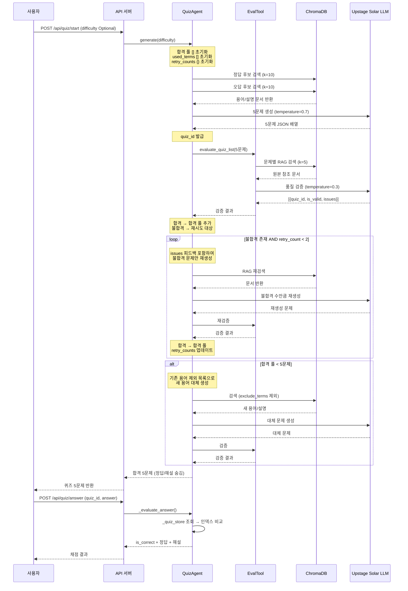
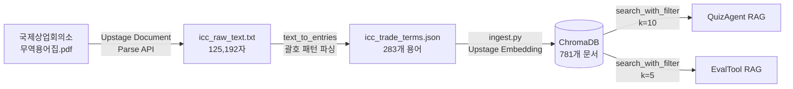

# Quiz / Eval Agent

무역 신입사원 교육을 위한 **RAG 기반 용어 퀴즈 생성 + 품질 자동 검증** 시스템

---

## 목차

1. [구현 기능](#1-구현-기능)
2. [생성된 파일](#2-생성된-파일)
3. [워크플로우](#3-워크플로우)
4. [카테고리별 상세](#4-카테고리별-상세)
5. [API 엔드포인트](#5-api-엔드포인트)
6. [데이터 파이프라인](#6-데이터-파이프라인)

---

## 1. 구현 기능

### QuizAgent
| 기능 | 설명 |
|------|------|
| 퀴즈 생성 | RAG 검색 기반 4지선다 용어 퀴즈 5문제 생성 |
| 난이도 조절 | `easy` / `medium` / `hard` 지정 또는 혼합(easy2+medium2+hard1) |
| 퀴즈 유형 | `용어→설명` / `설명→용어` 두 방향 출제 |
| RAG 오답 생성 | 정답 후보(k=10) + 오답 후보(k=10) 각각 검색하여 혼동 유사 선택지 구성 |
| 답안 채점 | `quiz_id` + `answer` 인덱스 비교, 정답/해설 반환 |
| 메모리 저장 | `_quiz_store` dict로 서버 메모리에 퀴즈 보관 (정답/해설 포함) |

### EvalTool
| 기능 | 설명 |
|------|------|
| 문제별 품질 검증 | 생성된 퀴즈를 RAG 원본 데이터와 대조하여 `is_valid` 판정 |
| 5항목 검증 | 문제·정답·오답·정답인덱스·해설 각각 원본 일치 여부 확인 |
| issues 반환 | 불합격 시 구체적인 불일치 사유 목록 반환 |
| 배치 처리 | 여러 문제를 한 번의 LLM 호출로 일괄 검증 |

### 재시도 + 대체 생성 루프
| 단계 | 조건 | 동작 |
|------|------|------|
| 합격 | `is_valid=true` | 합격 풀에 추가 |
| 재시도 | `is_valid=false` AND 재시도 < 2회 | issues 피드백 포함하여 해당 문제만 재생성 |
| 대체 생성 | 재시도 2회 소진 | 기존 용어 제외 목록으로 다른 용어 신규 생성 |
| 최종 반환 | 합격 풀 5문제 달성 시 즉시 종료 | 정답/해설 숨기고 유저에게 반환 |

### LangSmith 트레이싱
| 트레이스 이름 | 대상 함수 |
|---|---|
| `quiz_generate_with_eval` | `QuizAgent._generate_with_eval()` |
| `quiz_generate_batch` | `QuizAgent._generate_quizzes()` |
| `quiz_evaluate_answer` | `QuizAgent._evaluate_answer()` |
| `eval_tool` | `evaluate_quiz_list()` |

---

## 2. 생성된 파일

```
backend/
├── agents/
│   ├── quiz_agent.py       # QuizAgent 클래스 (RAG 기반 퀴즈 생성 + 채점)
│   └── eval_agent.py       # EvalTool 함수 (퀴즈 품질 검증)
├── prompts/
│   ├── quiz_prompt.txt     # 퀴즈 생성 LLM 프롬프트 템플릿
│   └── eval_prompt.txt     # 품질 검증 LLM 프롬프트 템플릿
├── api/
│   └── routes.py           # /quiz/start, /quiz/answer, /quiz/evaluate 엔드포인트
└── utils/
    └── llm.py              # Upstage Solar LLM 공통 호출 유틸

dataset/
├── icc_trade_terms.json    # ICC 무역용어집 PDF → JSON 변환본 (283개 용어)
└── raw/
    ├── pdf_to_json.py      # Upstage Document Parse API 기반 PDF→JSON 변환 스크립트
    └── icc_raw_text.txt    # PDF 파싱 원본 텍스트 (디버그용)

docs/QUIZ-EVAL-AGENT/
├── README.md               # 이 파일
└── 기획서.md               # 기획서 원문
```

---

## 3. 워크플로우

### 전체 퀴즈 생성 흐름



### 데이터 파이프라인 (PDF → ChromaDB)



---

## 4. 카테고리별 상세

### QuizAgent — `backend/agents/quiz_agent.py`

**핵심 상수**
```python
MAX_RETRY = 2          # 불합격 문제 재시도 최대 횟수
_quiz_store = {}       # 서버 메모리 퀴즈 저장소 {quiz_id: quiz_data}
```

**메서드 구조**
```
QuizAgent
├── run(user_input, context)               # 진입점 (action 분기)
├── _generate_with_eval(difficulty)        # 생성→검증→재시도→대체 파이프라인
├── _generate_quizzes(count, difficulty,   # RAG + LLM 퀴즈 N문제 생성
│       exclude_terms, feedback_items)
├── _evaluate_answer(quiz_id, user_answer) # 메모리 조회 후 채점
└── [helpers]
    ├── _split_by_validity()               # 합격/불합격 분리
    ├── _collect_feedback()                # issues 피드백 수집
    └── _extract_term()                    # 퀴즈에서 핵심 용어 추출
```

**난이도별 출제 규칙**
| difficulty | 유형 | 오답 전략 |
|---|---|---|
| easy | 용어→설명 위주 | 의미상 거리 먼 오답 |
| medium | 두 유형 혼합 | 유사 카테고리 용어 |
| hard | 설명→용어 위주 | 실제 혼동하기 쉬운 유사 용어 |
| 미지정 | easy2+medium2+hard1 | 혼합 |

---

### EvalTool — `backend/agents/eval_agent.py`

**함수 시그니처**
```python
async def evaluate_quiz_list(
    quiz_list: List[Dict[str, Any]]
) -> List[Dict[str, Any]]:
    # Returns: [{"quiz_id": str, "is_valid": bool, "issues": List[str]}]
```

**검증 5항목**
1. `question` — 원본 데이터의 용어/설명을 올바르게 반영했는지
2. `choices[answer]` — 정답 선택지가 원본과 일치하는지
3. 오답 선택지 — 완전한 허구가 아닌 실존 용어 기반인지
4. `answer` 인덱스 — 실제 정답을 가리키는지
5. `explanation` — 해설이 원본과 부합하는지

---

### 프롬프트 — `backend/prompts/`

| 파일 | 플레이스홀더 | 용도 |
|------|------------|------|
| `quiz_prompt.txt` | `{reference_data}`, `{distractor_data}`, `{difficulty_instruction}`, `{exclude_instruction}`, `{feedback_instruction}` | 퀴즈 생성 |
| `eval_prompt.txt` | `{quiz_data}`, `{reference_data}` | 품질 검증 |

---

### API 엔드포인트 — `backend/api/routes.py`

---

## 5. API 엔드포인트

### `POST /api/quiz/start` — 퀴즈 생성

**Request**
```json
{}                          // 난이도 미지정 (혼합)
{"difficulty": "easy"}      // 난이도 지정
```

**Response**
```json
{
  "response": [
    {
      "quiz_id": "a1b2c3d4",
      "question": "FOB란 무엇인가요?",
      "choices": ["본선인도조건", "운임포함조건", "운임보험료포함조건", "관세지급인도조건"],
      "quiz_type": "용어→설명",
      "difficulty": "easy"
    }
  ],
  "agent_type": "quiz",
  "metadata": {"difficulty": null, "count": 5, "total_generated": 5}
}
```

---

### `POST /api/quiz/answer` — 답안 채점

**Request**
```json
{"quiz_id": "a1b2c3d4", "answer": 0}
```

**Response**
```json
{
  "response": {
    "quiz_id": "a1b2c3d4",
    "is_correct": true,
    "user_answer": 0,
    "correct_answer": 0,
    "correct_choice": "본선인도조건",
    "explanation": "FOB(Free On Board)는 수출자가 지정 선적항에서..."
  }
}
```

---

### `POST /api/quiz/evaluate` — 수동 품질 검증

> EvalTool은 `/quiz/start` 호출 시 **내부에서 자동 실행**됩니다 (합격/불합격 판정 + 재시도까지 처리).
> 이 엔드포인트는 그와 **별개로**, 이미 생성된 퀴즈를 나중에 다시 검증하고 싶을 때 사용합니다.
> `quiz_id`를 알고 있으면 서버 재시작 전까지 언제든 호출 가능합니다 (디버깅·사후 품질 감사 용도).

**Request**
```json
{"quiz_ids": ["a1b2c3d4", "e5f6g7h8"]}
```

**Response**
```json
{
  "results": [
    {"quiz_id": "a1b2c3d4", "is_valid": true, "issues": []},
    {"quiz_id": "e5f6g7h8", "is_valid": false, "issues": ["정답 인덱스 불일치"]}
  ]
}
```

---

## 6. 데이터 파이프라인

### PDF → JSON 변환 (`dataset/raw/pdf_to_json.py`)

```
1. PyMuPDF로 PDF 페이지 수 확인
2. 100페이지 초과 시 분할 (PyMuPDF)
3. 각 파트를 Upstage Document Parse API 호출 (OCR)
4. 텍스트 결합 → icc_raw_text.txt 저장
5. text_to_entries() 파싱:
   - 목차 섹션(-11- 이전) 스킵
   - 괄호로 끝나는 라인 = 용어 라인
   - 이후 텍스트 = 설명
6. icc_trade_terms.json 저장 (283개 엔트리)
```

### ChromaDB Ingestion (`backend/rag/ingest.py`)

```
uv run python backend/rag/ingest.py
```

- `dataset/*.json` 전체 자동 처리
- Upstage Embedding API로 벡터화
- 현재 총 **781개 문서** 저장 (ICC 용어집 283개 포함)